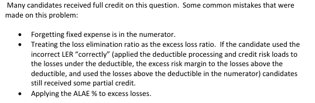

# Spring 2013 Exam 5 - Q13

**Points:** 2

## Question

Given the following information for a large deductible commercial general liability policy:

| B | C |
| --- | --- |
| $250,000 | Per occurrence deductible |
| 80% | Loss elimination ratio for a $250,000 deductible |
| 10% | ALAE/ground up loss ratio |
| $2,000,000 | Ground up loss estimate |
| $100,000 | Fixed expenses |
| 12% | Variable expenses as % of premium |
| 3% | Underwriting profit as a % of premium |
| 5% | Deductible processing cost as a % of losses below the deductible |
| 2% | Credit risk as a % of losses below the deductible |
| 8% | Additional risk margin as % of excess losses |

- The insurer will handle all claims, including those that fall below the deductible.
- The insurer will make the payments on all claims and will seek reimbursement for amounts

below the deductible from the insured.

- The deductible is for loss only.
- All ALAE is paid by the insurer.

Calculate the premium for the large deductible policy.

## Solution

With a deductible, the losses eliminated from the insurer's perspective are the losses below the deductible. As such, the numerator of the loss elimination ratio with a deductible is expected losses below the deductible. Since the policy covers losses above the deductible, we multiply the expected ground-up losses by 1 minus the LER to get expected losses on the policy.

Expected Losses above deductible

The question specifies (in multiple bullets) that the insurer will pay all ALAE, so ALAE is related to ground-up losses.

ALAE

The deductible processing cost and credit risk are additional expenses given as percentages of losses below the deductible.

Ded. Processing & Credit

The additional risk margin is a percent of excess losses.

Additional risk margin

Adding all these to the fixed expenses and then dividing by the variable expenses and profit gives us the premium.

Premium

$400,000 — `=B9*(1-B7)`

$200,000 — `=B8*B9`

$112,000 — `=SUM(B13:B14)*(B9-E30)`

$32,000 — `=B15*E30`

$992,941 — `=(E30+E34+E38+E42+B10)/(1-B11-B12)`

## Examiner Report

Examiner Report Comments:

