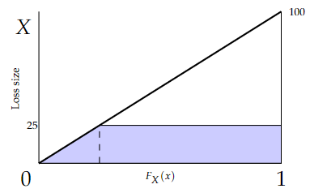

# 2011 Exam 8 - Q11 revised

**Points:** 2

## Question

Claim size follows a uniform distribution between $0 and $100.

Assume a 10% trend is applied uniformly to all losses.

Calculate the implied trend for pure premiums in the claim size layer $50 excess of $25.

For calculations, link to these cells:

| B | C |
| --- | --- |
| $100 | Top of uniform distribution |
| 10% | Trend rate |
| $25 | Bottom of claim size layer |
| $50 | Width of claim size layer |

## Solution

Here we want to obtain Tau_S - 1.

| Limit l | F(l) | E[X;l] | Using the diagram to the right below, you can visualize the uniform distribution on [0,100] by the thick line. |
| --- | --- | --- | --- |
| 22.73 | 0.23 | 20.14 | E[X;l] would be the area under the curve and below the value of l. |
| $25 | 0.25 | 21.88 | The diagram as shown shows the area with a limit of 25. |
| 68.18 | 0.68 | 44.94 | You can see the area can be calculated as the area of a triangle |
| $75 | 0.75 | 46.88 | plus the area of a rectangle. |

Formulas

- `B21` = `=B22/(1+B13)`
- `C21` = `=B21/B$12`
- `D21` = `=(0.5*C21*B21) + B21*(1-C21)`
- `B22` = `=B14`
- `C22` = `=B22/B$12`
- `D22` = `=(0.5*C22*B22) + B22*(1-C22)`
- `B23` = `=B24/(1+B13)`
- `C23` = `=B23/B$12`
- `D23` = `=(0.5*C23*B23) + B23*(1-C23)`
- `B24` = `=B14+B15`
- `C24` = `=B24/B$12`
- `D24` = `=(0.5*C24*B24) + B24*(1-C24)`

Calculating areas like this makes sense for the uniform distribution,

Tau_S — 1.091 — `=(1+B13)*(D23-D21)/(D24-D22)` — but would usually be too complex for other continuous distributions.

**Trend rate::** 9.1% — `=C26-1`
