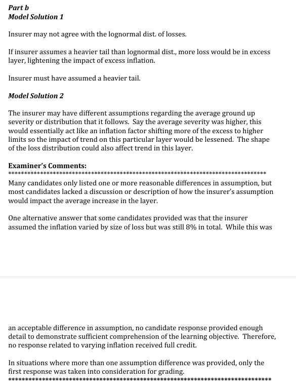

# 2012 Exam 8 - Q15 revised

**Points:** 1.75

## Question

An actuarial consulting firm is reviewing the inflation assumption used by a large insurer that writes casualty excess of loss coverage. The consulting firm has made the following assumptions regarding the insurer's excess casualty book:

| B | C |
| --- | --- |
| 8% | Overall inflation is 8.0% and is assumed to have the same multiplicative effect on each size of loss. |
| $5,890,000 | The unlimited, ground-up loss severity for the book of business follows a lognormal |

distribution with the expected loss equal to $5,890,000.

- The following limited average severities, based on a lognormal distribution, apply to the

insurer's excess casualty book:

| Per occurrence limit k | E[X;k] | E[X;k/1.08] |
| --- | --- | --- |
| $1,000,000 | 715,812 | 675,097 |
| $2,000,000 | 1,170,998 | 1,112,349 |
| $3,000,000 | 1,513,415 | 1,444,181 |
| $10,000,000 | 2,800,239 | 2,710,132 |
| $20,000,000 | 3,613,385 | 3,524,644 |
| $30,000,000 | 4,063,944 | 3,981,081 |
| $40,000,000 | 4,359,735 | 4,282,929 |
| $50,000,000 | 4,571,783 | 4,500,504 |

### Part a (1.00 pts)

Using the consulting firm's assumptions, calculate the average increase in excess losses due to inflation for a policy with a $10,000,000 limit attaching at $30,000,000.

### Part b (0.75 pts)

The insurer agrees with the consulting firm's overall trend assumption and general methodology, but believes that the average increase calculated in part (a) above is too high. Describe any differences in assumptions the insurer may have with the consulting firm.

## Solution

### Part a

**Tau_S:** 1.10 — `=(1+$B$8)*(E22-E21)/(D22-D21)`

**Trend rate:** 10.2% — `=C34-1`

### Part b

The insurer could have agreed that the overall inflation is 8%, but could have assumed a heavier tail in the loss distribution than the consulting firm. This would mean that there are more losses in excess of $30,000,000 than assumed by the consulting firm.

Since the overall inflation is essentially a weighted average of the inflation for the layer in excess of $30,000,000 and the inflation for the layer limited at $30,000,000, and the lower layer will have lower inflation than the total inflation of 8%, giving more weight to the excess layer but still having the same 8% overall inflation would imply a lower amount of inflation in the excess layer.

As an extreme example, if 99% of losses were in the excess layer and the overall inflation was 8%, then the excess layer inflation would clearly be very close to 8% as well.

## Examiner Report

Examiner Report Sample Solutions and Comments:

