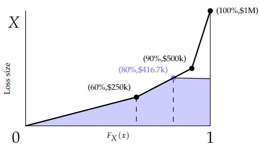

# 2014 Exam 8 - Q6 revised

**Points:** 2

## Question

Claim size for a book of business has the following distribution:

| B | C | E | F | G |
| --- | --- | --- | --- | --- |
| 60% | Probability of a loss between | $0 | and | $250,000 |
| 30% | Probability of a loss between | $250,000 | and | $500,000 |
| 10% | Probability of a loss between | $500,000 | and | $1,000,000 |

Losses are uniformly distributed within each range.

20% — Assume a 20% trend is applied uniformly to all losses.

Calculate the implied trend for aggregate

losses in the layer — $500,000 — excess of — $500,000 — .

## Solution

Here we want to obtain Tau_S - 1.

| Limit l | F(l) | E[X;l] | Using the diagram to the right below, you can visualize the claim size distribution by the thick line. |
| --- | --- | --- | --- |
| 416,666.67 | 0.80 | 225,000.00 | E[X;l] would be the area under the curve and below the value of l. |
| $500,000 | 0.90 | 237,500.00 | The diagram as shown shows the area with a limit of $416,667. |
| 833,333.33 | 0.97 | 259,722.22 | You can see the area can be calculated as the area of a triangle |
| $1,000,000 | 1.00 | 262,500.00 | plus the area of a trapezoid plus the area of a rectangle. |

Formulas

- `B21` = `=B22/(1+B12)`
- `C21` = `=B6+(B21-E7)/(G7-E7)*B7`
- `D21` = `=B$6*M6 + (C21-B$6)*(E$7+B21)/2 + (1-C21)*B21`
- `B22` = `=E15`
- `C22` = `=B6+B7`
- `D22` = `=SUMPRODUCT(B6:B7,M6:M7)+B8*B22`
- `B23` = `=B24/(1+B12)`
- `C23` = `=B6+B7+(B23-E8)/(G8-E8)*B8`
- `D23` = `=B6*M6 + B7*M7 + (C23-SUM(B6:B7))*(E8+B23)/2 + (1-C23)*B23`
- `B24` = `=E15+G15`
- `C24` = `=SUM(B6:B8)`
- `D24` = `=SUMPRODUCT(B6:B8,M6:M8)`

The area of a trapezoid is 0.5 * base * (height1 + height2).

Tau_S — 1.667 — `=(1+B12)*(D23-D21)/(D24-D22)` — We can use linear interpolation to get F(l) values since for each segment

of the distribution, we have a straight line with 2 known points.

**Trend rate::** 66.7% — `=C26-1`

Avg in range

$125,000 — `=AVERAGE(E6,G6)`

$375,000 — `=AVERAGE(E7,G7)`

$750,000 — `=AVERAGE(E8,G8)`

