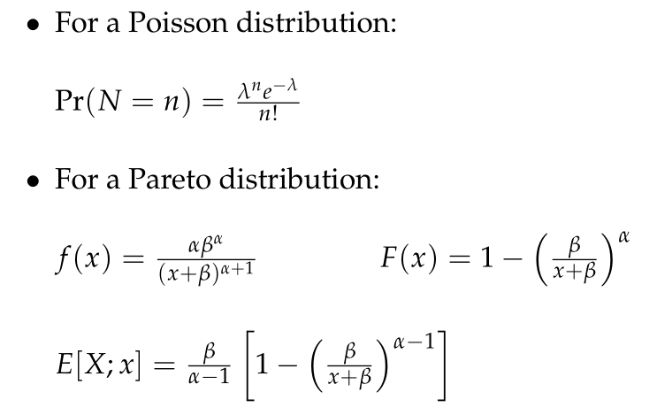
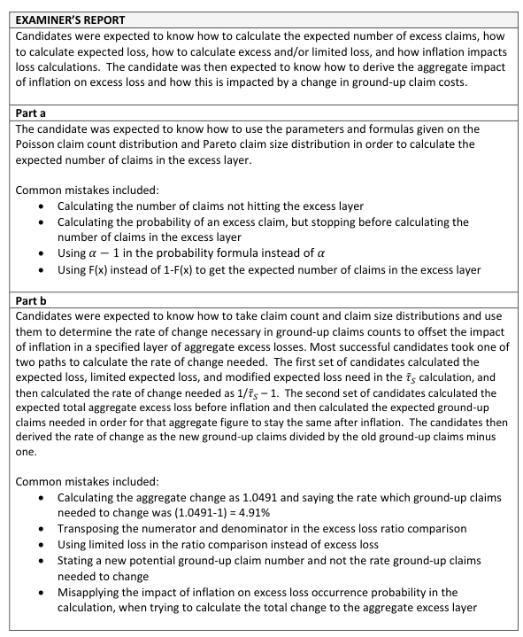

# 2018 Exam 8 - Q13

**Points:** 2.75

## Question

An insurance company observes the following ground-up claim experience for a book of business:

- Claim counts (N) follow a Poisson distribution
- Claim size (X) follows a Pareto distribution

| B | C |
| --- | --- |
| 5,000 | λ parameter for Claim count Poisson distribution |
| 2 | α parameter for Claims size Pareto distribution |
| 6,000 | β parameter for Claims size Pareto distribution |

The insurance company pays claims in excess of $10,000.

Given the following:

Formula sheet supplied with the question.

Poisson distribution:
$$\Pr(N = n) = \frac{\lambda^n e^{-\lambda}}{n!}$$

Pareto distribution:
$$f(x) = \frac{\alpha\beta^{\alpha}}{(x+\beta)^{\alpha+1}} \qquad F(x) = 1 - \left(\frac{\beta}{x+\beta}\right)^{\alpha}$$
$$E[X; x] = \frac{\beta}{\alpha-1}\left[1 - \left(\frac{\beta}{x+\beta}\right)^{\alpha-1}\right]$$

### Part a (0.75 pts)

$10,000 — Calculate the expected number of claims in excess of $10,000.

### Part b (2.00 pts)

Assume:

3% — Uniform annual inflation rate for claim size

Calculate the rate at which ground-up claim counts must change in order for there to be no change in expected annual total aggregate excess losses.

## Solution

### Part a

**F(10k):** 0.859 — `=1-(B11/(B32+B11))^B10`

**Exp counts above 10k:** 703.125 — `=(1-P3)*B9`

### Part b

There are a couple ways to think about this problem, so I'll show a few different solutions.

Solution 1: using Tau_S

Tau_S = Agg XS losses after inflation / Agg XS losses before inflation Tau_S = [GU counts * Pr(Loss above 10k after inflation) * Excess sev after inflation] / [GU counts * Pr(Loss above 10k before inflation) * Excess sev before inflation]

We can modify this to include the change in ground-up counts that will result in a value of 1 (i.e., no change in aggregate XS losses).

1 = [GU counts * Change in GU counts * Pr(Loss above 10k after inflation) * Excess sev after inflation] / [GU counts * Pr(Loss above 10k before inflation) * Excess sev before inflation] 1 = Change in GU counts * [GU counts * Pr(Loss above 10k after inflation) * Excess sev after inflation] / [GU counts * Pr(Loss above 10k before inflation) * Excess sev before inflation] 1 = Change in GU counts * Tau_S 1/Tau_S = Change in GU counts

| l | E[X;l] |
| --- | --- |
| 9,708.74 | $3,708 |
| $10,000 | $3,750 |
| infinity | 6,000 |

Formulas

- `M22` = `=M23/(1+B$37)`
- `N22` = `=N$24*(1-(B$11/(M22+B$11))^(B$10-1))`
- `M23` = `=B$32`
- `N23` = `=N$24*(1-(B$11/(M23+B$11))^(B$10-1))`
- `N24` = `=B$11/(B$10-1)`

**Tau_S:** 1.049 — `=(1+B37)*(N24-N22)/(N24-N23)`

**Change in GU counts:** -4.68% — `=1/O26-1`

Solution 2: using (conditional) excess severity and counts

| l | E[X;l] | F(l) |
| --- | --- | --- |
| 9,708.74 | $3,708 | 0.854 |
| $10,000 | $3,750 | 0.859 |
| infinity | 6,000 |  |

Formulas

- `M33` = `=M34/(1+B$37)`
- `N33` = `=N$35*(1-(B$11/(M33+B$11))^(B$10-1))`
- `O33` = `=1-(B$11/(M33+B$11))^B$10`
- `M34` = `=B$32`
- `N34` = `=N$35*(1-(B$11/(M34+B$11))^(B$10-1))`
- `O34` = `=1-(B$11/(M34+B$11))^B$10`
- `N35` = `=B$11/(B$10-1)`

| M | O |
| --- | --- |
| Excess sev before inflation | $16,000 |
| Excess sev after inflation | $16,180 |

Formulas

- `O37` = `=(N35-N34)/(1-O34)`
- `O38` = `=(1+B37)*(N35-N33)/(1-O33)`

**Excess sev change factor:** 1.01125 — `=O38/O37`

If we want no change in excess losses, then the change in excess counts has to offset the change in excess claim size.

## Examiner Report

Examiner Report Comments:

Change in XS counts — 0.989 — `=1/O40` — <--- to offset excess claim size change

**New expected XS counts:** 695.30 — `=O44*P5`

**New expected GU counts:** 4,766.00 — `=O46/(1-O33)`

**Change in GU counts:** -4.68% — `=O48/B9-1`

Solution 3: using unconditional severity and counts

| l | E[X;l] | F(l) |
| --- | --- | --- |
| 9,708.74 | $3,708 | 0.854 |
| $10,000 | $3,750 | 0.859 |
| infinity | 6,000 |  |

Formulas

- `M55` = `=M56/(1+B$37)`
- `N55` = `=N$57*(1-(B$11/(M55+B$11))^(B$10-1))`
- `O55` = `=1-(B$11/(M55+B$11))^B$10`
- `M56` = `=B$32`
- `N56` = `=N$57*(1-(B$11/(M56+B$11))^(B$10-1))`
- `O56` = `=1-(B$11/(M56+B$11))^B$10`
- `N57` = `=B$11/(B$10-1)`

| M | Q |
| --- | --- |
| Unconditional sev for layer before inflation | $2,250.00 |
| Unconditional sev for layer after inflation | $2,360.47 |

Formulas

- `Q59` = `=(N57-N56)`
- `Q60` = `=(1+B37)*(N57-N55)`

**Change in unconditional sev:** 1.049 — `=Q60/Q59`

If we want no change in excess losses, then the change in ground-up counts has to offset the change in unconditional claim size.

Change in GU counts — -4.68% — `=1/Q62-1` — <--- to offset claim size change

Solution 4: recognizing new Pareto parameters after inflation. Can be combined with any solution above, below shows solution 1 approach.

**After inflation, shifted Pareto has same alpha and new beta::** 6,180 — `=B11*(1+B37)`

| M | N |
| --- | --- |
| E[X;10k] | $3,750 |
| E[X] | 6,000 |
| E[X1;10k] | $3,820 |
| E[X1] | 6,180 |

Formulas

- `N72` = `=N$73*(1-(B$11/(10000+B$11))^(B$10-1))`
- `N73` = `=B$11/(B$10-1)`
- `N74` = `=N$75*(1-(R70/(10000+R70))^(B$10-1))`
- `N75` = `=R70/(B$10-1)`

**Tau_S:** 1.049 — `=(N75-N74)/(N73-N72)`

**Change in GU counts:** -4.68% — `=1/O77-1`
