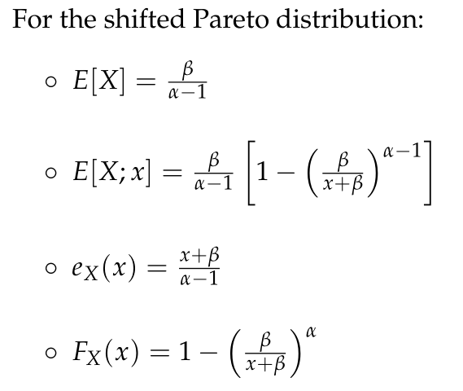
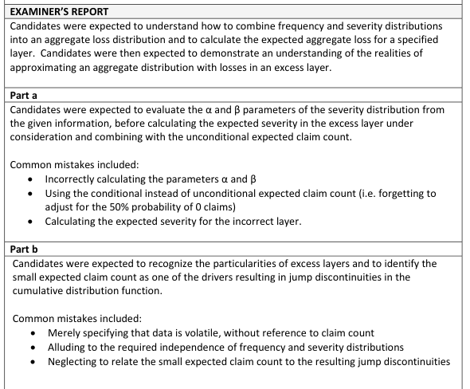

# 2019 Exam 8 - Q13 revised

**Points:** 2

## Question

For a given policy that provides first dollar coverage:

50% — Probability that no claims occur during the policy period

Given that a claim does occur, the frequency distribution is shown below:

| Number of Claims | Probability |
| --- | --- |
| 1 | 70% |
| 3 | 20% |
| 5 | 10% |

The claim-size variable X for this policy follows a shifted Pareto distribution with the following characteristics:

| B | C |
| --- | --- |
| 15,000 | eX(6,000) |
| 3,000 | E[X] |
| 1,433.30 | E[X;4,000] |

## Solution

### Part a

I assume the layer being referenced is the claim size layer, as the aggregate loss layer would be too complex. First we can solve for the Pareto parameters with the information given.

e(6000) = 6000/(alpha-1) + Beta/(alpha-1)=15000 Beta/(alpha-1) = E[X] = 3000. Plugging that in above:

6000/(alpha-1) + 3000=15000 Now we can solve for alpha, then Beta.

**Alpha:** 1.5 — `=6000/(B18-B19)+1`

**Beta:** 1,500 — `=B19*(M11-1)`

From here, we can calculate E[S] = E[N] * (E[X;5k] - E[X;4k]) It would be mathematically equivalent to calculate E[N_4k] * E[X_4k;1k], but those terms require us to also calculate F(4k), so it takes longer.

**E[X;5k]:** 1,558.85 — `=B19*(1-(M13/(5000+M13))^(M11-1))`

**E[N]:** 0.9 — `=(1-B6)*SUMPRODUCT(C11:C13,D11:D13)`

**Exp Agg Loss in Layer:** 112.99 — `=M20*(M18-B20)`

### Part b

With a per-claim limit, there will be discontinuities in the CDF for an aggregate distribution at any multiples of the per-claim limit. This issue is more pronounced for an excess layer since excess claim counts are small. This makes it difficult for a continuous distribution to provide a good fit around these discontinuities.

## Examiner Report

### Part a (1.50 pts)

Calculate the expected aggregate loss in the layer 1,000 excess of 4,000 for this policy.

### Part b (0.50 pts)

Explain one difficulty that can arise when trying to fit an aggregate loss distribution function to losses in an excess layer.

Examiner Report Comments:

