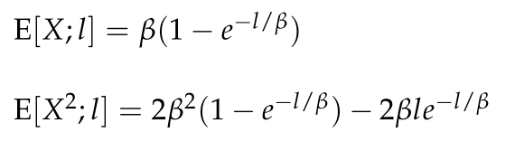

# Practice Problem 1 - Bahnemann Problem 5.1

## Question

The claim-size random variable X for a claim process has an exponential distribution. However, policy conditions limit claims to the layer between 1,000 and 3,000.

| B | C |
| --- | --- |
| 1,000 | Mean of claim-size distribution |
| 1,000 | Bottom of layer for policy |
| 3,000 | Top of layer for policy |
| 20 | Expected number of claims for the ground-up claim process |

You are also given the following formulas for the exponential distribution:

Exponential severity with mean $\beta$:

$$E[X; l] = \beta\left(1 - e^{-l/\beta}\right)$$
$$E[X^2; l] = 2\beta^2\left(1 - e^{-l/\beta}\right) - 2\beta l\,e^{-l/\beta}$$

### Part a

Compute the mean and variance of the layer claim size.

### Part b

Compute the expected number of layer claims.

### Part c

How do the policy conditions alter the coefficient of variation of the claim-size variable?

### Part d

Given the following additional information:

10% — Uniform inflation rate per annum

What is the annual percentage increase in the layer claim size? ... the layer claim count? ... the total layer aggregate loss?

## Solution

### Part a

For an exponential distribution with mean = β = 1,000, we have F(x) = 1 - exp(-x/1,000). In this problem, a = 1,000 (the bottom of the layer) and a + l = 3,000 (the top of the layer), so l = 3,000 - 1,000 = 2,000. In other words, this acts like a policy with a 1,000 retention and a 2,000 limit (or equivalently, a 1000 deductible and a 3000 limit).

| M | O |
| --- | --- |
| E[X;1000] | 632.12 |
| E[X;3000] | 950.21 |

Formulas

- `O7` = `=B8*(1-EXP(-B9/B8))`
- `O8` = `=B8*(1-EXP(-B10/B8))`

1 - F(1000) — 0.37 — `=1-EXPON.DIST(B9,1/B8,TRUE)` — Alternatively: — 0.37 — `=EXP(-B9/B8)`

**Mean for layer:** 864.7 — `=(O8-O7)/O10`

| M | O |
| --- | --- |
| E[X^2;1000] | 528,482.235314 |
| E[X^2;3000] | 1,601,703.453057 |

Formulas

- `O14` = `=2*B8^2*(1-EXP(-B9/B8))-2*B8*B9*EXP(-B9/B8)`
- `O15` = `=2*B8^2*(1-EXP(-B10/B8))-2*B8*B10*EXP(-B10/B8)`

**E[X^2 for layer]:** 1,187,988.30058 — `=(O15-O14-2*B9*(O8-O7))/O10`

**Variance for layer:** 440,343.228165 — `=O17-O12^2`

### Part b

Note that we want to find how many claims will contribute to the layer, NOT how many claims have a ground-up amount exactly in the interval. As such, all we care about is that a claim is at least 1,000 in size.

**E[N_a]:** 7.36 — `=B11*O10`

### Part c

The policy restrictions restrict the variability of claims, such that the coefficient of variation will be lower with the policy restrictions than the coefficient of variation for the unlimited claim size variable.

We can calculate the CV of the restricted claim size variable from the part (a) results as sqrt(440343) / 864.7 = 0.767. By comparison, an unlimited exponential distribution always has a CV of 1, which is clearly higher than the 0.767.

### Part d

| Limit l | E[X;l] | F(l) |
| --- | --- | --- |
| 909.09 | 597.11 | 0.597 |
| 2,727.27 | 934.60 |  |

Formulas

- `M34` = `=B9/(1+$B$33)`
- `N34` = `=$B$8*(1-EXP(-M34/$B$8))`
- `O34` = `=EXPON.DIST(M34,1/B8,TRUE)`
- `M35` = `=B10/(1+$B$33)`
- `N35` = `=$B$8*(1-EXP(-M35/$B$8))`

**Excess sev for layer after inflation:** 921.45 — `=(1+B33)*(N35-N34)/(1-O34)`

**% increase in expected layer claim size:** 6.57% — `=R37/O12-1`

**% increase in expected layer claim counts:** 9.52% — `=(1-O34)/O10-1`

**% increase in exp agg layer losses:** 16.71% — `=(1+R39)*(1+R41)-1`
