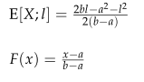
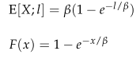
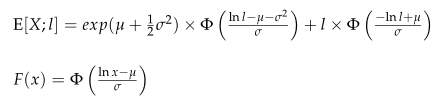

# Practice Problem 2 - Bahnemann Problem 5.2

## Question

Compute eX(3,000) for the following distributions of X.

For all distributions:

2,000 — E[X]

### Part a

Uniform distribution on [a,b]

| B | C |
| --- | --- |
| 0 | a for uniform distribution |
| 4,000 | b for uniform distribution |

For the uniform distribution, you are given that:

Uniform severity on $(a, b)$:

$$E[X; l] = \frac{2bl - a^2 - l^2}{2(b-a)} \qquad F(x) = \frac{x-a}{b-a}$$

### Part b

Exponential distribution with:

2,000 — β for exponential distribution

For the exponential distribution, you are given that:

Exponential severity with mean $\beta$:

$$E[X; l] = \beta\left(1 - e^{-l/\beta}\right) \qquad F(x) = 1 - e^{-x/\beta}$$

### Part c

Shifted Pareto distribution with:

| B | C |
| --- | --- |
| 3 | α for Shifted Pareto distribution |
| 4,000 | β for Shifted Pareto distribution |

For the Shifted Pareto distribution, you are given that:

Pareto severity with parameters $\alpha, \beta$:

$$E[X; l] = \frac{\beta}{\alpha-1}\left(1 - \left(\frac{\beta}{l+\beta}\right)^{\alpha-1}\right) \qquad F(x) = 1 - \left(\frac{\beta}{x+\beta}\right)^{\alpha}$$

### Part d

Lognormal distribution with:

| B | C |
| --- | --- |
| 5.9809 | μ for lognormal distribution |
| 1.8000 | σ for lognormal distribution |

For the lognormal distribution, you are given that:

Lognormal severity with parameters $\mu, \sigma$:

$$E[X; l] = e^{\mu + \frac{1}{2}\sigma^2}\times \Phi\!\left(\frac{\ln l - \mu - \sigma^2}{\sigma}\right) + l \times \Phi\!\left(\frac{-\ln l + \mu}{\sigma}\right)$$
$$F(x) = \Phi\!\left(\frac{\ln x - \mu}{\sigma}\right)$$

| B | C |
| --- | --- |
| 0.130 | Φ(-1.125) |
| 0.250 | Φ(-0.675) |
| 0.870 | Φ(1.125) |

## Solution

### Part a

3,000

**F(3000):** 0.75 — `=(H2-B13)/(B14-B13)`

**E[X;3000]:** 1,875 — `=(2*B14*H2-B13^2-H2^2)/(2*(B14-B13))`

**e_x(3000):** 500 — `=($B$8-J6)/(1-J4)`

### Part b

Note that the exponential distribution has the property that the excess claim size and unlimited claim size have the same distribution, so we already know that we'll end up with a mean of 2,000.

F(3000) — 0.77687 — `=1-EXP(-H2/B27)` — Alternatively: — 0.77687 — `=EXPON.DIST(H2,1/B27,TRUE)`

**E[X;3000]:** 1,553.73968 — `=B27*J13`

**e_x(3000):** 2,000 — `=($B$8-J15)/(1-J13)`

### Part c

**F(3000):** 0.813411 — `=1-(B40/(H2+B40))^B39`

**E[X;3000]:** 1,346.938776 — `=(B40/(B39-1))*(1-(B40/(H2+B40))^(B39-1))`

**e_x(3000):** 3,500 — `=($B$8-J21)/(1-J19)`

### Part d

F(3000) — 0.870 — `=B68` — For F(x) calc: — 1.125 — `=(LN(H2)-B54)/B55` — Alternatively, get F(3000) as:

E[X;3000] — 889.99877 — `=EXP(B54+0.5*B55^2)*B67+H2*B66` — For E[X;l] calc: — -0.675 — `=(LN(H2)-B54-B55^2)/B55` — -1.12526 — `=(-LN(H2)+B54)/B55`

**e_x(3000):** 8,538.470998 — `=($B$8-J27)/(1-J25)`

0.870 — `=LOGNORM.DIST(H2,B54,B55,TRUE)`
