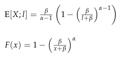

# Practice Problem 6 - Bahnemann Problem 5.22 revised

## Question

Claim-size X has a shifted Pareto distribution with the following:

| B | C |
| --- | --- |
| 3 | α for Shifted Pareto distribution |
| 9,000 | β for Shifted Pareto distribution |

Pareto severity with parameters $\alpha, \beta$:

$$E[X; l] = \frac{\beta}{\alpha-1}\left(1 - \left(\frac{\beta}{l+\beta}\right)^{\alpha-1}\right) \qquad F(x) = 1 - \left(\frac{\beta}{x+\beta}\right)^{\alpha}$$

The annual claim size inflation rate is given as:

10% — Uniform inflation rate per annum

Calculate the effective inflation rate on the excess aggregate loss for each of the following excess layers.

### Part a

| B | C |
| --- | --- |
| 3,000 | bottom of layer a |
| 5,000 | top of layer a+l |

### Part b

| B | C |
| --- | --- |
| 3,000 | bottom of layer a |
| 8,000 | top of layer a+l |

## Solution

### Part a

Here we want Tau_S since the question asked about the inflation on excess aggregate loss.

| limit | E[X;limit] |   |   |
| --- | --- | --- | --- |
| 2,727.27 | 1,849.65 | Tau_S | 1.087 |
| 3,000 | 1,968.75 | Effective inflation rate | 8.7% |
| 4,545.45 | 2,513.40 |  |  |
| 5,000 | 2,640.31 |  |  |

Formulas

- `H7` = `=H8/(1+B18)`
- `I7` = `=($B$7/($B$6-1))*(1-($B$7/(H7+$B$7))^($B$6-1))`
- `L7` = `=(1+B18)*(I9-I7)/(I10-I8)`
- `H8` = `=B24`
- `I8` = `=($B$7/($B$6-1))*(1-($B$7/(H8+$B$7))^($B$6-1))`
- `L8` = `=L7-1`
- `H9` = `=H10/(1+B18)`
- `I9` = `=($B$7/($B$6-1))*(1-($B$7/(H9+$B$7))^($B$6-1))`
- `H10` = `=B25`
- `I10` = `=($B$7/($B$6-1))*(1-($B$7/(H10+$B$7))^($B$6-1))`

### Part b

| H | I | K | L |
| --- | --- | --- | --- |
| limit | E[X;limit] | Tau_S | 1.103 |
| 7,272.73 | 3,123.50 | Effective inflation rate | 10.3% |
| 8,000 | 3,238.75 |  |  |

Formulas

- `L12` = `=(1+B18)*(I13-I7)/(I14-I8)`
- `H13` = `=H14/(1+B18)`
- `I13` = `=($B$7/($B$6-1))*(1-($B$7/(H13+$B$7))^($B$6-1))`
- `L13` = `=L12-1`
- `H14` = `=B29`
- `I14` = `=($B$7/($B$6-1))*(1-($B$7/(H14+$B$7))^($B$6-1))`

