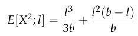

# 2001 Exam 9 - Q37 revised

**Points:** 1

## Question

One method for calculating risk loads is to use variance as a measure for risk. Based on this method, answer the following question.

Assume no other costs besides loss and the risk load.

Assume the claim frequency is Poisson. Assume the severity distribution is uniform between $0 and $1,000,000.

For a uniform distribution on the interval [0,b], you are given:

Limited second moment (uniform on $(0, b)$):

$$E[X^2; l] = \frac{l^3}{3b} + \frac{l^2(b-l)}{b}$$

| B | C |
| --- | --- |
| 0.01 | Mean of Poisson claim frequency distribution |
| $0 | Bottom of uniform severity distribution |
| $1,000,000 | Top of uniform severity distribution |
| $3,750 | Risk load for a policy with a limit of: |

What is the risk load for a policy with a $1,000,000 limit? Show all work.

$500,000

## Solution

The general variance formula for a risk load is ρ(l) = k(E[X^2;l] + δ(E[X;l])^2)

Since frequency is Poisson, δ=0, and we just have ρ(l) = kE[X^2;l]

We are given ρ(500k) = 3750, and we can calculate E[X^2;500k], so we can use these 2 pieces of info to solve for k.

Then we can compute ρ(1M) using the k and E[X^2;1M]

| l | E[X^2;l] |
| --- | --- |
| $500,000 | $166,666,666,667 |
| $1,000,000 | $333,333,333,333 |

Formulas

- `I11` = `=F21`
- `J11` = `=I11^3/(3*B$20)+(I11^2*(B$20-I11)/B$20)`
- `J12` = `=I12^3/(3*B$20)+(I12^2*(B$20-I12)/B$20)`

**k:** 0.0000000225 — `=B21/J11`

**risk load for 1M limit:** $7,500 — `=J14*J12`
