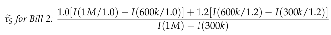

# 2005 Exam 9 - Q10

**Points:** 4

## Question

The State Actuarial Reinsurance Company covers $700,000 in excess of $300,000 for each actuarial liability claim in state XYZ. An analysis performed last year indicates that the following set of increased limit factors is appropriate to use for actuarial liability:

| Policy Limit | Increased Limit Factor |
| --- | --- |
| $100,000 | 1.000 |
| $250,000 | 1.499 |
| $272,727 | 1.558 |
| $300,000 | 1.625 |
| $500,000 | 2.036 |
| $545,455 | 2.116 |
| $600,000 | 2.207 |
| $833,333 | 2.552 |
| $909,091 | 2.652 |
| $1,000,000 | 2.766 |

The state legislature is considering two bills for actuarial liability in state XYZ:

| B | C |
| --- | --- |
| 10% | • Bill 1 would result in a 10% increase of the amounts of all claims. |
| 20% | • Bill 2 would result in a 20% increase of the amounts of all claims valued less than $600,000 |

under the current law, subject to a $600,000 maximum. Under Bill 2 the amounts of all claims valued $600,000 or more would not change.

### Part a (3.00 pts)

Based on the information above, evaluate the impact of each bill on the losses paid by the State Actuarial Reinsurance Company.

### Part b (1.00 pts)

If the state legislature approved Bill 2 and changed the basic limit from $100,000 to $300,000, what would be the new increased limit factor at $1,000,000?

## Solution

### Part a

For both bills, the impact will be the change in aggregate losses (Tau_S). We can express this in terms of ILFs by dividing all terms by E[X;b]:

| l | I(l) | l/tau | I(l/tau) |
| --- | --- | --- | --- |
| $300,000 | 1.625 | $272,727 | 1.558 |
| $1,000,000 | 2.766 | $909,091 | 2.652 |

Formulas

- `M10` = `=C12`
- `N10` = `=L10/(1+$B$22)`
- `O10` = `=C11`
- `L11` = `=L10+700000`
- `M11` = `=C18`
- `N11` = `=L11/(1+$B$22)`
- `O11` = `=C17`

**Impact of Bill 1::** 5.5% — `=(1+$B$22)*(O11-O10)/(M11-M10) - 1`

For Bill 2, there is no inflation in the layer from 600k to 1M, but there is 20% inflation in the layer from 300k to 600k.

| l | I(l) | l/tau | I(l/tau) |
| --- | --- | --- | --- |
| $300,000 | 1.625 | $250,000 | 1.499 |
| $600,000 | 2.207 | $500,000 | 2.036 |

Formulas

- `M22` = `=M10`
- `N22` = `=L22/(1+$B$23)`
- `O22` = `=C10`
- `M23` = `=C15`
- `N23` = `=L23/(1+$B$23)`
- `O23` = `=C13`

**Impact of Bill 2::** 5.5% — `=((M11-M23)+(1+$B$23)*(O23-O22))/(M11-M10) - 1`

### Part b

The numerator here is the same as for bill 2 above, except that we are looking at ground-up losses instead of losses above 300k so we remove the I(300k/1.2) term. For the denominator, we need to use 1.2*I(300k/1.2) because we want the ILF relative to the new basic limit of 300k after inflation.

**New I(1M):** 1.669 — `=((M11-M23)+(1+$B$23)*O23)/((1+$B$23)*O22)`
