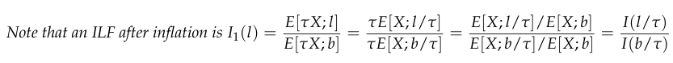
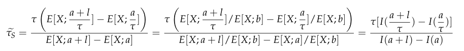

# 2009 Exam 9 - Q17

**Points:** 2

## Question

An actuary has derived the following table of increased limits factors:

| Policy Limit | Increased Limit Factor (ILF) |
| --- | --- |
| 96,154 | 0.972 |
| 100,000 | 1.000 |
| 104,000 | 1.025 |
| 480,769 | 1.738 |
| 500,000 | 1.750 |
| 520,000 | 1.761 |
| 961,538 | 2.236 |
| 1,000,000 | 2.240 |
| 1,040,000 | 2.244 |

4% — Annual inflation rate

### Part a (1.25 pts)

Calculate updated Increased Limit Factors based on one year of inflation at 4% for the limits of $500,000 and $1,000,000.

### Part b (0.75 pts)

Calculate the expected percentage increase in losses for the limit $500,000 excess of $500,000 for a policyholder who purchases the same limits of insurance one year later.

## Solution

### Part a

| l | l/tau | I(l/tau) | I_1(l) |
| --- | --- | --- | --- |
| $100,000 | $96,154 | 0.972 |  |
| $500,000 | $480,769 | 1.738 | 1.788 |
| $1,000,000 | $961,538 | 2.236 | 2.300 |

Formulas

- `K7` = `=J7/(1+$B$17)`
- `L7` = `=C7`
- `K8` = `=J8/(1+$B$17)`
- `L8` = `=C10`
- `M8` = `=L8/L7`
- `K9` = `=J9/(1+$B$17)`
- `L9` = `=C13`
- `M9` = `=L9/L7`

### Part b

**Expected % increase::** 5.7% — `=(1+$B$17)*(L9-L8)/(C14-C11) - 1`
