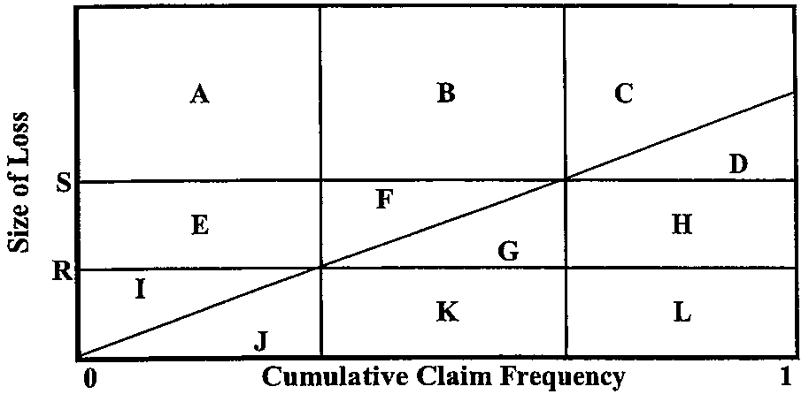

# 2009 Exam 9 - Q24

**Points:** 2

## Question

The following graph applies to a cumulative size-of-loss distribution function. A,B, ..., L are the areas of the enclosed regions. R and S are limits.

**Lee diagram.** Vertical axis = Size of Loss, horizontal axis = Cumulative Claim Frequency running 0 to 1. A diagonal loss-size line rises from the origin to the top-right. Two horizontal lines mark sizes $R$ (lower) and $S$ (upper), and two vertical lines split the frequency axis into three bands, giving twelve labelled regions:

- Above $S$: **A** (left band), **B** (middle), **C** (right), with **D** the sliver right of the diagonal at level $S$.
- Between $R$ and $S$: **E** (left), **F** (just above the diagonal, middle), **G** (below/right of the diagonal, middle), **H** (right).
- Below $R$: **I** (left, above the diagonal), **J** (left, below), **K** (middle), **L** (right).

Area below the diagonal = losses; area above = the complement.

### Part a (1.00 pts)

Express the expected loss algebraically using the area labels provided in the graph.

### Part b (1.00 pts)

R is the basic limit with an increased limit factor of 1.0. Express the increased limit factor for coverage limit S algebraically using the area labels provided in the graph.

## Solution

### Part a

Solution 1: assume no limits/retentions

I assume no retention/limits are applied.

Expected Loss is area D+G+H+J+K+L

Solution 2: assume layer between R and S

I assume question is about layer from R to S.

Expected Loss is area G+H

### Part b

ILF = (G+H+J+K+L) / (J+K+L)
