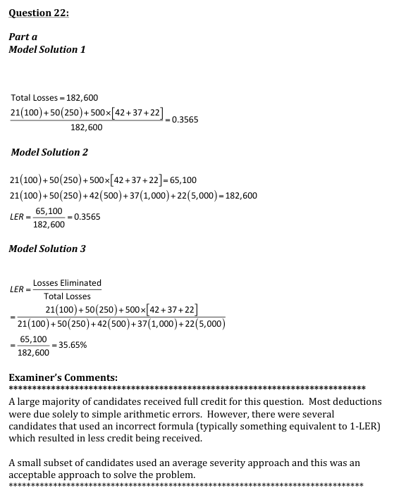
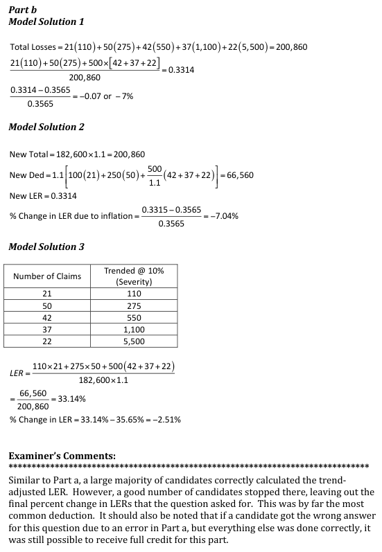
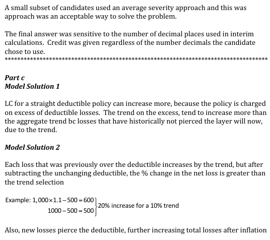
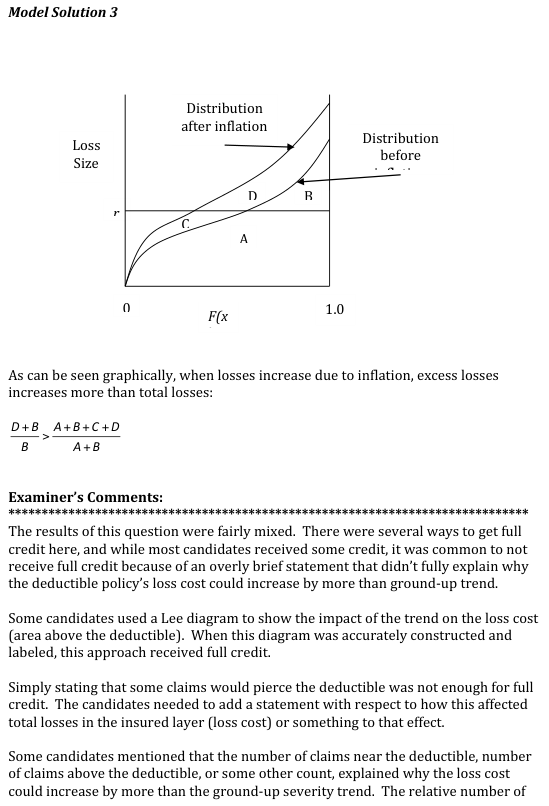
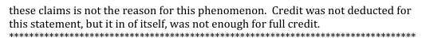

# 2012 Exam 8 - Q22

**Points:** 3

## Question

The current deductible pricing for an auto insurer is based on the following claim distribution:

| Size of Loss | Number of Claims |
| --- | --- |
| $100 | 21 |
| $250 | 50 |
| $500 | 42 |
| $1,000 | 37 |
| $5,000 | 22 |

An actuary wants to review the effect of loss trend on the insurer's loss elimination ratios.

### Part a (1.00 pts)

Calculate the loss elimination ratio for a straight $500 deductible assuming no trend adjustment.

### Part b (1.50 pts)

You are additionally given:

10% — Ground-up loss severity trend

Assuming no frequency trend, calculate the percentage change in the loss elimination ratio for a straight $500 deductible.

### Part c (0.50 pts)

Explain why the loss cost for a given straight deductible policy can increase more than the ground-up severity trend.

## Solution

Loss eliminated per claim by deductible

| no trend | with trend |
| --- | --- |
| $100 | $110 |
| $250 | $275 |
| $500 | $500 |
| $500 | $500 |
| $500 | $500 |

Formulas

- `J7` = `=MIN(B7,500)`
- `L7` = `=MIN(B7*(1+$B$21),500)`
- `J8` = `=MIN(B8,500)`
- `L8` = `=MIN(B8*(1+$B$21),500)`
- `J9` = `=MIN(B9,500)`
- `L9` = `=MIN(B9*(1+$B$21),500)`
- `J10` = `=MIN(B10,500)`
- `L10` = `=MIN(B10*(1+$B$21),500)`
- `J11` = `=MIN(B11,500)`
- `L11` = `=MIN(B11*(1+$B$21),500)`

### Part a

**LER:** 35.7% — `=SUMPRODUCT(J7:J11,C7:C11)/SUMPRODUCT(B7:B11,C7:C11)`

### Part b

**LER:** 33.1% — `=SUMPRODUCT(L7:L11,C7:C11)/((1+$B$21)*SUMPRODUCT(B7:B11,C7:C11))`

**% chg in LER:** -7.1% — `=(L15-L13)/L13`

### Part c

This was also covered on exam 5 when talking about trends for excess layers exceeding ground-up trends.

For claims above the deductible, the trend is entirely in the excess layer.

For example, if you have a 1,000 loss before inflation and a 500 deductible, then the net loss is 1,000 - 500 = 500

After 10% inflation, the ground-up loss becomes (1,000)(1.1) = 1,100, and the new net loss is 1,100 - 500 = 600

600 / 500 - 1 = 20%, which is greater than the 10% inflation.

Also, claims just under the deductible are pushed into the excess layer by the trend, creating new losses for the excess layer.

## Examiner Report

Examiner Report Solutions and Comments:

