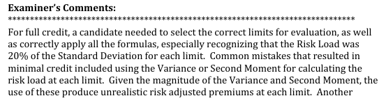
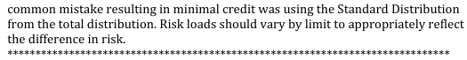

# 2013 Exam 8 - Q6

**Points:** 2

## Question

Given the following information:

| Amount of Loss | Probability of Loss |
| --- | --- |
| $0 | 80% |
| $100,000 | 15% |
| $500,000 | 5% |

| B | C |
| --- | --- |
| $200,000 | Basic limit |
| 20% | The actuary selects 20% of the standard deviation as the risk load. |

- Assume there are no expenses.

$400,000 — Policy limit being priced

Calculate the risk-loaded increased limit factor for a policy limit of $400,000.

## Solution

Note that the table gives a pure premium distribution, not a severity distribution, which is evident given the 80% chance of no losses. So the $100k and $500k in the table represent the total losses from all claims. Furthermore, the limits we are discussing must be aggregate limits, not per-claim limits (since we don't have per-claim data), so we aren't using the per-claim risk load formulas from the lessons. Instead, since the question says there are no expenses, the premium for a policy will just consist of the expected loss cost plus the risk load:

Prem_L = E[S;L] + 10% × Stdev[S;L]

| Limit L | E[S;L] | E[S^2;L] | Stdev[S;L] | Prem for limit L | Risk-loaded ILF for L |
| --- | --- | --- | --- | --- | --- |
| $200,000 | 25,000 | 3,500,000,000 | 53,619.03 | 35,723.81 |  |
| $400,000 | 35,000 | 9,500,000,000 | 90,967.03 | 53,193.41 | 1.489 |

Formulas

- `B29` = `=B11`
- `C29` = `=SUMPRODUCT($D$7:$D$9,$J$7:$J$9)`
- `D29` = `=SUMPRODUCT($D$7:$D$9,$L$7:$L$9)`
- `E29` = `=SQRT(D29-C29^2)`
- `F29` = `=C29+$B$12*E29`
- `B30` = `=B16`
- `C30` = `=SUMPRODUCT($D$7:$D$9,$K$7:$K$9)`
- `D30` = `=SUMPRODUCT($D$7:$D$9,$M$7:$M$9)`
- `E30` = `=SQRT(D30-C30^2)`
- `F30` = `=C30+$B$12*E30`
- `G30` = `=F30/F29`

| basic | increased | basic^2 | increased^2 |
| --- | --- | --- | --- |
| $0 | $0 | $0 | $0 |
| $100,000 | $100,000 | $10,000,000,000 | $10,000,000,000 |
| $200,000 | $400,000 | $40,000,000,000 | $160,000,000,000 |

Formulas

- `J7` = `=MIN(C7,$B$11)`
- `K7` = `=MIN(C7,$B$16)`
- `L7` = `=J7^2`
- `M7` = `=K7^2`
- `J8` = `=MIN(C8,$B$11)`
- `K8` = `=MIN(C8,$B$16)`
- `L8` = `=J8^2`
- `M8` = `=K8^2`
- `J9` = `=MIN(C9,$B$11)`
- `K9` = `=MIN(C9,$B$16)`
- `L9` = `=J9^2`
- `M9` = `=K9^2`

## Examiner Report

Examiner Report Comments:

