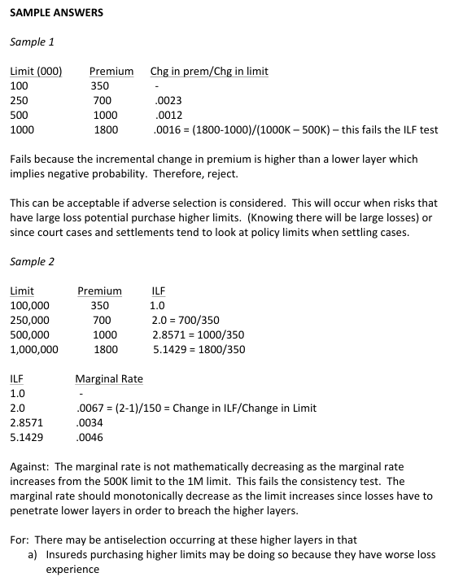
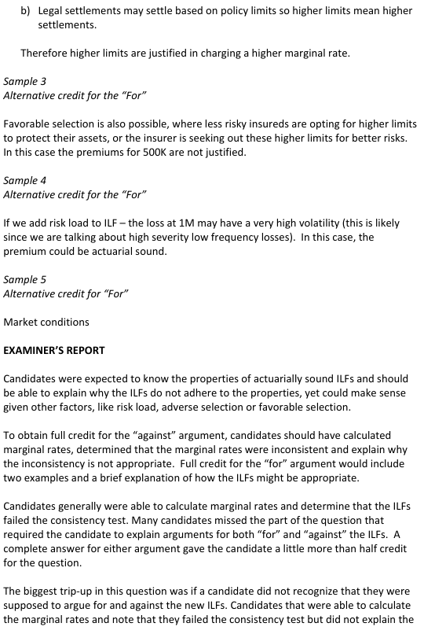
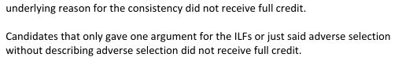

# 2014 Exam 8 - Q7

**Points:** 1.75

## Question

An insurer currently offers the following coverage limits at actuarially sound premiums.

| Limit | Premium |
| --- | --- |
| $100,000 | $350 |
| $250,000 | $700 |

Next year, underwriting would like to offer additional coverage options. The following premiums are under actuarial review.

| Limit | Premium |
| --- | --- |
| $500,000 | $1,000 |
| $1,000,000 | $1,800 |

Argue for and against the actuarial soundness of these new premiums as they relate to the

## Solution

| Limit l | ILF | I'(l) | Optional I''(l) rescaled |
| --- | --- | --- | --- |
| $100,000 | 1.00 |  |  |
| $250,000 | 2.00 | 0.0000067 |  |
| $500,000 | 2.86 | 0.0000034 | -0.13 |
| $1,000,000 | 5.14 | 0.0000046 | 0.02 |

Formulas

- `I5` = `=C7`
- `J5` = `=D7/D7`
- `I6` = `=C8`
- `J6` = `=D8/D7`
- `K6` = `=(J6-J5)/(I6-I5)`
- `I7` = `=C14`
- `J7` = `=D14/D7`
- `K7` = `=(J7-J6)/(I7-I6)`
- `L7` = `=(K7-K6)/(I7-I6)*10000000000`
- `I8` = `=C15`
- `J8` = `=D15/D7`
- `K8` = `=(J8-J7)/(I8-I7)`
- `L8` = `=(K8-K7)/(I8-I7)*10000000000`

Against: the premium for the $1M limit fails the consistency test since I''(1M) > 0. This implies negative probabilities in the claim size distribution (i.e., f(x) < 0 for some values of x), which doesn't make sense.

For: if insureds with higher loss potential were more inclined to buy higher limits (1M in this case), or jury verdicts were larger for larger limits, then ILFs could fail I''(l) <= 0 and still be reasonable.

## Examiner Report

lower-limit options.

Examiner Report Solutions and Comments:

