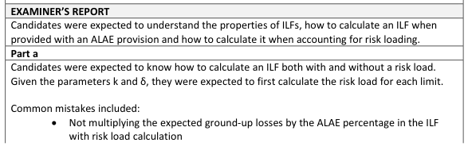
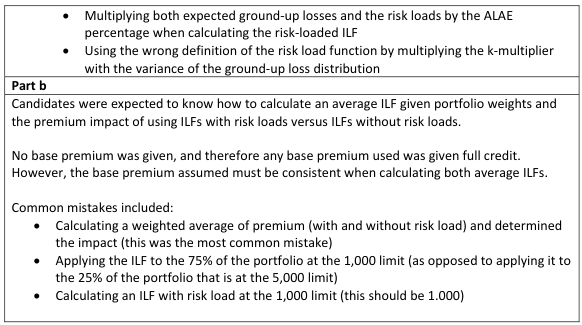

# 2017 Exam 8 - Q7

**Points:** 1.75

## Question

Given the following information:

| B | C |
| --- | --- |
| 15% | Allocated loss adjustment expense as a percent of the indemnity amount |
| 0.000064 | The variance method has been selected to include a risk load in the Increased Limits Factors |
| 0 | (ILFs) with k = 0.000064 and δ = 0. |

| Limit, l | E[X;l] | E[X^2;l] |
| --- | --- | --- |
| 1,000 | 840 | 790,123 |
| 5,000 | 2,485 | 9,467,456 |

### Part a (1.00 pts)

Calculate the following:

- The risk loads for each limit.
- The ILF with and without risk load for the 5,000 limit.

### Part b (0.75 pts)

Assuming portfolio weights of 75% for a 1,000 limit and 25% for a 5,000 limit, determine the overall impact on premium by using the ILFs with the risk loads instead of the ILFs without

## Solution

### Part a

Although not stated, obviously the basic limit must be 1,000. Note that the ALAE cancels out for the ILF without risk load, but it does not cancel out when we calculate the risk-loaded ILF.

I(5k) without risk load

The general variance formula for a risk load is ρ(l) = k(E[X^2;l] + δ(E[X;l])^2) Since δ=0, and we just have ρ(l) = kE[X^2;l]

risk load for 1k risk load for 5k

I(5k) with risk load

### Part b

Avg ILF without risk load Avg ILF with risk load

Prem chg from using risk loaded ILFs

2.958 — `=D12/D11`

50.57 — `=$B$7*E11`

605.92 — `=$B$7*E12`

3.407 — `=(D12*(1+$B$6)+O11)/(D11*(1+$B$6)+O10)`

1.490 — `=0.75*1+0.25*O5`

1.602 — `=0.75*1+0.25*O13`

7.5% — `=O16/O15-1`

## Examiner Report

risk loads.

Examiner Report Comments:

