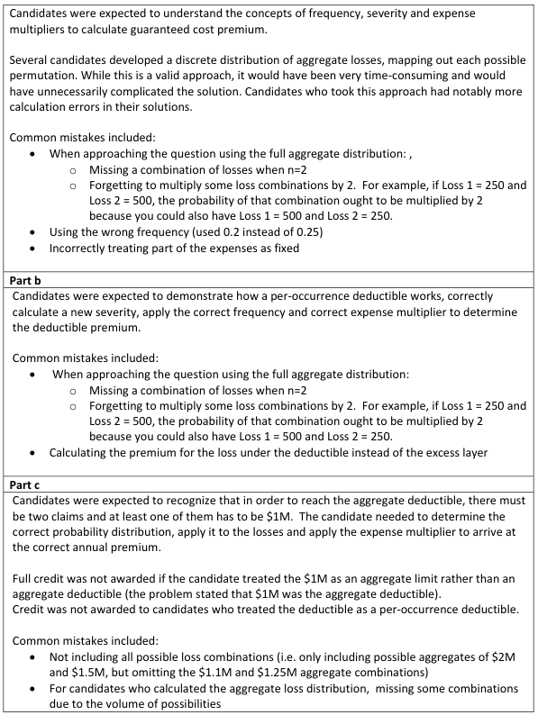
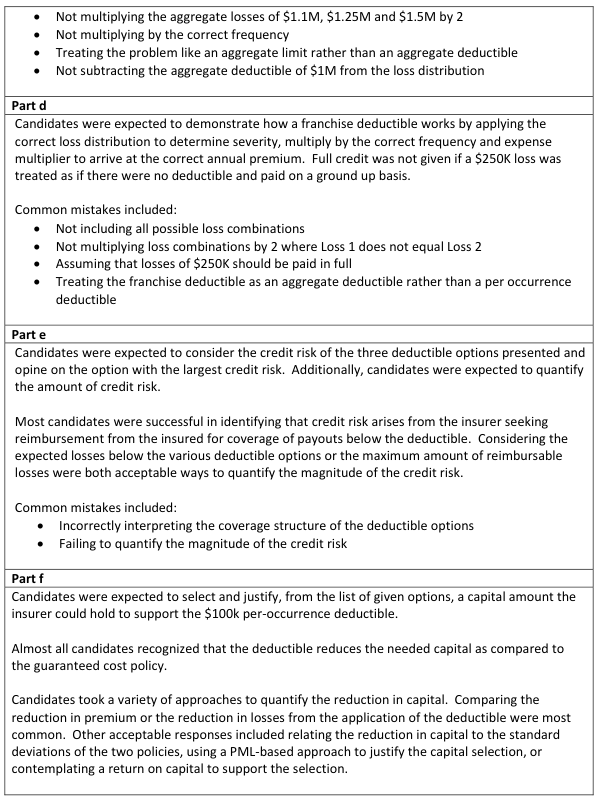
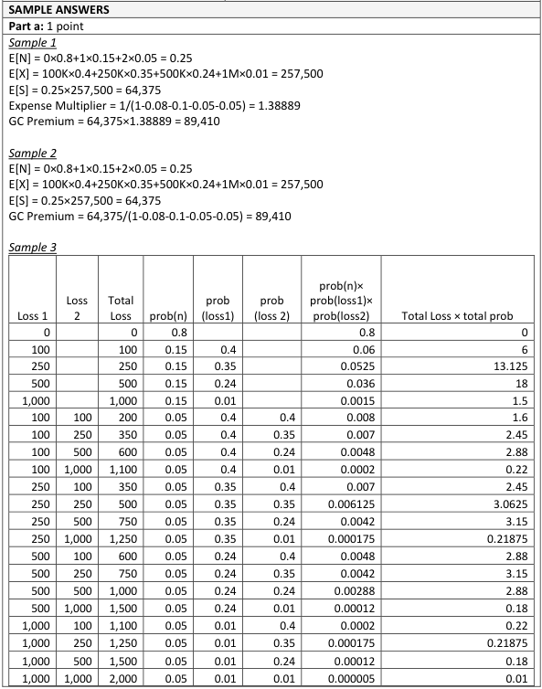
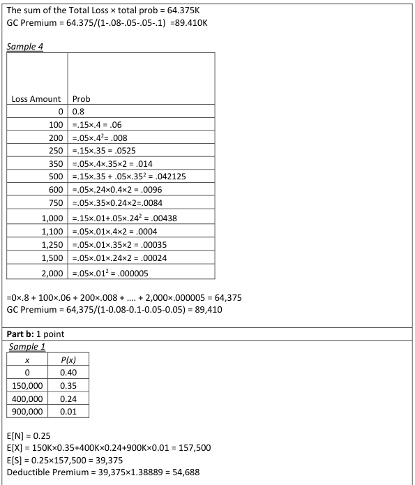
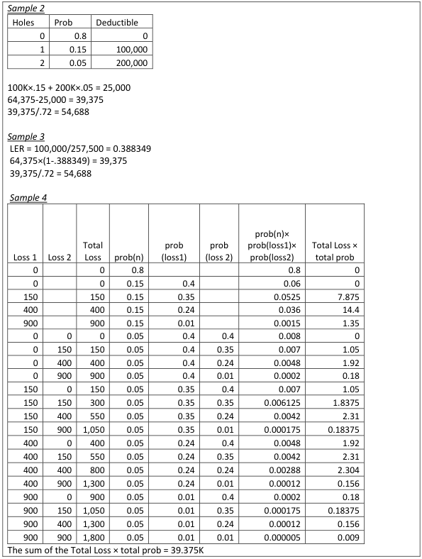
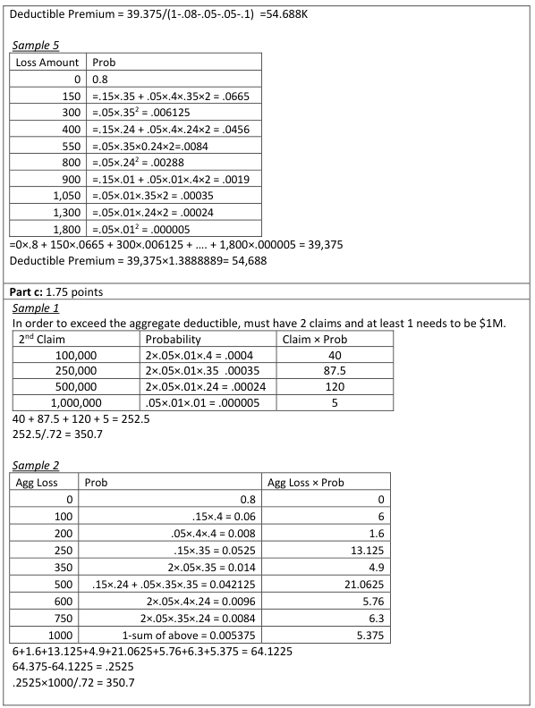
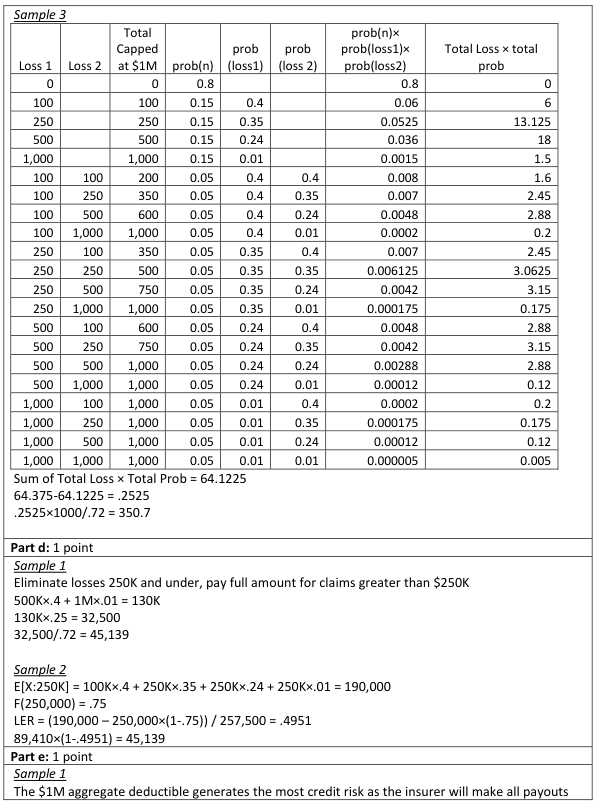
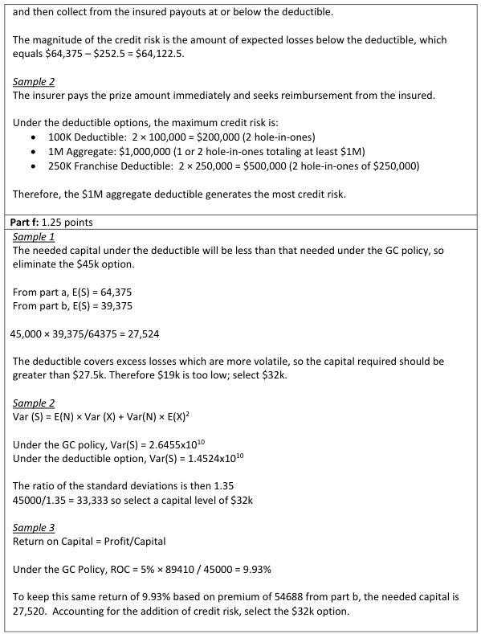
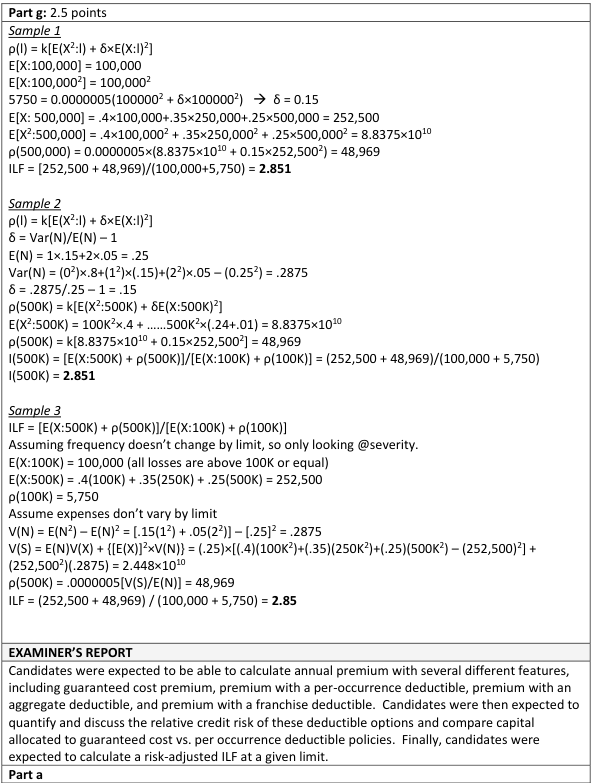
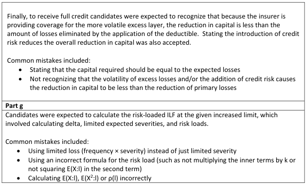

# 2018 Exam 8 - Q2

**Points:** 9.5

## Question

A certain golf course holds a series of tournaments throughout the year, during which prizes are awarded if a player hits a hole-in-one. The prize amounts vary based on the difficulty of the hole, but are consistent across tournaments.

The course has approached an insurer to design a policy which would protect the course from large prize payouts. The insurer would pay the full prize amount directly to the winning player, and seek recoveries of any applicable deductible from the golf course.

A single annual policy will cover all of the tournaments throughout a given year.

The total number of holes-in-one in a given year (n), across all tournaments, has the following probability distribution:

| n | P(n) |
| --- | --- |
| 0 | 0.80 |
| 1 | 0.15 |
| 2 | 0.05 |
| 3 or more | 0.00 |

Given that a hole-in-one has occurred, the prize amount (x) has the following probability distribution:

| x | P(x) |
| --- | --- |
| $100,000 | 0.40 |
| $250,000 | 0.35 |
| $500,000 | 0.24 |
| $1,000,000 | 0.01 |

The expenses and profit for this policy are:

| None | Fixed Expenses |
| --- | --- |
| 8% | General Expenses as a % of premium |
| 10% | Commission as a % of premium |
| 5% | Taxes as a % of premium |
| 5% | Underwriting Profit as a % of premium |

The above assumptions apply to all program structures.

### Part a (1.00 pts)

Calculate the annual guaranteed cost premium for this policy.

### Part b (1.00 pts)

Calculate the annual premium for this policy with the following deductible:

$100,000 — Per-occurrence deductible

### Part c (1.75 pts)

Calculate the annual premium for this policy with the following deductible structure:

| B | C |
| --- | --- |
| $1,000,000 | Annual aggregate deductible |
| None | Per-occurrence deductible |

### Part d (1.00 pts)

Calculate the annual premium for this policy with the following deductible:

$250,000 — Franchise deductible

### Part e (1.00 pts)

Explain which of the deductible structures above would generate the greatest credit risk to the insurer, and estimate the magnitude of that risk.

### Part f (1.25 pts)

The insurer has allocated $45,000 of capital to support the guaranteed cost policy in part (a) above.

Recommend and justify which of the three options below would be the most appropriate capital requirement to support the per-occurrence deductible policy in part (b) above:

i. $45,000

ii. $32,000

iii. $19,000

### Part g (2.50 pts)

Based on the success of this program, the insurer wishes to expand this coverage to other golf courses.

The insurer will offer varying per occurrence limits with no aggregate limits, the prize amounts would remain the same, and the same distribution assumptions would apply.

Use the variance method with the additional information below to calculate the risk-loaded ILF for a $500,000 policy limit.

| B | C |
| --- | --- |
| $100,000 | Basic limit |
| $500,000 | Policy limit |
| 5,750 | ρ(100,000) |
| 0.0000005 | k |

x

$100,000

$250,000

$500,000

$1,000,000

| n | P(n) |
| --- | --- |
| 0 | 0.80 |
| 1 | 0.15 |
| 2 | 0.05 |

| x | P(x) |
| --- | --- |
| $100,000 | 0.40 |
| $250,000 | 0.35 |
| $500,000 | 0.24 |
| $1,000,000 | 0.01 |

## Solution

### Part a

**E[n]:** 0.25 — `=SUMPRODUCT(C18:C20,D18:D20)`

**E[X]:** 257,500 — `=SUMPRODUCT(C27:C30,D27:D30)`

**E[S]:** 64,375 — `=M4*M2`

**Total expenses:** 28% — `=SUM(C35:C38)`

**Premium:** $89,410 — `=M6/(1-M8)`

### Part b

**E[X;100k]:** $100,000 — `=SUM(D27:D30)*C27`

**E[X]-E[X;100k]:** $157,500 — `=M4-M12`

**Premium:** $54,688 — `=(M2*M14)/(1-M8)`

### Part c

With a $1M annual aggregate deductible, the only possibilities for payment exist when 2 claims occur AND 1 of those claims is $1M (either first or second).

| Agg loss | probability | XS agg loss |
| --- | --- | --- |
| $1,100,000 | 0.0004 | $100,000 |
| $1,250,000 | 0.00035 | $250,000 |
| $1,500,000 | 0.00024 | $500,000 |
| $2,000,000 | 0.000005 | $1,000,000 |

Formulas

- `J22` = `=$C$30+C27`
- `L22` = `=$D$20*$D$30*D27*2`
- `M22` = `=J22-$B$53`
- `J23` = `=$C$30+C28`
- `L23` = `=$D$20*$D$30*D28*2`
- `M23` = `=J23-$B$53`
- `J24` = `=$C$30+C29`
- `L24` = `=$D$20*$D$30*D29*2`
- `M24` = `=J24-$B$53`
- `J25` = `=$C$30+C30`
- `L25` = `=$D$20*$D$30*D30`
- `M25` = `=J25-$B$53`

**Exp XS:** 252.5 — `=SUMPRODUCT(L22:L25,M22:M25)`

**Premium:** $351 — `=L27/(1-M8)`

### Part d

With a franchise deductible, only amounts above (and not equal to) the deductible are paid in full.

Loss net of ded

$0

$0

$500,000 — `=J36`

$1,000,000 — `=J37`

**Expected Sev:** 130,000 — `=SUMPRODUCT(L34:L37,D27:D30)`

**Premium:** $45,139 — `=(L39*M2)/(1-M8)`

### Part e

It isn't obvious what the question means by the magnitude of the credit risk. I assume this means the expected amount to be reimbursed. It would make sense that the higher the deductible, the greater the credit risk.

With the 100k occurrence deductible, the maximum possible recovery is 200k. With the 1M aggregate deductible, the max possible recovery is 1M. With the 250k franchise deductible, the max possible recovery is 500k.

**The agg ded plan also has the highest expected reimbursement of:** 64,122.5 — `=M6-L27`

As such, the aggregate deductible plan poses the greatest credit risk.

### Part f

Capital requirements are not on the exam 8 syllabus, and as such I believe it was a bit unreasonable to put this question on the exam. Generally speaking, it would make sense that the insurer would need to hold less capital for a high deductible plan compared to a full coverage plan, but the capital provision as a percentage of premium should be higher since the losses above the deductible are more volatile.

Since the expected costs for the insurer are much lower under the deductible plan in part (b) compared to the guaranteed cost policy, the capital requirement in dollar terms for the deductible plan would also be much lower. This rules out the same capital of $45k. Also, since the losses in excess of the high deductible are more volatile than ground-up losses, the capital requirement as a percentage of premium should be higher for the deductible plan. Since the 19k requirement would imply a smaller capital requirement as a percent of premium (54,688) than 45k was of the original premium (89,410), the 19k wouldn't make sense either. The $32k requirement satisfies both of the criteria (lower in dollars and higher as a percent of premium), so that would be the appropriate choice.

### Part g

The general variance formula for a risk load is ρ(l) = k(E[X^2;l] + δ(E[X;l])^2) δ = (Var[N] - E[N]) / E[N] = Var[N] / E[N] - 1

n^2

0 — `=J74^2`

1 — `=J75^2`

4 — `=J76^2`

**E[n^2]:** 0.35 — `=SUMPRODUCT(L74:L76,K74:K76)`

**Var(n):** 0.2875 — `=L78-M2^2`

**Delta:** 0.15 — `=L80/M2-1`

| min(x,500k) | min(x,500k)^2 |
| --- | --- |
| $100,000 | $10,000,000,000 |
| $250,000 | $62,500,000,000 |
| $500,000 | $250,000,000,000 |
| $500,000 | $250,000,000,000 |

Formulas

- `L85` = `=MIN(J85,$B$86)`
- `M85` = `=L85^2`
- `L86` = `=MIN(J86,$B$86)`
- `M86` = `=L86^2`
- `L87` = `=MIN(J87,$B$86)`
- `M87` = `=L87^2`
- `L88` = `=MIN(J88,$B$86)`
- `M88` = `=L88^2`

**E[X;500k]:** 252,500 — `=SUMPRODUCT(L85:L88,K85:K88)`

**E[X^2;500k]:** 88,375,000,000 — `=SUMPRODUCT(M85:M88,K85:K88)`

**risk load at 500k:** 48,969.22 — `=B88*(M92+L82*L90^2)`

**I(500k):** 2.851 — `=(L90+M94)/(B85+B87)`

## Examiner Report

Examiner Report Solutions and Comments:

