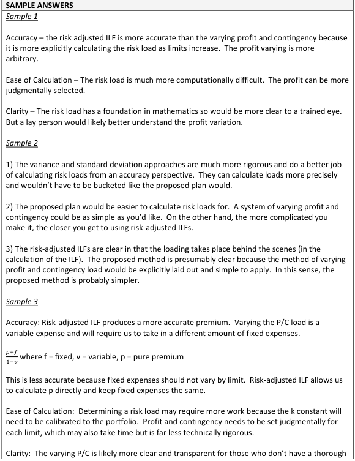
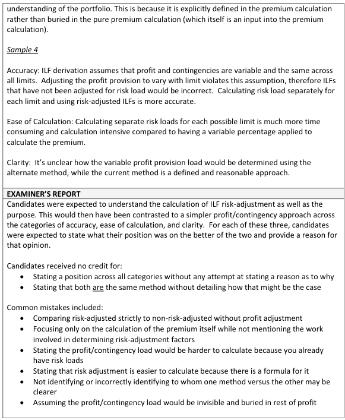

# 2018 Exam 8 - Q8

**Points:** 1.5

## Question

An actuary has been using risk-adjusted increased limit factors to account for riskiness in pricing. The actuary's coworker has suggested an alternate approach of using non-risk-adjusted increased limit factors and, instead, varying the profit and contingency load with the policy limit.

Compare and contrast the two methods with respect to each of the following:

- Accuracy
- Ease of calculation
- Clarity

## Solution

Without knowing how the profit and contingency load by policy limit would be calculated, it is hard to compare the two methods. Perhaps they would result in identical results. Also, profit and contingency load calculations are not on the exam 8 syllabus. So I'll talk about the risk-adjusted ILFs, and claim ignorance about the other calculation.

Accuracy: Risk-loaded ILFs would quantify the higher risk associated with higher limits using the variance or standard deviation of aggregate limited losses. To the extent that variance or SD is a good representation of this risk, the risk-loaded ILFs will be accurate. It is unclear how varying the profit & contingency load by limit would work, so the accuracy of that approach is unclear.

Ease of calculation: Risk-loaded ILFs are fairly easy to calculate given either historical losses or assumed frequency and severity distributions. It is unclear how the profit & contingency load by limit would be calculated, and the calculations may rely on data not as readily available as loss data.

Clarity is a strange word to apply to a ratemaking calculation. I assume it means easy to understand/explain the calculation (e.g., as in a rate filing to a DOI).

Clarity: The risk-adjusted ILF calculations have been in actuarial literature for decades, and are well understood approaches by actuaries. The profit & contingency load varying by limit is not a commonly used approach and as such may be more difficult to explain or justify.

## Examiner Report

Examiner Report Solutions and Comments:

