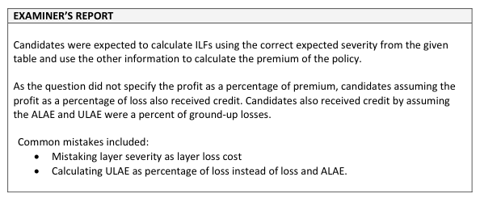

# 2019 Exam 8 - Q8

**Points:** 1.5

## Question

Given the following for a policy:

| B | C |
| --- | --- |
| 100,000 | Basic Limit |
| 65,000 | Expected Basic Limit Indemnity |
| 20% | Allocated Loss Adjustment Expense (ALAE) as a % of Indemnity |
| 1.5% | Unallocated Loss Adjustment Expense as a % of Indemnity and ALAE |
| 15% | All other expenses are variable and are 15% of the premium |
| 0% | Risk load |
| 2.5% | Profit load |

- The following table shows Indemnity-only limited expected severity:

| Limit L | E[X;L] |
| --- | --- |
| 100,000 | 58,750 |
| 200,000 | 100,000 |
| 500,000 | 156,250 |
| 1,000,000 | 218,750 |

Calculate the premium for this policy with a 500,000 limit over a 500,000 deductible.

## Solution

For a large deductible policy, the insurer normally handles all claims on a ground-up basis, so LAE would be based on ground-up losses (assuming the deductible applies to loss only and not loss+ALAE). That said, this question is from the Bahnemann material. Bahnemann focuses on small deductibles (not large deductibles), and the formulas from that text assume that the ALAE (and perhaps ULAE) related to claims below the deductible is eliminated. So you could make different assumptions about LAE here since the question wasn't clear on these LAE details. Also, the question didn't specify whether the profit load was a percent of premium (most common) or a percent of excess losses, so either assumption was accepted. I'll show 4 approaches with different methods/assumptions.

Solution 1: using ILFs. Assumes profit is a % of premium. Assumes LAE is a % of layer loss.

| B | D | F | H |
| --- | --- | --- | --- |
| I(500k) | 2.660 |  |  |
| I(1M) | 3.723 |  |  |
|  |  | Expected Loss in Layer | $69,149 |
| 100k lim Prem | $95,964 | Implied ALAE | $13,830 |
|  |  | Implied ULAE | $1,245 |
| Policy Prem | $102,089 | Policy Prem | $102,089 |

Formulas

- `D34` = `=D19/D17`
- `D35` = `=D20/D17`
- `H36` = `=B7*(D35-D34)`
- `D37` = `=(B7*(1+B8)*(1+B9))/(1-B10-B12)`
- `H37` = `=H36*B8`
- `H38` = `=SUM(H36:H37)*B9`
- `D39` = `=D37*(D35-D34)`
- `H39` = `=SUM(H36:H38)/(1-B10-B12)`

Solution 2: calculating frequency and severity for layer. Assumes profit is a % of premium. Assumes LAE is a % of layer loss.

**E[N]:** 1.106 — `=B7/D17`

**Unconditional expected sev for layer:** 62,500 — `=D20-D19`

**Exp loss in layer:** $69,149 — `=F45*F43`

**Policy Prem:** $102,089 — `=(F47*(1+B8)*(1+B9))/(1-B10-B12)`

Solution 3: using ILFs. Assumes profit is a % of layer loss and LAE. Assumes LAE is a % of layer loss.

Assume the profit load is proportional to loss and LAE

| B | D | F | H |
| --- | --- | --- | --- |
| I(500k) | 2.660 |  |  |
| I(1M) | 3.723 |  |  |
|  |  | Expected Loss in Layer | $69,149 |
| 100k lim Prem | $95,470 | Implied ALAE | $13,830 |
|  |  | Implied ULAE | $1,245 |
| Policy Prem | $101,564 | Policy Prem | $101,564 |

Formulas

- `D55` = `=D19/D$17`
- `D56` = `=D20/D$17`
- `H57` = `=B7*(D56-D55)`
- `D58` = `=(B7*(1+B8)*(1+B9)*(1+B12))/(1-B10)`
- `H58` = `=H57*B8`
- `H59` = `=SUM(H57:H58)*B9`
- `D60` = `=D58*(D56-D55)`
- `H60` = `=SUM(H57:H59)*(1+B12)/(1-B10)`

Solution 4: calculating frequency and severity for layer. Assumes profit is a % of premium. Assumes LAE is a % of ground-up loss.

**Exp loss in layer:** $69,149 — `=B7*(D20/D17-D19/D17)`

Assume ALAE and ULAE are a percent of losses ground-up losses (limited to 1M)

Technically it would be more appropriate to use unlimited loss to get the ALAE and ULAE in this case, but we don't have that.

**Expected loss limited to 1M:** $242,021 — `=B7*(D20/D17)`

| B | F |
| --- | --- |
| ALAE | $48,404 |
| ULAE | $4,356 |

Formulas

- `F72` = `=B8*F70`
- `F73` = `=B9*(F70+F72)`

**Policy Prem:** $147,769 — `=(F64+F72+F73)/(1-B10-B12)`

## Examiner Report

Examiner Report Comments:

