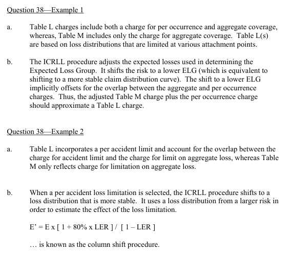

# 2002 Exam 9 - Q38 revised

**Points:** 2

## Question

Answer the following questions.

### Part a (1.00 pts)

Briefly describe how a Table L differs from a Table M.

### Part b (1.00 pts)

Briefly describe how NCCI's Insurance Charge Reflecting Loss Limitation procedure was used to reflect the selection of a loss limitation on a retrospectively rated policy.

## Solution

### Part a

Table L incorporates a per accident limit and the charge accounts for both the loss limit and the aggregate limit, whereas Table M only reflects the charge for the aggregate limit. Table L is built separately for each loss limit.

### Part b

The NCCI used the ICRLL procedure to shift the Table M distribution used to that of a larger risk as an approximation to using a Limited Table M. This was done by adjusting the expected losses of the risk used to lookup the expected loss group by an adjustment factor of:

(1+0.8k)/(1-k)

## Examiner Report

Examiner Report Solutions:

