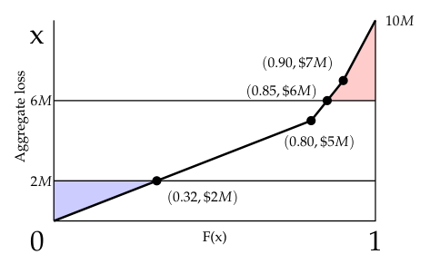

# 2006 Exam 9 - Q29 revised

**Points:** 1.5

## Question

An insured's aggregate losses follow the probability density function f(x), given below, where x is in millions:

| B | C | D |
| --- | --- | --- |
|  | 0.0000 | if x ≤ 0 |
|  | 0.1600 | if 0 < x ≤ 5 |
| f(x) = | 0.0500 | if 5 < x ≤ 7 |
|  | 0.0333 | if 7 < x ≤ 10 |
|  | 0.0000 | if x > 10 |

The insured selects a retrospectively rated policy with:

| B | C |
| --- | --- |
| $2,000,000 | Minimum aggregate loss |
| $6,000,000 | Maximum aggregate loss |

Calculate in dollars the insurance charge at maximum and the insurance savings at minimum for this insured.

## Solution

This can be visualized by the diagram to the right. The red area represents the charge at maximum losses. The blue triangle represents the savings at minimum losses.

Solution 1: Calculate areas using the diagram

| B | D |
| --- | --- |
| Charge at max | $275,000 |
| Savings at min | $320,000 |

Formulas

- `D28` = `=0.5*(1-J9)*(K10-K9)+0.5*((1-J9)+(1-J8))*(K9-K8)`
- `D29` = `=0.5*J6*K6`

Solution 2: Calculate expected aggregate limited losses at 2M and 6M

| B | D |
| --- | --- |
| E[A] | $3,450,000 |
| E[A;6M] | $3,175,000 |
| E[A;2M] | $1,680,000 |

Formulas

- `D34` = `=J7*((0+K7)/2)+(J9-J7)*((K9+K7)/2)+(J10-J9)*((K9+K10)/2)`
- `D35` = `=J7*((0+K7)/2)+(J8-J7)*((K7+K8)/2)+(1-J8)*K8`
- `D36` = `=J6*((0+K6)/2)+(1-J6)*K6`

| B | D |
| --- | --- |
| Charge at max | $275,000 |
| Savings at min | $320,000 |

Formulas

- `D38` = `=D34-D35`
- `D39` = `=B15-D36`

Building a Table M here wouldn't get accurate charges since Table M accumulates the area of rectangles, but the distribution here isn't in discrete steps, so the areas under the curve aren't approximated well by (large) rectangles.

CDF values:

| x | F(x) | x in Dollars |
| --- | --- | --- |
| 2 | 0.320 | $2,000,000 |
| 5 | 0.800 | $5,000,000 |
| 6 | 0.850 | $6,000,000 |
| 7 | 0.900 | $7,000,000 |
| 10 | 1.000 | $10,000,000 |

Formulas

- `J6` = `=I6*C8`
- `K6` = `=I6*1000000`
- `J7` = `=I7*C8`
- `K7` = `=I7*1000000`
- `J8` = `=J7+C9*(I8-I7)`
- `K8` = `=I8*1000000`
- `J9` = `=J8+C9*(I9-I8)`
- `K9` = `=I9*1000000`
- `K10` = `=I10*1000000`

