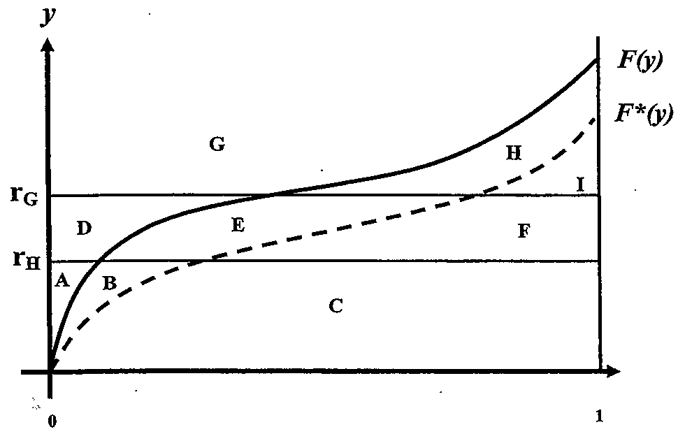

# 2007 Exam 9 - Q31

**Points:** 2

## Question

The diagram below exhibits cumulative distribution functions:

- F(y) which represents aggregate loss ratios with no loss limit, and
- F*(y) which represents aggregate loss ratios adjusted for a per occurrence loss limit.

The diagram is also partitioned into nine areas labeled with the letters from A to I.

**Entry-ratio diagram with two curves.** Vertical axis $y$, horizontal axis 0 to 1. Solid curve $F(y)$ rises convexly; dashed curve $F^*(y)$ lies below it. Horizontal lines mark $r_H$ (lower) and $r_G$ (upper). Nine labelled regions:

- Below $r_H$: **A** (far left, above the solid curve), **B** (left, between the curves), **C** (the wide band beneath both curves).
- Between $r_H$ and $r_G$: **D** (left), **E** (centre), **F** (right, below the dashed curve).
- Above $r_G$: **G** (left, above the solid curve), **H** (right, between the curves), **I** (far right).

### Part a (1.00 pts)

Using the labels provided, give an algebraic expression for each of the following quantities:

1. The Table M Charge at rG

2. The Table L Charge at rG

3. The Table L Savings at rH

4. The Loss Elimination Ratio

### Part b (1.00 pts)

Using the labels provided and the entry ratio rG , algebraically demonstrate whether the following equation is valid.

Table L Charge - Table M Charge = Table L Savings - Table M Savings

## Solution

### Part a

1. The Table M Charge at r_G = H + I

2. The Table L Charge at r_G = B + E + H + I

3. The Table L Savings at r_H = A + B

4. The Loss Elimination Ratio = B + E + H

### Part b

Table L Savings at r_G = A + B + D + E Table M Savings at r_G = A + D

(B + E + H + I) - (H + I) = (A + B + D + E) - (A + D) B + E = B + E

So the equation is valid.
