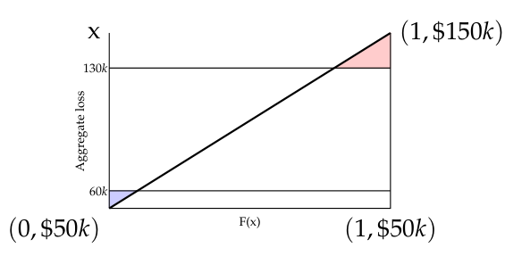

# 2008 Exam 9 - Q29 revised

**Points:** 1

## Question

A retrospectively rated workers compensation risk has aggregate losses that follow a uniform distribution on the interval below:

| B | C |
| --- | --- |
| $50,000 | Bottom of aggregate loss interval |
| $150,000 | Top of aggregate loss interval |

| B | C |
| --- | --- |
| $60,000 | Minimum aggregate loss |
| $130,000 | Maximum aggregate loss |

Calculate the net insurance charge for this risk in dollars.

## Solution

This can be visualized by the diagram to the right. The red triangle represents the charge at maximum losses. The blue triangle represents the savings at minimum losses.

Solution 1: Calculate areas using the diagram

| B | D |
| --- | --- |
| Charge at max | $2,000 |
| Savings at min | $500 |

Formulas

- `D22` = `=0.5*(1-I8)*(H9-H8)`
- `D23` = `=0.5*I7*(H7-H6)`

**Net Insurance Charge:** $1,500 — `=D22-D23`

Solution 2: Calculate expected aggregate limited losses at 60k and 130k

| B | D |
| --- | --- |
| E[A] | $100,000 |
| E[A;60k] | $59,500 |
| E[A;130k] | $98,000 |

Formulas

- `D29` = `=AVERAGE(B7:B8)`
- `D30` = `=I7*AVERAGE(H6:H7)+(1-I7)*H7`
- `D31` = `=I8*AVERAGE(H6,H8)+(1-I8)*H8`

| B | D |
| --- | --- |
| Charge at max | $2,000 |
| Savings at min | $500 |

Formulas

- `D33` = `=D29-D31`
- `D34` = `=B10-D30`

**Net Insurance Charge:** $1,500 — `=D33-D34`

Solution 3: Calculate an exact formula for the charges using calculus (not recommended for the exam)

I'm only showing this since this is a simple uniform distribution, so the calculus isn't too complex. There is nearly 0 chance the current exam would require you to solve integrals.

**E[A]:** $100,000 — `=AVERAGE(B7:B8)`

Distribution for entry ratios:

Uniform on — 0.5 — `=B7/D43` — 1.5 — `=B8/D43`

f(y) = 1  / (1.5 - 0.5)

phi(r) = integral from r to 1.5 of [(y - r) / (1.5 - 0.5) dy] = (1/2)(1.5^2 - r^2)-r(1.5-r) = 1.125 - (1/2)r^2 - 1.5r + r^2 = 0.5r^2 - 1.5r + 1.125

|   | r | phi(r) | psi(r) |
| --- | --- | --- | --- |
| r_H | 0.6 | 0.405 | 0.005 |
| r_G | 1.3 | 0.02 |  |

Formulas

- `C51` = `=B10/D43`
- `D51` = `=0.5*C51^2-1.5*C51+1.125`
- `E51` = `=D51+C51-1`
- `C52` = `=B11/D43`
- `D52` = `=0.5*C52^2-1.5*C52+1.125`

**I:** $1,500 — `=(D52-E51)*D43`

CDF values:

| x | F(x) |
| --- | --- |
| $50,000 | 0.00 |
| $60,000 | 0.10 |
| $130,000 | 0.80 |
| $150,000 | 1.00 |

Formulas

- `H6` = `=B7`
- `I6` = `=(H6-B$7)/(B$8-B$7)`
- `H7` = `=B10`
- `I7` = `=(H7-B$7)/(B$8-B$7)`
- `H8` = `=B11`
- `I8` = `=(H8-B$7)/(B$8-B$7)`
- `H9` = `=B8`
- `I9` = `=(H9-B$7)/(B$8-B$7)`

