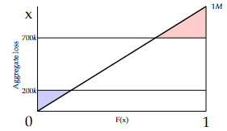
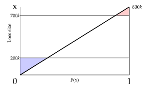

# 2009 Exam 9 - Q31 revised

**Points:** 3.5

## Question

The following information applies to a company's retrospectively rated workers compensation policy:

- Its losses are expected to be uniformly distributed on [a,b].

| B | C |
| --- | --- |
| $0 | a parameter for uniform distribution |
| $1,000,000 | b parameter for uniform distribution |
| $700,000 | Losses at maximum premium |
| $200,000 | Losses at minimum premium |
| 1.10 | Loss conversion factor |
| $100,000 | Basic premium |

### Part a (1.50 pts)

Calculate the expected retrospective premium for this workers compensation policy.

### Part b (2.00 pts)

The company is considering whether to implement a fraud detection device. This addition would result in a shift in the loss distribution to a uniform distribution between [a,b], where:

| B | C |
| --- | --- |
| $0 | a parameter for uniform distribution |
| $800,000 | b parameter for uniform distribution |

Assuming that no other plan parameters change (including the basic premium staying at 100k, which in reality should change), calculate the resulting premium savings.

## Solution

### Part a

| CDF values: |   | Assume T = 1 since not given. |
| --- | --- | --- |
| x | F(x) |  |
| $0 | 0.00 |  |
| $200,000 | 0.20 |  |
| $700,000 | 0.70 |  |
| $1,000,000 | 1.00 |  |

Formulas

- `J4` = `=B9`
- `K4` = `=(J4-B$9)/(B$10-B$9)`
- `J5` = `=B12`
- `K5` = `=(J5-B$9)/(B$10-B$9)`
- `J6` = `=B11`
- `K6` = `=(J6-B$9)/(B$10-B$9)`
- `J7` = `=B10`
- `K7` = `=(J7-B$9)/(B$10-B$9)`

This can be visualized by the diagram to the right. The red triangle represents the charge at maximum losses. The blue triangle represents the savings at minimum losses.

Solution 1: Calculate areas using the diagram

| J | L |
| --- | --- |
| Charge at max | $45,000 |
| Savings at min | $20,000 |
| I | $25,000 |
| E[A] | $500,000 |

Formulas

- `L15` = `=0.5*(1-K6)*(J7-J6)`
- `L16` = `=0.5*K5*J5`
- `L17` = `=L15-L16`
- `L18` = `=AVERAGE(B9:B10)`

E[R] — $622,500 — `=(B14+B13*(L18-L17))` — E[R] = (B + cE[L])T = (B + c(E[A]-I))T

Solution 2: Calculate expected aggregate limited losses at 200k and 700k

| J | L |
| --- | --- |
| E[A] | $500,000 |
| E[A;200k] | $180,000 |
| E[A;700k] | $455,000 |

Formulas

- `L24` = `=AVERAGE(B9:B10)`
- `L25` = `=K5*AVERAGE(J4:J5)+(1-K5)*J5`
- `L26` = `=K6*AVERAGE(J4,J6)+(1-K6)*J6`

| J | L |
| --- | --- |
| Charge at max | $45,000 |
| Savings at min | $20,000 |
| I | $25,000 |

Formulas

- `L28` = `=L24-L26`
- `L29` = `=B12-L25`
- `L30` = `=L28-L29`

E[R] — $622,500 — `=(B14+B13*(L24-L30))` — E[R] = (B + cE[L])T = (B + c(E[A]-I))T

Solution 3: Calculate an exact formula for the charges using calculus (not recommended for the exam)

I'm only showing this since this is a simple uniform distribution, so the calculus isn't too complex. There is nearly 0 chance the current exam would require you to solve integrals.

**E[A]:** $500,000 — `=AVERAGE(B9:B10)`

Distribution for entry ratios:

Uniform on — 0 — `=B9/L39` — 2 — `=B10/L39`

f(y) = 1  / (2 - 0)

phi(r) = integral from r to 2 of [(y - r) / (2 - 0) dy] = (1/4)(2^2 - r^2)-(r/2)(2-r) = 1 - (1/4)r^2 - r + (1/2)r^2 =0.25r^2 - r  + 1

|   | r | phi(r) | psi(r) |
| --- | --- | --- | --- |
| r_H | 0.4 | 0.64 | 0.04 |
| r_G | 1.4 | 0.09 |  |
| I |  | $25,000 |  |

Formulas

- `K47` = `=B12/L39`
- `L47` = `=0.25*K47^2-K47+1`
- `M47` = `=L47+K47-1`
- `K48` = `=B11/L39`
- `L48` = `=0.25*K48^2-K48+1`
- `L49` = `=(L48-M47)*L39`

E[R] — $622,500 — `=(B14+B13*(L39-L49))` — E[R] = (B + cE[L])T = (B + c(E[A]-I))T

### Part b

Note that in reality, the basic premium would change here because the insurance charge will be different with this new distribution. Since B contains I, B should change. Also, the expense component of B should probably change as well. To keep things simple, I've clarified the original flawed question wording so you know it doesn't reflect reality.

CDF values:

| x | F(x) |
| --- | --- |
| $0 | 0.00 |
| $200,000 | 0.25 |
| $700,000 | 0.88 |
| $800,000 | 1.00 |

Formulas

- `J59` = `=B23`
- `K59` = `=(J59-B$23)/(B$24-B$23)`
- `J60` = `=B12`
- `K60` = `=(J60-B$23)/(B$24-B$23)`
- `J61` = `=B11`
- `K61` = `=(J61-B$23)/(B$24-B$23)`
- `J62` = `=B24`
- `K62` = `=(J62-B$23)/(B$24-B$23)`

This can be visualized by the diagram to the right. The red triangle represents the charge at maximum losses. The blue triangle represents the savings at minimum losses.

Solution 1: Calculate areas using the diagram

| J | L | M |
| --- | --- | --- |
| Charge at max | $6,250 |  |
| Savings at min | $25,000 |  |
| I | $-18,750 |  |
| E[A] | $400,000 |  |
| E[R] | $560,625 | E[R] = (B + cE[L])T = (B + c(E[A]-I))T |

Formulas

- `L70` = `=0.5*(1-K61)*(J62-J61)`
- `L71` = `=0.5*K60*J60`
- `L72` = `=L70-L71`
- `L73` = `=AVERAGE(B23:B24)`
- `L74` = `=(B14+B13*(L73-L72))`

**Premium Savings:** $61,875 — `=L20-L74`

Solution 2: Calculate expected aggregate limited losses at 200k and 700k

| J | L |
| --- | --- |
| E[A] | $400,000 |
| E[A;200k] | $175,000 |
| E[A;700k] | $393,750 |

Formulas

- `L80` = `=AVERAGE(B23:B24)`
- `L81` = `=K60*AVERAGE(J59:J60)+(1-K60)*J60`
- `L82` = `=K61*AVERAGE(J59,J61)+(1-K61)*J61`

| J | L | M |
| --- | --- | --- |
| Charge at max | $6,250 |  |
| Savings at min | $25,000 |  |
| I | $-18,750 |  |
| E[R] | $560,625 | E[R] = (B + cE[L])T = (B + c(E[A]-I))T |

Formulas

- `L84` = `=L80-L82`
- `L85` = `=B12-L81`
- `L86` = `=L84-L85`
- `L87` = `=(B14+B13*(L80-L86))`

**Premium Savings:** $61,875 — `=L32-L87`

Solution 3: Calculate an exact formula for the charges using calculus (not recommended for the exam)

I'm only showing this since this is a simple uniform distribution, so the calculus isn't too complex. There is nearly 0 chance the current exam would require you to solve integrals.

**E[A]:** $400,000 — `=AVERAGE(B23:B24)`

Distribution for entry ratios:

Uniform on — 0 — `=B23/L96` — 2 — `=B24/L96`

Distribution in terms of entry ratios same as in part (a), only r_G and r_H are now different phi(r) = 0.25r^2 - r  + 1

|   | r | phi(r) | psi(r) |
| --- | --- | --- | --- |
| r_H | 0.5 | 0.5625 | 0.0625 |
| r_G | 1.75 | 0.015625 |  |
| I |  | $-18,750 |  |

Formulas

- `K104` = `=B12/L96`
- `L104` = `=0.25*K104^2-K104+1`
- `M104` = `=L104+K104-1`
- `K105` = `=B11/L96`
- `L105` = `=0.25*K105^2-K105+1`
- `L106` = `=(L105-M104)*L96`

E[R] — $560,625 — `=(B14+B13*(L96-L106))` — E[R] = (B + cE[L])T = (B + c(E[A]-I))T

**Premium Savings:** $61,875 — `=L51-L108`
