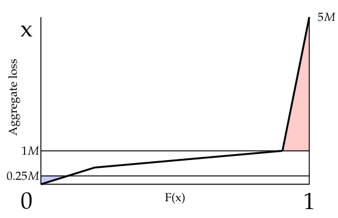

# 2010 Exam 9 - Q25 revised

**Points:** 1

## Question

Aggregate losses on a policy have the following distribution:

| B | C | E | F | G |
| --- | --- | --- | --- | --- |
| 20% | probability of a loss between | $0 | and | $500,000 |
| 70% | probability of a loss between | $500,000 | and | $1,000,000 |
| 10% | probability of a loss between | $1,000,000 | and | $5,000,000 |

Losses follow a uniform distribution within each range.

| B | C |
| --- | --- |
| $250,000 | Minimum aggregate loss |
| $1,000,000 | Maximum aggregate loss |

Calculate the dollar value of the net insurance charge.

## Solution

This can be visualized by the diagram to the right. The red triangle represents the charge at maximum losses. The blue triangle represents the savings at minimum losses.

Solution 1: Calculate areas using the diagram

| B | D |
| --- | --- |
| Charge at max | $200,000 |
| Savings at min | $12,500 |

Formulas

- `D24` = `=0.5*(1-L9)*(K10-K9)`
- `D25` = `=0.5*L7*K7`

**Net Insurance Charge:** $187,500 — `=D24-D25`

Solution 2: Calculate expected aggregate limited losses at 250k and 1M

| B | D |
| --- | --- |
| E[A] | $875,000 |
| E[A;250k] | $237,500 |
| E[A;1M] | $675,000 |

Formulas

- `D31` = `=B6*AVERAGE(E6,G6)+B7*AVERAGE(E7,G7)+B8*AVERAGE(E8,G8)`
- `D32` = `=L7*AVERAGE(K6:K7)+(1-L7)*K7`
- `D33` = `=B6*AVERAGE(E6,G6)+B7*AVERAGE(E7,G7)+(1-L9)*K9`

| B | D |
| --- | --- |
| Charge at max | $200,000 |
| Savings at min | $12,500 |

Formulas

- `D35` = `=D31-D33`
- `D36` = `=B12-D32`

**Net Insurance Charge:** $187,500 — `=D35-D36`

Building a Table M here wouldn't get accurate charges since Table M accumulates the area of rectangles, but the distribution here isn't in discrete steps, so the areas under the curve aren't approximated well by (large) rectangles.

CDF values:

| x | F(x) |
| --- | --- |
| $0 | 0.00 |
| $250,000 | 0.10 |
| $500,000 | 0.20 |
| $1,000,000 | 0.90 |
| $5,000,000 | 1.00 |

Formulas

- `K6` = `=E6`
- `K7` = `=B12`
- `L7` = `=K7/G6*B6`
- `K8` = `=G6`
- `L8` = `=B6`
- `K9` = `=G7`
- `L9` = `=L8+B7`
- `K10` = `=G8`

