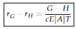
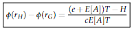
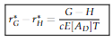
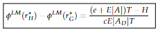

# 2010 Exam 9 - Q27

**Points:** 2

## Question

Consider two policies:

- A retrospectively rated policy with no loss limit
- A retrospectively rated policy with a $500,000 loss limit

Both policies are subject to the following parameters:

| B | C |
| --- | --- |
| 1.00 | Maximum Premium Factor |
| 0.40 | Minimum Premium Factor |
| 1.20 | Loss Conversion Factor |
| 0.60 | Expected Loss & ALAE Ratio |
| 1.05 | Tax Multiplier |
| 0.35 | Expense and Profit Provision |
| 0.10 | Loss Elimination Ratio at $500,000 |

Calculate the difference between the balance equations for the two policies.

## Solution

Without occurrence limit: — I'm showing the formulas from the manual here for your benefit. Note that in this problem, you'd divide numerator and denominator by P.

$$r_G - r_H = \frac{G - H}{c\,E[A]\,T}$$

**Entry difference:** 0.794 — `=(B11-B12)/(B13*B14*B15)`

$$\phi(r_H) - \phi(r_G) = \frac{(e + E[A])T - H}{c\,E[A]\,T}$$

**Charge difference:** 0.790 — `=((B16+B14)*B15-B12)/(B13*B14*B15)`

With occurrence limit:

While not stated directly, you would be expected to use the Limited Table M balance equations here, since the Table L balance equations would be exactly the same as the Table M balance equations, which would make the question trivial. Also, they specifically gave you the loss elimination ratio, which would only be needed for the Limited Table M balance equations.

**E[A_D]/P:** 0.54 — `=B14*(1-B17)`

Entry ratios on the limited (large-deductible) basis:

$$r^*_G - r^*_H = \frac{G - H}{c\,E[A_D]\,T}$$

**Entry difference:** 0.882 — `=(B11-B12)/(B13*K14*B15)`

Per-occurrence-limited (large deductible) form:

$$\phi^{LM}(r^*_H) - \phi^{LM}(r^*_G) = \frac{(e + E[A])T - H}{c\,E[A_D]\,T}$$

**Charge difference:** 0.878 — `=((B16+B14)*B15-B12)/(B13*K14*B15)`

Differences:

**Entry Difference:** 0.0882 — `=K16-K4`

**Charge Difference:** 0.0878 — `=K18-K6`
