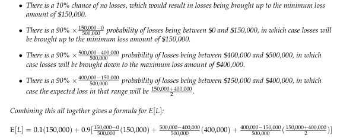
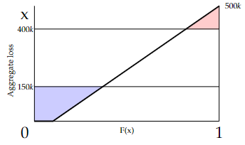

# 2011 Exam 8 - Q20

**Points:** 2.5

## Question

The following information is known about a balanced retrospectively rated policy:

| B | C |
| --- | --- |
| $150,000 | Losses at minimum premium |
| $400,000 | Losses at maximum premium |
| 1.20 | Loss conversion factor |
| $50,000 | Basic premium |

- There is a 10% chance that this policyholder has no losses.
- There is a 90% chance that the losses are uniformly distributed between $0 and $500,000.
- There are no taxes.

Calculate the guaranteed cost premium for this policy.

## Solution

We are told the plan is balanced, so E[R] = GCP.

Solution 1: Calculate E[L] directly

**E[L]:** $251,250 — `=0.1*B6 + 0.9*((B6-0)/500000*B6 + ((500000-B7)/500000)*400000 + ((B7-B6)/500000)*(B6+B7)/2)`

GCP = E[R] — $351,500 — `=(B9+B8*J6)` — E[R] = (B + cE[L])T

Solution 2: Calculate E[A] and I separately to get E[L]

**E[A]:** $225,000 — `=0.1*0+0.9*(500000/2)`

| x | F(x) |
| --- | --- |
| $150,000 | 0.37 |
| $400,000 | 0.82 |

Formulas

- `I18` = `=B6`
- `J18` = `=0.1+0.9*I18/500000`
- `I19` = `=B7`
- `J19` = `=0.1+0.9*I19/500000`

See diagram to the right. The charge is the red area, the savings is the blue area.

| I | J |
| --- | --- |
| Charge at Max | $9,000 |
| Savings at Min | $35,250 |

Formulas

- `J24` = `=0.5*(500000-I19)*(1-J19)`
- `J25` = `=0.5*I18*(0.1+J18)`

**I:** $-26,250 — `=J24-J25`

GCP = E[R] — $351,500 — `=(B9+B8*(J15-J27))` — E[R] = (B + c(E[A]-I))T
