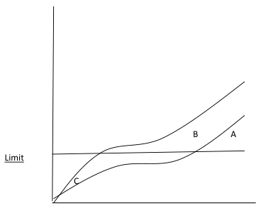

# 2011 Exam 8 - Q22 revised

**Points:** 3

## Question

The unlimited and limited loss ratios for five identical risks are as follows:

| Risk # | Unlimited Loss Ratio | Limited Loss Ratio |
| --- | --- | --- |
| 1 | 30% | 15% |
| 2 | 45% | 45% |
| 3 | 45% | 45% |
| 4 | 90% | 60% |
| 5 | 90% | 90% |

### Part a (2.50 pts)

Calculate Table L charges at loss ratios of 0% to 90% using increments of 15%.

### Part b (0.50 pts)

Describe the impact on the insurance charge when a loss limit is introduced.

## Solution

### Part a

| I | J |
| --- | --- |
| E[A]/P | 60% |
| E[A_D]/P | 51% |

Formulas

- `J2` = `=AVERAGE(C7:C11)`
- `J3` = `=AVERAGE(D7:D11)`

**k:** 0.15 — `=1-J3/J2`

| Lim LR | r | # above | % above | Table L Charge |
| --- | --- | --- | --- | --- |
| 0% | 0.00 | 5 | 1 | 1.00 |
| 15.00% | 0.25 | 4 | 0.8 | 0.75 |
| 30.00% | 0.50 | 4 | 0.8 | 0.55 |
| 45.00% | 0.75 | 2 | 0.4 | 0.35 |
| 60.00% | 1.00 | 1 | 0.2 | 0.25 |
| 75.00% | 1.25 | 1 | 0.2 | 0.20 |
| 90.00% | 1.50 | 0 | 0 | 0.15 |

Formulas

- `J8` = `=I8/J$2`
- `K8` = `=COUNTIF($D$7:$D$11,">"&I8)`
- `L8` = `=K8/5`
- `M8` = `=M9+(J9-J8)*L8`
- `I9` = `=I8+0.15`
- `J9` = `=I9/J$2`
- `K9` = `=COUNTIF($D$7:$D$11,">"&I9)`
- `L9` = `=K9/5`
- `M9` = `=M10+(J10-J9)*L9`
- `I10` = `=I9+0.15`
- `J10` = `=I10/J$2`
- `K10` = `=COUNTIF($D$7:$D$11,">"&I10)`
- `L10` = `=K10/5`
- `M10` = `=M11+(J11-J10)*L10`
- `I11` = `=I10+0.15`
- `J11` = `=I11/J$2`
- `K11` = `=COUNTIF($D$7:$D$11,">"&I11)`
- `L11` = `=K11/5`
- `M11` = `=M12+(J12-J11)*L11`
- `I12` = `=I11+0.15`
- `J12` = `=I12/J$2`
- `K12` = `=COUNTIF($D$7:$D$11,">"&I12)`
- `L12` = `=K12/5`
- `M12` = `=M13+(J13-J12)*L12`
- `I13` = `=I12+0.15`
- `J13` = `=I13/J$2`
- `K13` = `=COUNTIF($D$7:$D$11,">"&I13)`
- `L13` = `=K13/5`
- `M13` = `=M14+(J14-J13)*L13`
- `I14` = `=I13+0.15`
- `J14` = `=I14/J$2`
- `K14` = `=COUNTIF($D$7:$D$11,">"&I14)`
- `L14` = `=K14/5`
- `M14` = `=J5`

### Part b

CAS Sample Solution 1

When an occurrence limit is introduced, some losses are eliminated above that limit and never get considered on an aggregate limit. A charge needs to be included for the occurrence limitation. However, be careful not to overlap occurrence charge and aggregate charge if using an unlimited charge table. Table L fixes this by already reflecting the occurrence limitation and adding a charge for it.

CAS Sample Solution 2

Insurance charge decreases when loss limit is introduced due to overlap between excess ratio and insurance charge (assuming insurance charge here is not Table L insurance charge, which includes the LER, and is therefore increased.)

CAS Sample Solution 3 revised

Insurance charge is increased, since both per occurrence limit and aggregate limit decrease the ratable loss, and insurance charge covers the now higher expected excess (non-ratable) losses.

CAS Sample Solution 4 (note that drawing diagrams isn't required on the current exam)

When loss limit is introduced, the charge is A + B + C. Without loss limit, the charge is A + B

