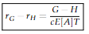

# 2011 Exam 8 - Q25 revised

**Points:** 1.5

## Question

The following information is available for a retrospectively rated policy:

| B | C |
| --- | --- |
| $20,000 | Standard premium |
| $19,160 | Provisions for losses and expenses exclusive of taxes |
| $12,000 | Expected losses |
| 1.250 | Loss conversion factor |
| 1.025 | Tax multiplier |
| 95% | Selected maximum loss ratio |
| 20% | Selected minimum loss ratio |
| 0.055 | Charge for maximum |
| 0.700 | Charge for minimum |

Calculate the maximum premium ratio for this policy.

## Solution

Solution 1: Use balance equations

We can use the charge difference balance equation to solve for H, and then use the entry balance equation to solve for G The "Provisions for losses and expenses exclusive of taxes" is e + E[A].

$$\phi(r_H) - \phi(r_G) = \frac{(e + E[A])T - H}{c\,E[A]\,T}$$

**H:** $9,722 — `=B7*B10-(B14-B13)*B9*B8*B10`

| H | I |
| --- | --- |
| E[A]/P | 0.6 |
| r_G | 1.58 |
| r_H | 0.33 |

Formulas

- `I9` = `=B8/B6`
- `I10` = `=B11/I9`
- `I11` = `=B12/I9`

$$r_G - r_H = \frac{G - H}{c\,E[A]\,T}$$

| H | I |
| --- | --- |
| G | $28,941 |
| G/P | 1.447 |

Formulas

- `I13` = `=(I10-I11)*B9*B8*B10+I7`
- `I14` = `=I13/B6`

Solution 2: Get insurance charge, then get basic premium, then solve for G

| H | I | J |
| --- | --- | --- |
| E[A]/P | 0.6 |  |
| r_H | 0.333 |  |
| Psi(r_H) | 0.033 | psi(r_H) = phi(r_H) + r_H - 1 |

Formulas

- `I18` = `=B8/B6`
- `I19` = `=B12/I18`
- `I20` = `=B14+I19-1`

| H | I | J |
| --- | --- | --- |
| I | $260 | I = (phi(r_G) - psi(r_H))E[A] |
| e | $7,160 | e = (e + E[A]) - E[A] |
| B | $4,485 | B = e - (c-1)E[A] + cI |

Formulas

- `I22` = `=(B13-I20)*B8`
- `I23` = `=B7-B8`
- `I24` = `=I23-(B9-1)*B8+B9*I22`

**L_G:** 19,000 — `=B11*B6`

| H | I | J |
| --- | --- | --- |
| G | $28,941 | G = (B + cL_G)T |
| G/P | 1.447 |  |

Formulas

- `I28` = `=(I24+B9*I26)*B10`
- `I29` = `=I28/B6`

