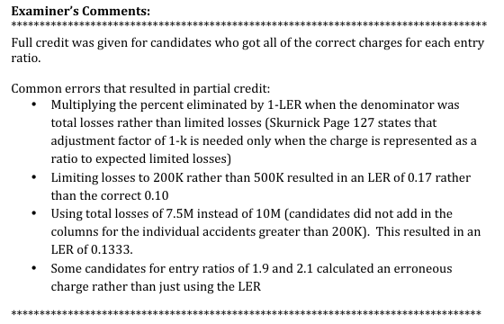

# 2012 Exam 8 - Q18

**Points:** 2

## Question

The table below provides the actual loss history for 10 similar risks:

|   | Sum of Losses Under $200,000 per Accident | Individual Accidents Greater Than $200,000 |   |
| --- | --- | --- | --- |
| Risk |  | Accident 1 | Accident 2 |
| 1 | $300,000 |  |  |
| 2 | $400,000 |  |  |
| 3 | $500,000 |  |  |
| 4 | $600,000 |  |  |
| 5 | $700,000 |  |  |
| 6 | $800,000 |  |  |
| 7 | $900,000 |  |  |
| 8 | $1,000,000 | $300,000 |  |
| 9 | $1,100,000 | $600,000 |  |
| 10 | $1,200,000 | $200,000 | $1,400,000 |
| Total | $7,500,000 | $1,100,000 | $1,400,000 |

Construct Table L charges for a loss limit of $500,000 at entry ratios of 1.10, 1.30, 1.60, 1.90, and 2.10.

## Solution

| H | I | K | L |
| --- | --- | --- | --- |
| E[A] | $1,000,000 | k | 0.1 |
| E[A_D] | $900,000 |  |  |

Formulas

- `I4` = `=SUM(C18:E18)/B17`
- `L4` = `=1-I5/I4`
- `I5` = `=AVERAGE(H8:H17)`

| A_D | r | Solution 1: Using vertical slices |   |   |   |   |   |
| --- | --- | --- | --- | --- | --- | --- | --- |
| $300,000 | 0.30 |  |  |  |  |  |  |
| $400,000 | 0.40 | r | Table L Charge |  |  |  |  |
| $500,000 | 0.50 | 1.1 | 0.25 |  |  |  |  |
| $600,000 | 0.60 | 1.3 | 0.19 |  |  |  |  |
| $700,000 | 0.70 | 1.6 | 0.13 |  |  |  |  |
| $800,000 | 0.80 | 1.9 | 0.1 |  |  |  |  |
| $900,000 | 0.90 | 2.1 | 0.1 |  |  |  |  |
| $1,300,000 | 1.30 |  |  |  |  |  |  |
| $1,600,000 | 1.60 | Solution 2: Limited Losses |  |  |  |  |  |
| $1,900,000 | 1.90 |  |  |  |  |  |  |
|  |  | r_L: | 1.1 | 1.3 | 1.6 | 1.9 | 2.1 |

Formulas

- `H8` = `=C8`
- `I8` = `=H8/I$4`
- `H9` = `=C9`
- `I9` = `=H9/I$4`
- `H10` = `=C10`
- `I10` = `=H10/I$4`
- `L10` = `=L4+(I17-K10)*(1/10)+(I16-K10)*(1/10)+(I15-K10)*(1/10)`
- `H11` = `=C11`
- `I11` = `=H11/I$4`
- `L11` = `=L4+(I17-K11)*(1/10)+(I16-K11)*(1/10)`
- `H12` = `=C12`
- `I12` = `=H12/I$4`
- `L12` = `=L4+(I17-K12)*(1/10)`
- `H13` = `=C13`
- `I13` = `=H13/I$4`
- `L13` = `=L4`
- `H14` = `=C14`
- `I14` = `=H14/I$4`
- `L14` = `=L4`
- `H15` = `=C15+MIN(D15,500000)`
- `I15` = `=H15/I$4`
- `H16` = `=C16+MIN(D16,500000)`
- `I16` = `=H16/I$4`
- `H17` = `=C17+MIN(D17,500000)+MIN(E17,500000)`
- `I17` = `=H17/I$4`

Risk

| K | L | M | N | O | P |
| --- | --- | --- | --- | --- | --- |
| 1 | 0.30 | 0.30 | 0.30 | 0.30 | 0.30 |
| 2 | 0.40 | 0.40 | 0.40 | 0.40 | 0.40 |
| 3 | 0.50 | 0.50 | 0.50 | 0.50 | 0.50 |

Formulas

- `L20` = `=MIN($I8,L$18)`
- `M20` = `=MIN($I8,M$18)`
- `N20` = `=MIN($I8,N$18)`
- `O20` = `=MIN($I8,O$18)`
- `P20` = `=MIN($I8,P$18)`
- `L21` = `=MIN($I9,L$18)`
- `M21` = `=MIN($I9,M$18)`
- `N21` = `=MIN($I9,N$18)`
- `O21` = `=MIN($I9,O$18)`
- `P21` = `=MIN($I9,P$18)`
- `L22` = `=MIN($I10,L$18)`
- `M22` = `=MIN($I10,M$18)`
- `N22` = `=MIN($I10,N$18)`
- `O22` = `=MIN($I10,O$18)`
- `P22` = `=MIN($I10,P$18)`

## Examiner Report

Examiner Report Comments:

| K | L | M | N | O | P |
| --- | --- | --- | --- | --- | --- |
| 4 | 0.60 | 0.60 | 0.60 | 0.60 | 0.60 |
| 5 | 0.70 | 0.70 | 0.70 | 0.70 | 0.70 |
| 6 | 0.80 | 0.80 | 0.80 | 0.80 | 0.80 |
| 7 | 0.90 | 0.90 | 0.90 | 0.90 | 0.90 |
| 8 | 1.10 | 1.30 | 1.30 | 1.30 | 1.30 |
| 9 | 1.10 | 1.30 | 1.60 | 1.60 | 1.60 |
| 10 | 1.10 | 1.30 | 1.60 | 1.90 | 1.90 |
| Charge | 0.25 | 0.19 | 0.13 | 0.10 | 0.10 |

Formulas

- `L23` = `=MIN($I11,L$18)`
- `M23` = `=MIN($I11,M$18)`
- `N23` = `=MIN($I11,N$18)`
- `O23` = `=MIN($I11,O$18)`
- `P23` = `=MIN($I11,P$18)`
- `L24` = `=MIN($I12,L$18)`
- `M24` = `=MIN($I12,M$18)`
- `N24` = `=MIN($I12,N$18)`
- `O24` = `=MIN($I12,O$18)`
- `P24` = `=MIN($I12,P$18)`
- `L25` = `=MIN($I13,L$18)`
- `M25` = `=MIN($I13,M$18)`
- `N25` = `=MIN($I13,N$18)`
- `O25` = `=MIN($I13,O$18)`
- `P25` = `=MIN($I13,P$18)`
- `L26` = `=MIN($I14,L$18)`
- `M26` = `=MIN($I14,M$18)`
- `N26` = `=MIN($I14,N$18)`
- `O26` = `=MIN($I14,O$18)`
- `P26` = `=MIN($I14,P$18)`
- `L27` = `=MIN($I15,L$18)`
- `M27` = `=MIN($I15,M$18)`
- `N27` = `=MIN($I15,N$18)`
- `O27` = `=MIN($I15,O$18)`
- `P27` = `=MIN($I15,P$18)`
- `L28` = `=MIN($I16,L$18)`
- `M28` = `=MIN($I16,M$18)`
- `N28` = `=MIN($I16,N$18)`
- `O28` = `=MIN($I16,O$18)`
- `P28` = `=MIN($I16,P$18)`
- `L29` = `=MIN($I17,L$18)`
- `M29` = `=MIN($I17,M$18)`
- `N29` = `=MIN($I17,N$18)`
- `O29` = `=MIN($I17,O$18)`
- `P29` = `=MIN($I17,P$18)`
- `L30` = `=1-AVERAGE(L20:L29)`
- `M30` = `=1-AVERAGE(M20:M29)`
- `N30` = `=1-AVERAGE(N20:N29)`
- `O30` = `=1-AVERAGE(O20:O29)`
- `P30` = `=1-AVERAGE(P20:P29)`

Solution 3: Build a Table L

|   | r | # above | % above | Table L Charge |
| --- | --- | --- | --- | --- |
|  | 0 | 10 | 1 | 1 |
| 0.30 | 0.30 | 9 | 0.9 | 0.7 |
| 0.40 | 0.40 | 8 | 0.8 | 0.61 |
| 0.50 | 0.50 | 7 | 0.7 | 0.53 |
| 0.60 | 0.60 | 6 | 0.6 | 0.46 |
| 0.70 | 0.70 | 5 | 0.5 | 0.4 |
| 0.80 | 0.80 | 4 | 0.4 | 0.35 |
| 0.90 | 0.90 | 3 | 0.3 | 0.31 |
| 1.30 | 1.100 | 3 | 0.3 | 0.25 |
| 1.60 | 1.30 | 2 | 0.2 | 0.19 |
| 1.9 | 1.60 | 1 | 0.1 | 0.13 |
|  | 1.90 | 0 | 0 | 0.1 |
|  | 2.100 | 0 | 0 | 0.1 |

Formulas

- `L35` = `=COUNTIF($I$7:$I$17,">"&K35)`
- `M35` = `=L35/10`
- `N35` = `=N36+(K36-K35)*M35`
- `J36` = `={SORT(UNIQUE(I8:I17))}`
- `K36` = `=J36`
- `L36` = `=COUNTIF($I$7:$I$17,">"&K36)`
- `M36` = `=L36/10`
- `N36` = `=N37+(K37-K36)*M36`
- `K37` = `=J37`
- `L37` = `=COUNTIF($I$7:$I$17,">"&K37)`
- `M37` = `=L37/10`
- `N37` = `=N38+(K38-K37)*M37`
- `K38` = `=J38`
- `L38` = `=COUNTIF($I$7:$I$17,">"&K38)`
- `M38` = `=L38/10`
- `N38` = `=N39+(K39-K38)*M38`
- `K39` = `=J39`
- `L39` = `=COUNTIF($I$7:$I$17,">"&K39)`
- `M39` = `=L39/10`
- `N39` = `=N40+(K40-K39)*M39`
- `K40` = `=J40`
- `L40` = `=COUNTIF($I$7:$I$17,">"&K40)`
- `M40` = `=L40/10`
- `N40` = `=N41+(K41-K40)*M40`
- `K41` = `=J41`
- `L41` = `=COUNTIF($I$7:$I$17,">"&K41)`
- `M41` = `=L41/10`
- `N41` = `=N42+(K42-K41)*M41`
- `K42` = `=J42`
- `L42` = `=COUNTIF($I$7:$I$17,">"&K42)`
- `M42` = `=L42/10`
- `N42` = `=N43+(K43-K42)*M42`
- `L43` = `=COUNTIF($I$7:$I$17,">"&K43)`
- `M43` = `=L43/10`
- `N43` = `=N44+(K44-K43)*M43`
- `K44` = `=J43`
- `L44` = `=COUNTIF($I$7:$I$17,">"&K44)`
- `M44` = `=L44/10`
- `N44` = `=N45+(K45-K44)*M44`
- `K45` = `=J44`
- `L45` = `=COUNTIF($I$7:$I$17,">"&K45)`
- `M45` = `=L45/10`
- `N45` = `=N46+(K46-K45)*M45`
- `K46` = `=J45`
- `L46` = `=COUNTIF($I$7:$I$17,">"&K46)`
- `M46` = `=L46/10`
- `N46` = `=N47+(K47-K46)*M46`
- `L47` = `=COUNTIF($I$7:$I$17,">"&K47)`
- `M47` = `=L47/10`
- `N47` = `=L4`

