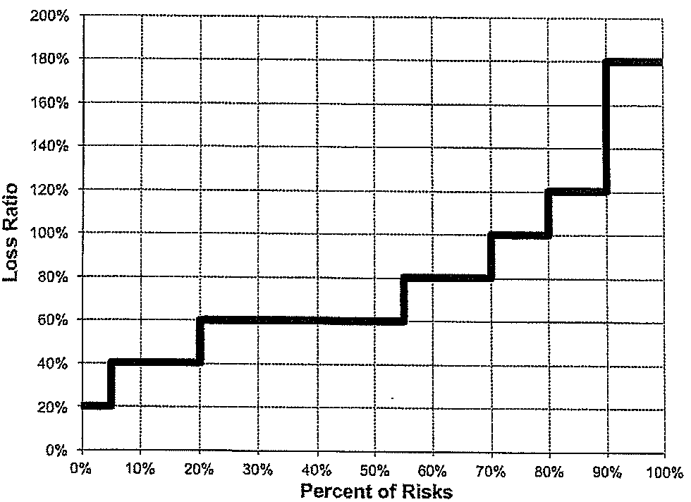
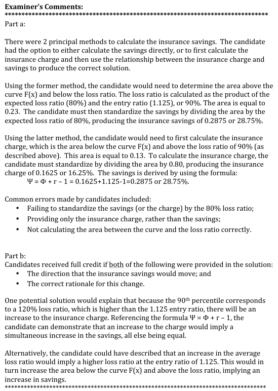

# 2012 Exam 8 - Q21

**Points:** 2

## Question

A group of similar risks has an average loss ratio of 80%. The following Lee diagram depicts this group of risks:

**Empirical loss-ratio step function.** Horizontal axis = Percent of Risks (0-100%), vertical axis = Loss Ratio (0-200%). The cumulative step function takes these values:

| Percent of risks | Loss ratio |
| --- | --- |
| 0% - 5% | 20% |
| 5% - 20% | 40% |
| 20% - 55% | 60% |
| 55% - 70% | 80% |
| 70% - 80% | 100% |
| 80% - 90% | 120% |
| 90% - 100% | 180% |

### Part a (1.50 pts)

Calculate the insurance savings at an entry ratio of 1.125.

### Part b (0.50 pts)

The risks above the 90th percentile have their losses restated, significantly increasing the loss ratio. Describe the change to the insurance savings at an entry ratio of 1.125.

## Solution

### Part a

The quickest way to solve this is to convert the given entry ratio to a loss ratio, rather than converting all the loss ratios in the graph to entry ratios. Then remember to divide by the expected loss ratio in the ψ(r) calculation. The average loss ratio is given at 80%

Solution 1: Calculate the savings directly

**LR at r of 1.125:** 90% — `=0.8*1.125`

Summing the area above curve to line at 90% loss ratio using vertical slices (from left to right), and then dividing by the total area under the curve (ELR = 80%):

**Savings at 1.125:** 0.2875 — `=((N8-0.2)*0.05 + (N8-0.4)*(0.2-0.05)+ (N8-0.6)*(0.55-0.2)+ (N8-0.8)*(0.7-0.55) )/0.8`

Solution 2: Calculate the charge, then use that to calculate the savings

**LR at r of 1.125:** 90% — `=0.8*1.125`

Summing the area above line at 90% loss ratio and below curve using vertical slices (from left to right):

and then dividing by the total area under the curve (ELR = 80%):

**Charge at 1.125:** 0.1625 — `=((1-N16)*0.1+(1.2-N16)*0.1+(1.8-N16)*0.1)/0.8`

**Savings at 1.125:** 0.2875 — `=N20+1.125-1`

### Part b

For example, suppose the new loss ratio above the 90th percentile was now 250%. We can calculate the new ELR and new savings:

| L | N | P | R |
| --- | --- | --- | --- |
| Old ELR: | 80% | New ELR: | 87% |
| Old LR at r of 1.125 | 90% | New LR at r of 1.125 | 97.875% |
| Old Savings: | 0.2875 | New Savings: | 0.32773 |

Formulas

- `N25` = `=0.2*0.05+0.4*(0.2-0.05)+0.6*(0.55-0.2)+0.8*(0.7-0.55)+1*(0.8-0.7)+1.2*(0.9-0.8)+1.8*(1-0.9)`
- `R25` = `=0.2*0.05+0.4*(0.2-0.05)+0.6*(0.55-0.2)+0.8*(0.7-0.55)+1*(0.8-0.7)+1.2*(0.9-0.8)+2.5*(1-0.9)`
- `N26` = `=N25*1.125`
- `R26` = `=R25*1.125`
- `N27` = `=((N26-0.2)*0.05 + (N26-0.4)*(0.2-0.05)+ (N26-0.6)*(0.55-0.2)+ (N26-0.8)*(0.7-0.55) )/N25`
- `R27` = `=((R26-0.2)*0.05 + (R26-0.4)*(0.2-0.05)+ (R26-0.6)*(0.55-0.2)+ (R26-0.8)*(0.7-0.55) )/R25`

Solution 1: Discuss savings directly

This would cause the average loss ratio to increase, meaning the entry ratio of 1.125 would correspond to a higher loss ratio than 90%. Since the remainder of the curve wouldn't change (other than above 90%), the numerator in the savings formula used in part (a) above would increase faster than the denominator would increase, so the insurance savings would increase.

Solution 2: Discuss charge impact, then infer savings impact

A significant increase to the area under the curve for the last decile would cause the charge to increase since that area would increase faster than the total area under the curve. Since savings = charge + r - 1, because the charge increases, the savings will also increase.

## Examiner Report

Examiner Report Comments:

