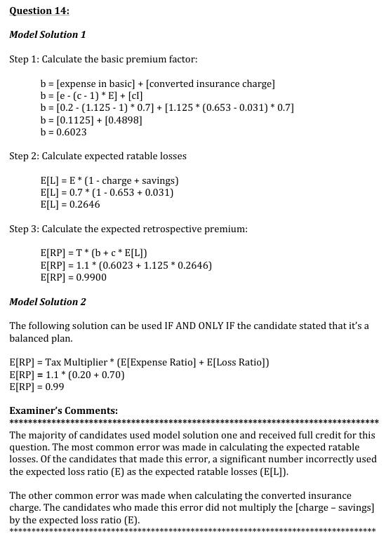

# 2013 Exam 8 - Q14

**Points:** 1.5

## Question

A policy subject to a balanced retrospective rating plan is written with the following values:

| B | C |
| --- | --- |
| 70% | Expected loss ratio as a % of standard premium |
| 1.10 | Tax multiplier |
| 20% | Expense ratio |
| 1.125 | Loss conversion factor |
| 125% | Maximum retrospective premium  as a % of standard premium |
| 75% | Minimum retrospective premium  as a % of standard premium |

The appropriate values from Table M for the current year are as follows:

| B | C |
| --- | --- |
| 0.653 | Insurance charge at entry ratio associated with maximum |
| 0.031 | Insurance savings at entry ratio associated with minimum |

Calculate the expected retrospective premium as a percentage of standard premium for the policy.

## Solution

The question writer didn't realize it, but since the expected retrospective premium equals the guaranteed cost premium for a balanced plan, we can quickly obtain the solution using (e/P + E[A]/P)T. Unbelievably though, in order to get full credit for that solution, the graders required that you restate that this works because the plan is balanced, even though the question already said the plan was balanced.

Solution 1: Quick solution (likely unforeseen by the question writer)

Because the plan is balanced, E[R] = GCP

**GCP/P:** 0.99 — `=(B8+B6)*B7`

Solution 2: Long solution, likely the one intended by the question writer

**I/P:** 0.4354 — `=(B15-B16)*B6`

B/P — 0.602 — `=B8-(B9-1)*B6+B9*J15` — B = e - (c-1)E[A] + cI

**E[L]/P:** 0.2646 — `=B6-J15`

**E[R]/P:** 0.99 — `=(J17+B9*J19)*B7`

## Examiner Report

Examiner Report Solutions and Comments:

