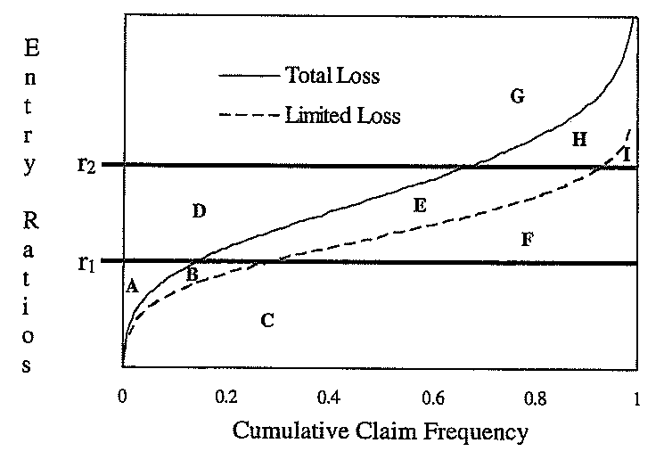
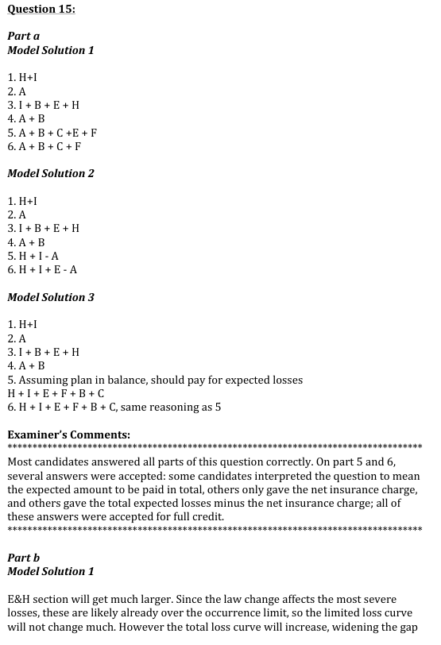
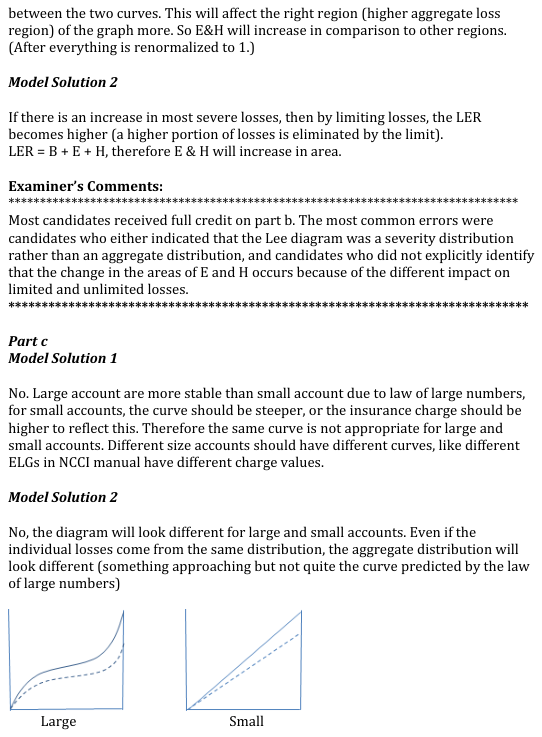
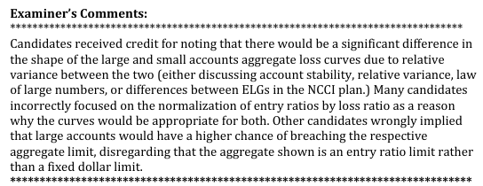

# 2013 Exam 8 - Q15 revised

**Points:** 3.25

## Question

The following diagram depicts a book of business for a retrospectively rated workers compensation plan:

**Entry-ratio diagram, total vs limited losses.** Vertical axis = Entry Ratios, horizontal axis = Cumulative Claim Frequency 0 to 1. A solid curve labelled *Total Loss* and a dashed curve labelled *Limited Loss* both rise steeply near $F = 1$. Heavy horizontal lines mark $r_1$ (lower) and $r_2$ (upper). Regions: **A** and **B** at the far left near the origin, **C** the wide area beneath both curves below $r_1$, **D** and **E** between $r_1$ and $r_2$ above the curves, **F** between $r_1$ and $r_2$ below the dashed curve, **G** and **H** above $r_2$, and **I** at the top right corner.

The descriptions of the labels on the diagram are as follows:

- r1 = Aggregate minimum
- r2 = Aggregate maximum
- Total loss - Total aggregate losses with no per-accident limit
- Limited loss - Total aggregate losses after application of a per-accident limit

### Part a (1.50 pts)

Using the letter labels above to represent portions of the graph, describe the following

## Solution

### Part a

I presume the definition of "entry ratio" on the vertical axis has a denominator of unlimited expected loss, rather than limited expected loss (as it would be for the Limited Table M case). Note that the horizontal axis in this problem is incorrectly labeled. It should say "cumulative distribution function" or perhaps "cumulative percent of risks" instead of "cumulative claim frequency."

| L | M |
| --- | --- |
| 1.) H + I | The area above r_2 but below the Total Loss curve |
| 2.) A | The area below r_1 but above the Total Loss curve |
| 3.) B + E + H + I | The area between curves (the Loss Elimination Ratio), plus the area above r_2 but below the Limited loss curve. |
| 4.) A + B | The area below r_1 but above the Limited Loss curve |

5.) The wording on this question wasn't very clear. It seems that they meant to ask for the net insurance charge based on the "I," though based on the wording, other answers were also accepted.

Possible answers for 5:

| L | M |
| --- | --- |
| H + I - A | The net insurance (Table M) charge |
| B + C + E + F + H + I | Total expected losses (in a balanced plan, the expected premium is set so the premium covers expected |

unlimited loss)

A + B + C + E + F — Total expected losses less the net insurance (Table M) charge

6.) The same issue on the wording was here too, so multiple answers were accepted.

Possible answers for 6:

| L | M |
| --- | --- |
| E + H + I - A | The net insurance (Table L) charge |
| B + C + E + F + H + I | Total expected losses (in a balanced plan, the expected premium is set so the premium covers expected |

unlimited loss)

A + B + C + F — Total expected losses less the net insurance (Table L) charge

### Part b

If the most severe losses increase, the total loss curve will change shape so that it is steeper on the right part of the graph, though the total area below the curve will still be 1. The limited loss curve will be less affected since these severe losses may already be capped by the per-accident limit. As such, the areas E and H between the curves will increase.

### Part c

Note that the Lee diagram shows an aggregate loss distribution, which includes total losses experienced by a policy (frequency and severity). This question is related to why the NCCI uses different Expected Loss Groups to have different Table M curves by size of insured.

The same graph would not be accurate for both small and large insureds. When a Table M or L is built on the experience of many large insureds, the large insureds will have less variance in the entry ratios compared with the tables built on data from small insureds. This is due to the additional claim counts from large insureds and the law of large numbers. As a result, the entry ratios for large insureds underlying the tables will be closer together, and the curves will be flatter than the curves for small insureds.

## Examiner Report

quantities:

1.) φ - The Table M insurance charge at r2. 2.) ψ - The Table M savings at r1. 3.) φD* - The Table L insurance charge at r2. 4.) ψD* - The Table L insurance savings at r1. 5.) I - The amount expected to be paid by the insured with an aggregate limit but no per-accident limit. 6.) I* - The amount expected to be paid by the insured in the presence of both an aggregate and a per-accident limit.

### Part b (0.75 pts)

A change in relevant workers compensation law goes into effect that causes a significant increase in the most severe losses. Briefly explain what effect this is likely to have on the areas of E and H in the above diagram.

### Part c (1.00 pts)

Assume loss frequency and severity are independent, all individual losses come from the same distribution, and the only difference between large and small accounts is the number of expected claim counts. Determine whether the above diagram is accurate for both large and small accounts. Justify your answer.

Examiner Report Solutions and Comments:

<--- Perhaps they thought it was a severity distribution because the horizontal axis label incorrectly corresponded with a severity distribution.
