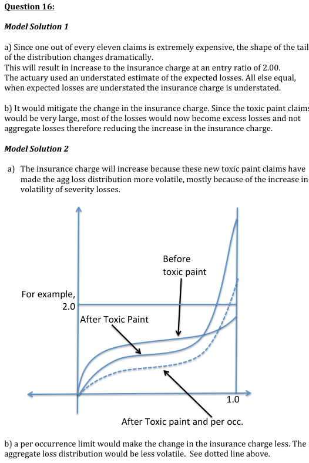
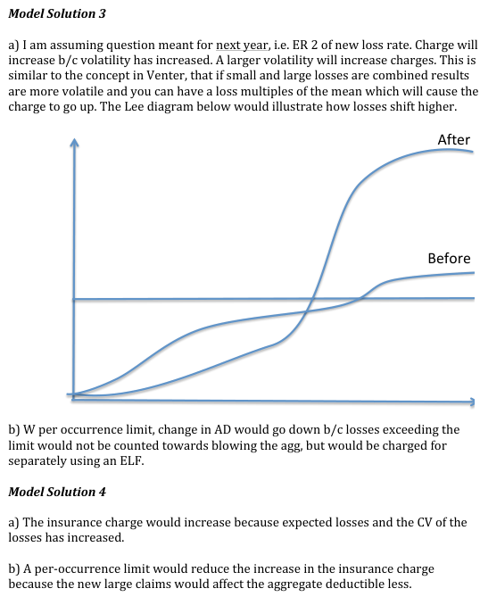
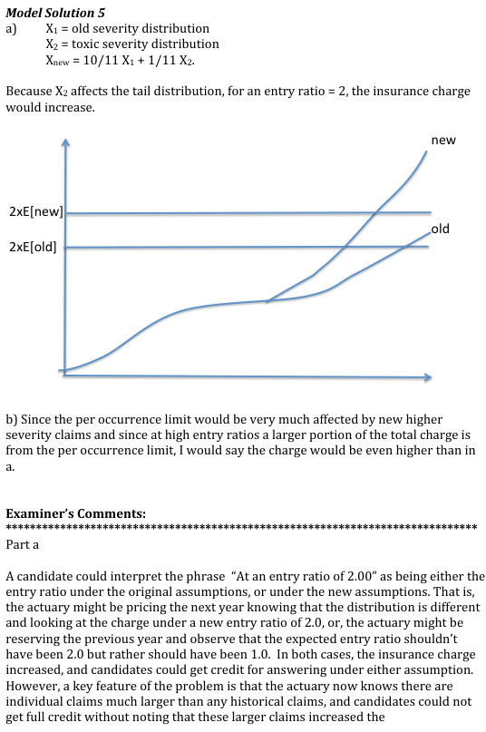
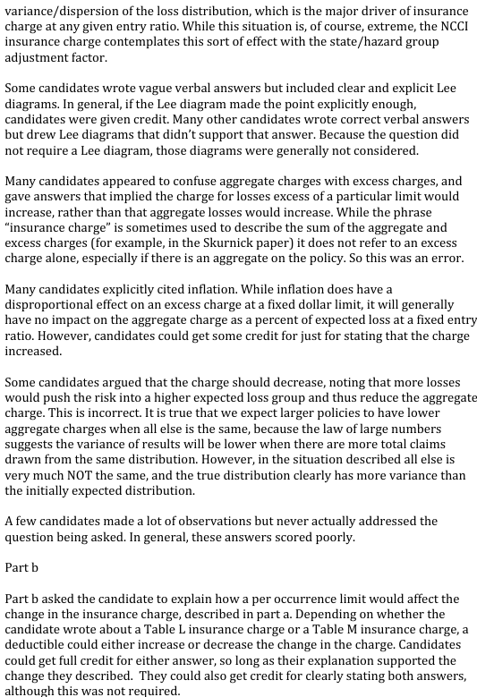
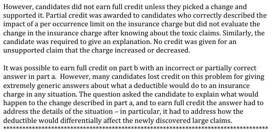

# 2013 Exam 8 - Q16

**Points:** 1.25

## Question

An actuary calculates the insurance charges on an aggregate deductible for a general liability policy for house painters. All the losses in the historical data used in the analysis resulted from inadequate and/or sloppy paint jobs, which were relatively inexpensive to fix. Later, it is discovered that some paint contained a toxic substance and those painters are liable for very expensive remediation of the painted properties.

The new claims are 10% as common as the historical claims. For every 10 claims that would have been expected before, there are now 11, one of which is cleaning up toxic paint.

Had this been known, the expected cost of a policy would have been twice the cost the actuary used.

### Part a (0.75 pts)

At an entry ratio of 2.00, with no per-occurrence loss limit, explain whether the insurance charge would increase, decrease, or stay the same.

### Part b (0.50 pts)

Explain how a per-occurrence limit would affect the change in the insurance charge for the aggregate deductible.

## Solution

### Part a

The addition of the toxic claims to the data would significantly increase the variance of aggregate losses. As such, for a given entry ratio, the expected percent of losses in excess of that entry ratio would increase. This means the insurance charge for a given entry ratio would increase.

### Part b

Solution 1: Discuss the Limited Table M charge

With a Limited Table M, the occurrence charge is applied separately from the charge for the aggregate limit.

If there was a per occurrence limit, it would cap some of the large toxic claims at the occurrence limit. As such, there would be a lower percent of expected limited losses in excess of the aggregate deductible compared with the percent of expected unlimited losses in excess of that same deductible. As such, the Limited Table M insurance charge for the aggregate deductible would be reduced compared to the case without the occurrence limit (a regular Table M).

Solution 2: Discuss the Table L charge

A Table L charge includes the charge for the occurrence limit and the aggregate limit, while the Table M charge is for the aggregate limit alone. Even though there is overlap between the occurrence and aggregate charges, as long as there isn't 100% overlap, the Table L charge will be larger than the Table M charge.

## Examiner Report

Examiner Report Solutions and Comments:

