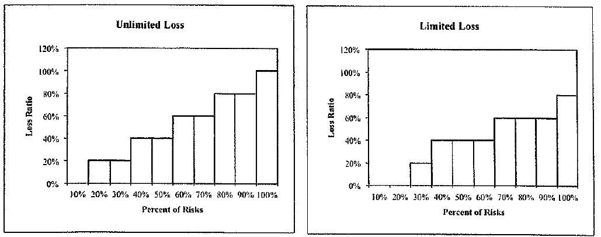
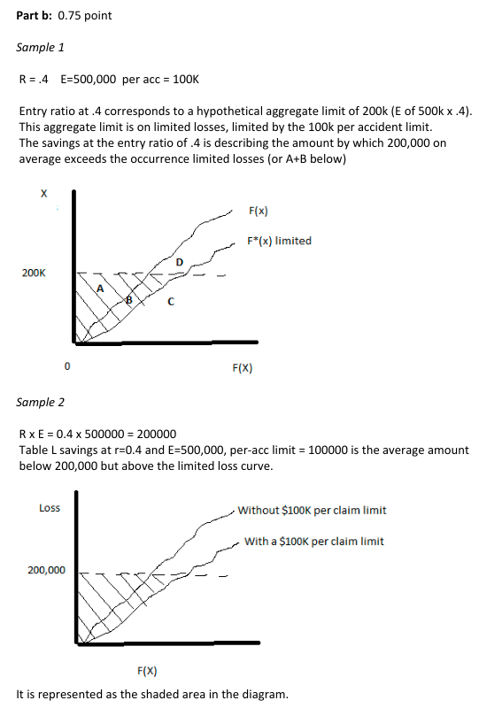
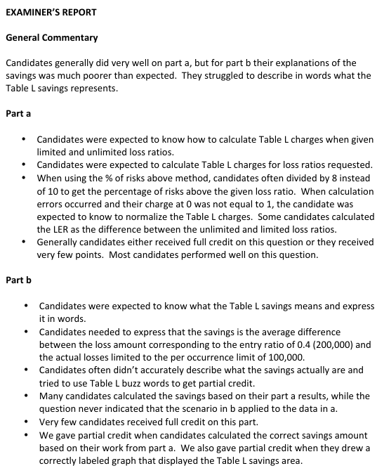

# 2014 Exam 8 - Q12

**Points:** 3

## Question

The following Lee diagrams depict the loss experience of a group of 10 similar risks; one for unlimited losses and the other for limited losses.

## Solution

### Part a

| N | P |
| --- | --- |
| E[A]/P | 50% |
| E[A_D]/P | 40% |

Formulas

- `P2` = `=0*0.1+0.2*0.2+0.4*0.2+0.6*0.2+0.8*0.2+1*0.1`
- `P3` = `=0*0.1+0.2*0.1+0.4*0.3+0.6*0.3+0.8*0.1`

**k:** 0.2 — `=1-P3/P2`

| Limited LR | r | # lim risks | # above | % above | Table L Charge |
| --- | --- | --- | --- | --- | --- |
| 0% | 0 | 2 | 8 | 0.8 | 1 |
| 20.0% | 0.4 | 1 | 7 | 0.7 | 0.68 |
| 40.0% | 0.8 | 3 | 4 | 0.4 | 0.4 |
| 60.0% | 1.2 | 3 | 1 | 0.1 | 0.24 |
| 80.0% | 1.6 | 1 | 0 | 0 | 0.2 |
| 100.0% | 2 | 0 | 0 | 0 | 0.2 |

Formulas

- `O8` = `=N8/P$2`
- `Q8` = `=SUM(P9:P$13)`
- `R8` = `=Q8/SUM(P$8:P$13)`
- `S8` = `=S9+(O9-O8)*R8`
- `N9` = `=N8+0.2`
- `O9` = `=N9/P$2`
- `Q9` = `=SUM(P10:P$13)`
- `R9` = `=Q9/SUM(P$8:P$13)`
- `S9` = `=S10+(O10-O9)*R9`
- `N10` = `=N9+0.2`
- `O10` = `=N10/P$2`
- `Q10` = `=SUM(P11:P$13)`
- `R10` = `=Q10/SUM(P$8:P$13)`
- `S10` = `=S11+(O11-O10)*R10`
- `N11` = `=N10+0.2`
- `O11` = `=N11/P$2`
- `Q11` = `=SUM(P12:P$13)`
- `R11` = `=Q11/SUM(P$8:P$13)`
- `S11` = `=S12+(O12-O11)*R11`
- `N12` = `=N11+0.2`
- `O12` = `=N12/P$2`
- `Q12` = `=SUM(P13:P$13)`
- `R12` = `=Q12/SUM(P$8:P$13)`
- `S12` = `=S13+(O13-O12)*R12`
- `N13` = `=N12+0.2`
- `O13` = `=N13/P$2`
- `R13` = `=Q13/SUM(P$8:P$13)`
- `S13` = `=P5`

### Part b

200,000 — `=0.4*500000`

The Table L savings at an entry ratio of 0.4 corresponds to the average amount by which aggregate losses limited to $100,000 per accident fall short of $200,000.

## Examiner Report

### Part a (2.25 pts)

Calculate the Table L charges at loss ratios of 0% to 100% in 20% increments.

### Part b (0.75 pts)

Describe what the Table L savings at an entry ratio of 0.4 reflects, assuming an expected unlimited loss of $500,000 and a per accident limit of $100,000.

Examiner Report Solutions for part (b) and Comments:

