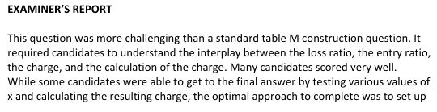
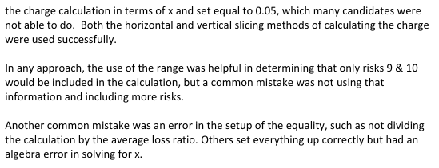

# 2014 Exam 8 - Q13

**Points:** 2

## Question

A Table M is constructed based on the experience of the following 10 similarly sized risks:

| Risk | Aggregate Loss Ratio |
| --- | --- |
| 1 | 10% |
| 2 | 30% |
| 3 | 35% |
| 4 | 40% |
| 5 | 60% |
| 6 | 75% |
| 7 | X% |
| 8 | 90% |
| 9 | 110% |
| 10 | 120% |

X is the aggregate loss ratio for Risk 7.

Assume:

- 75% ≤ X ≤ 90%
- The Table M charge at entry ratio 1.5 is 0.05.

Calculate X.

## Solution

Solution 1: Vertical slices approach

ELR — 0.57 — `=SUM(D14:D16,D7:D12)/10` — +0.1X

| If X is: | Implied ELR | r = 1.5 corresponds to a LR between |
| --- | --- | --- |
| 75% | 0.645 | 96.75% |
| 90% | 0.66 | 99.00% |

Formulas

- `I7` = `=0.57+0.1*H7`
- `K7` = `=1.5*I7`
- `I8` = `=0.57+0.1*H8`
- `K8` = `=1.5*I8`

Thus only risks 9 and 10 will contribute to the charge at r = 1.5

0.05 = [(120% - 1.5*ELR)(1/10) + (110% - 1.5*ELR)(1/10)] / ELR 0.05ELR = 0.12 - 0.15ELR + 0.11 - 0.15ELR 0.35ELR = 0.23

**ELR:** 0.657143 — `=0.23/0.35`

**X:** 87.1% — `=(I16-J4)/0.1`

Solution 2: Horizontal slices approach

ELR — 0.57 — `=SUM(D14:D16,D7:D12)/10` — +0.1X

| If X is: | Implied ELR | r = 1.5 corresponds to a LR between |
| --- | --- | --- |
| 75% | 0.645 | 96.75% |
| 90% | 0.66 | 99.00% |

Formulas

- `I25` = `=0.57+0.1*H25`
- `K25` = `=1.5*I25`
- `I26` = `=0.57+0.1*H26`
- `K26` = `=1.5*I26`

Thus only risks 9 and 10 will contribute to the charge at r = 1.5, i.e., r for risks 9 and 10 will be above 1.5

| LR | r | # above | % above | Charge |
| --- | --- | --- | --- | --- |
|  | 1.5 | 2 | 0.2 | [0+(1.2/ELR - 1.1/ELR)*0.1] + (1.1/ELR - 1.5)*0.2 |
| 110% | 1.1/ELR | 1 | 0.1 | 0+(1.2/ELR - 1.1/ELR)*0.1 |
| 120% | 1.2/ELR | 0 | 0 | 0 |

Formulas

- `K31` = `=J31/10`
- `H32` = `=D15`
- `K32` = `=J32/10`
- `H33` = `=D16`
- `K33` = `=J33/10`

0.05 = [0+(1.2/ELR - 1.1/ELR)*0.1] + (1.1/ELR - 1.5)*0.2 0.05 = 0.12/ELR - 0.1/ELR + 0.22/ELR - 0.3 0.35 = 0.23ELR

**ELR:** 0.657143 — `=0.23/0.35`

**X:** 87.1% — `=(I39-J22)/0.1`

Solution 3: Test every possible integer LR between 75 and 90 to see if it gets the 0.05 result

This does assume X is an integer, which actually seems reasonable since all the other LRs given are integers.

Test possible X values: — Only risks 9 and 10 have LRs above LRs below.

| X | ELR | LR at r=1.5 | Charge at r=1.5 using vertical slices |   |
| --- | --- | --- | --- | --- |
| 75% | 64.5% | 96.8% | 0.0566 |  |
| 76% | 64.6% | 96.9% | 0.0560 |  |
| 77% | 64.7% | 97.0% | 0.0555 |  |
| 78% | 64.8% | 97.2% | 0.0549 |  |
| 79% | 64.9% | 97.4% | 0.0544 |  |
| 80% | 65.0% | 97.5% | 0.0538 |  |
| 81% | 65.1% | 97.7% | 0.0533 |  |
| 82% | 65.2% | 97.8% | 0.0528 |  |
| 83% | 65.3% | 98.0% | 0.0522 |  |
| 84% | 65.4% | 98.1% | 0.0517 |  |
| 85% | 65.5% | 98.2% | 0.0511 |  |
| 86% | 65.6% | 98.4% | 0.0506 |  |
| 87% | 65.7% | 98.6% | 0.0501 | <--- this is the closest to 0.05, so X = 87% |
| 88% | 65.8% | 98.7% | 0.0495 |  |
| 89% | 65.9% | 98.9% | 0.0490 |  |
| 90% | 66.0% | 99.0% | 0.0485 |  |

Formulas

- `I50` = `=AVERAGE(H50,D$7:D$12,D$14:D$16)`
- `J50` = `=I50*1.5`
- `K50` = `=((D$16-J50)*(1/10)+(D$15-J50)*(1/10))/I50`
- `H51` = `=H50+0.01`
- `I51` = `=AVERAGE(H51,D$7:D$12,D$14:D$16)`
- `J51` = `=I51*1.5`
- `K51` = `=((D$16-J51)*(1/10)+(D$15-J51)*(1/10))/I51`
- `H52` = `=H51+0.01`
- `I52` = `=AVERAGE(H52,D$7:D$12,D$14:D$16)`
- `J52` = `=I52*1.5`
- `K52` = `=((D$16-J52)*(1/10)+(D$15-J52)*(1/10))/I52`
- `H53` = `=H52+0.01`
- `I53` = `=AVERAGE(H53,D$7:D$12,D$14:D$16)`
- `J53` = `=I53*1.5`
- `K53` = `=((D$16-J53)*(1/10)+(D$15-J53)*(1/10))/I53`
- `H54` = `=H53+0.01`
- `I54` = `=AVERAGE(H54,D$7:D$12,D$14:D$16)`
- `J54` = `=I54*1.5`
- `K54` = `=((D$16-J54)*(1/10)+(D$15-J54)*(1/10))/I54`
- `H55` = `=H54+0.01`
- `I55` = `=AVERAGE(H55,D$7:D$12,D$14:D$16)`
- `J55` = `=I55*1.5`
- `K55` = `=((D$16-J55)*(1/10)+(D$15-J55)*(1/10))/I55`
- `H56` = `=H55+0.01`
- `I56` = `=AVERAGE(H56,D$7:D$12,D$14:D$16)`
- `J56` = `=I56*1.5`
- `K56` = `=((D$16-J56)*(1/10)+(D$15-J56)*(1/10))/I56`
- `H57` = `=H56+0.01`
- `I57` = `=AVERAGE(H57,D$7:D$12,D$14:D$16)`
- `J57` = `=I57*1.5`
- `K57` = `=((D$16-J57)*(1/10)+(D$15-J57)*(1/10))/I57`
- `H58` = `=H57+0.01`
- `I58` = `=AVERAGE(H58,D$7:D$12,D$14:D$16)`
- `J58` = `=I58*1.5`
- `K58` = `=((D$16-J58)*(1/10)+(D$15-J58)*(1/10))/I58`
- `H59` = `=H58+0.01`
- `I59` = `=AVERAGE(H59,D$7:D$12,D$14:D$16)`
- `J59` = `=I59*1.5`
- `K59` = `=((D$16-J59)*(1/10)+(D$15-J59)*(1/10))/I59`
- `H60` = `=H59+0.01`
- `I60` = `=AVERAGE(H60,D$7:D$12,D$14:D$16)`
- `J60` = `=I60*1.5`
- `K60` = `=((D$16-J60)*(1/10)+(D$15-J60)*(1/10))/I60`
- `H61` = `=H60+0.01`
- `I61` = `=AVERAGE(H61,D$7:D$12,D$14:D$16)`
- `J61` = `=I61*1.5`
- `K61` = `=((D$16-J61)*(1/10)+(D$15-J61)*(1/10))/I61`
- `H62` = `=H61+0.01`
- `I62` = `=AVERAGE(H62,D$7:D$12,D$14:D$16)`
- `J62` = `=I62*1.5`
- `K62` = `=((D$16-J62)*(1/10)+(D$15-J62)*(1/10))/I62`
- `H63` = `=H62+0.01`
- `I63` = `=AVERAGE(H63,D$7:D$12,D$14:D$16)`
- `J63` = `=I63*1.5`
- `K63` = `=((D$16-J63)*(1/10)+(D$15-J63)*(1/10))/I63`
- `H64` = `=H63+0.01`
- `I64` = `=AVERAGE(H64,D$7:D$12,D$14:D$16)`
- `J64` = `=I64*1.5`
- `K64` = `=((D$16-J64)*(1/10)+(D$15-J64)*(1/10))/I64`
- `H65` = `=H64+0.01`
- `I65` = `=AVERAGE(H65,D$7:D$12,D$14:D$16)`
- `J65` = `=I65*1.5`
- `K65` = `=((D$16-J65)*(1/10)+(D$15-J65)*(1/10))/I65`

## Examiner Report

Examiner Report Comments:

