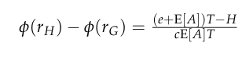
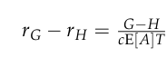
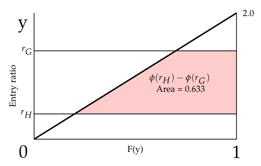
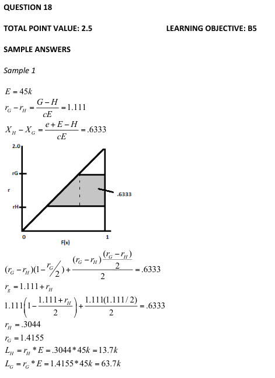
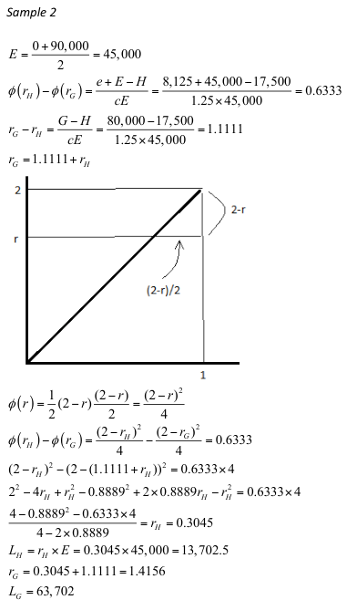
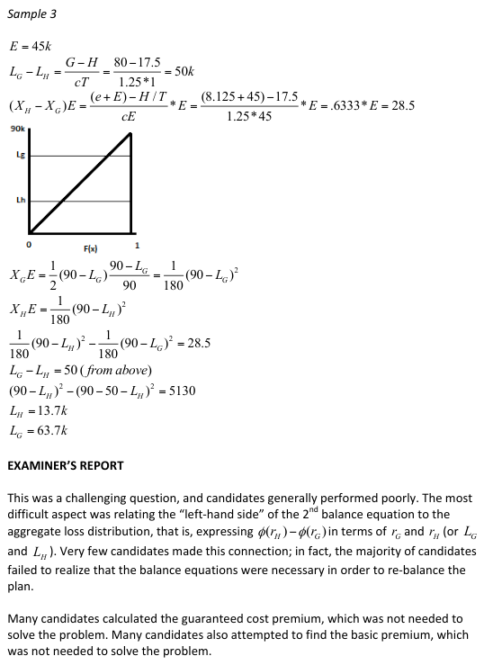
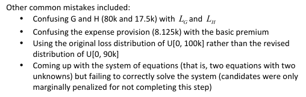

# 2014 Exam 8 - Q18

**Points:** 2.5

## Question

An actuary prices a retrospectively rated policy with the following provisions resulting in a balanced plan:

| B | C |
| --- | --- |
| 17,500 | Minimum premium |
| 80,000 | Maximum premium |
| 8,125 | Expense provision |
| 1.25 | Loss conversion factor |

Aggregate losses follow a uniform distribution on the interval:

| B | C |
| --- | --- |
| $0 | Bottom of interval |
| $100,000 | Top of interval |

There are no taxes.

After pricing the policy, the actuary discovers an error in the original loss distribution and determines that losses should instead follow a uniform distribution on the interval below:

| B | C |
| --- | --- |
| $0 | Bottom of corrected interval |
| $90,000 | Top of corrected interval |

The actuary decides to re-balance the plan based on the corrected distribution while still maintaining the same minimum and maximum premium.

Calculate the loss at minimum premium and loss at maximum premium that re-balance the plan.

## Solution

The original loss distribution is actually irrelevant to solving this problem. We want to find L_G and L_H, which we can obtain from using the balance equations. Since there are no taxes, T = 1.

**E[A]:** $45,000 — `=AVERAGE(B22:B23)`

$$r_G - r_H = \frac{G - H}{c\,E[A]\,T}$$

| I | K |
| --- | --- |
| phi(r_H) - phi(r_G) | 0.633 |
| r_G - r_H | 1.111 |

Formulas

- `K7` = `=((B9+K5)-B7)/(B10*K5)`
- `K8` = `=(B8-B7)/(B10*K5)`

Note that r_G = L_G / E[A] and r_H = L_H / E[A]. Since we know E[A], we want to find r_G and r_H. We can do this using the balance equations and the known loss distribution. The entry ratio at $90k = $90k / $45k = 2.0.

We can use the diagram to the right to visualize the corrected aggregate loss distribution.

| I | J |
| --- | --- |
| y | F(y) |
| r_H | r_H/2 |
| r_G | r_G/2 |

Area of red trapezoid = (0.5)(r_G - r_H)[(1 - r_G/2) + (1 - r_H/2)] = 0.633 Substitute r_G - r_H = 1.111, or r_G = r_H + 1.111 (0.5)(1.111)[(1 - (r_H + 1.111)/2) + (1 - r_H/2)] = 0.633 1 - r_H/2 - 1.111/2 + 1 - r_H/2 = 0.633 / (0.5)(1.111) 2 - 1.111/2- r_H = 0.633 / (0.5)(1.111)

| I | J |
| --- | --- |
| Solve for r_H | 0.304 |
| r_G | 1.416 |

Formulas

- `J31` = `=(2-K8/2) - (K7/(0.5*K8))`
- `J32` = `=K8+J31`

| I | K |
| --- | --- |
| Loss at Minimum (L_H) | $13,700 |
| Loss at Maximum (L_G) | $63,700 |

Formulas

- `K34` = `=J31*K$5`
- `K35` = `=J32*K$5`

## Examiner Report

Examiner Report Solution and Comments:

