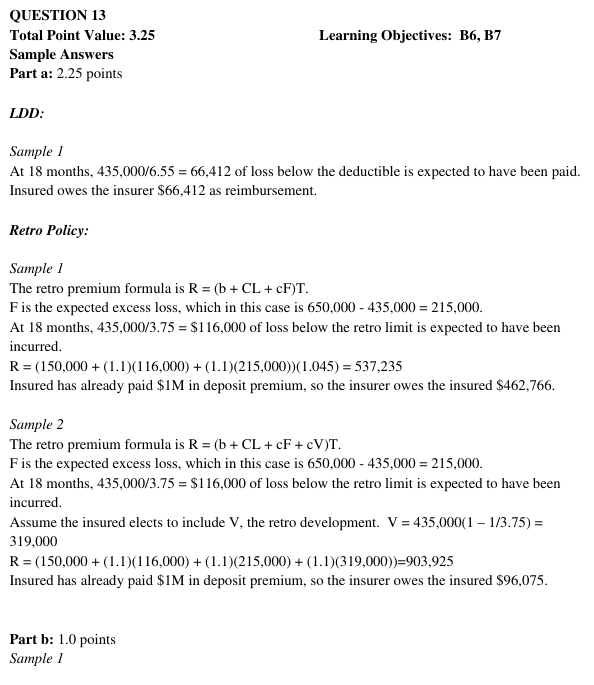
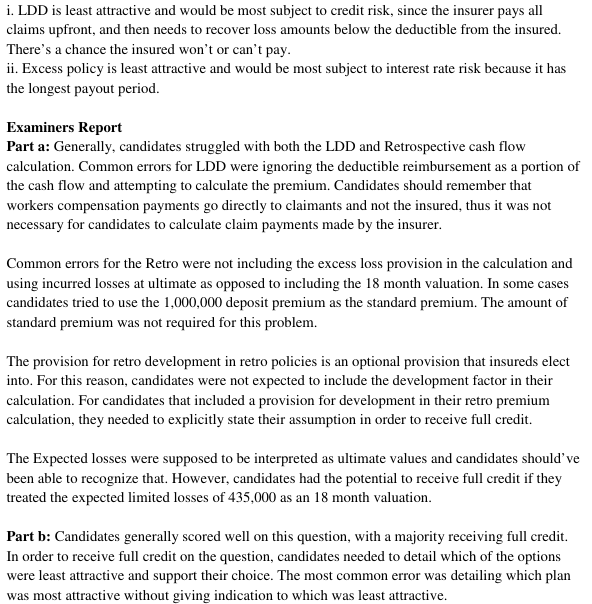

# 2015 Exam 8 - Q13 revised

**Points:** 3.25

## Question

An actuary prices two loss-sensitive options for a workers compensation policy as follows:

Option 1: A large deductible plan with a per-occurrence deductible of $50,000

Option 2: An incurred retrospective rating plan with the following parameters:

| C | D |
| --- | --- |
| $50,000 | Per Occurrence Limit |
| $150,000 | Basic Premium (NOT including charge for occurrence limit) |
| 1.045 | Tax Multiplier |
| 1.100 | Loss Conversion Factor |
| $1,000,000 | Deposit Premium (paid at policy inception) |

For each of the options above, assume that no aggregate limits or maximum premiums apply and that the first adjustment will take place 18 months after policy inception.

Additionally, the actuary has developed the following assumptions for the insured:

|   | Unlimited | Limited to $50,000 |
| --- | --- | --- |
| Expected Loss | $650,000 | $435,000 |
| 18-Ultimate Incurred LDF | 4.25 | 3.75 |
| 18-Ultimate Paid LDF | 8.80 | 6.55 |

### Part a (2.25 pts)

For each of the plans above, determine the expected cash flows between the insured and insurer 18 months after policy inception.

### Part b (1.00 pts)

The insured is contemplating a third option of purchasing an excess policy with a self-insured retention of $50,000.

i. Which of the three options would be least attractive to the insurer if they wish to minimize

credit risk? Briefly explain your choice.

ii. Which of the three options would be least attractive to the insurer if they wish to minimize

interest rate risk? Briefly explain your choice.

## Solution

### Part a

In this question, the cash flows at 18 months only include the premium adjustment for the retro policy and the deductible recovery from the large deductible policy (though I've never seen this called an "adjustment" before). The cash flow paid to claimants directly by the insurer would not be considered here.

Note that the deposit premium for the retro is higher than the expected retro premium at ultimate, which you can calculate as:

Expected Incurred Lim Loss at 18 months Expected Ult XS Loss

Expected Retro prem at 18 months

Expected retro cash flow as 18 months

Expected paid below LDD deductible at 18 months

The insurer would be expected to have paid 650,000 / 8.80 = 73,864 in claims as of 18 months, of which 66,412 is below the deductible. On a large deductible policy, the insurer pays the ground-up loss and then collects deductible amounts from the insured.

The insurer is expected to pay the insured $462,766 for the retro at 18 months. The insurer is expected to collect $66,412 from the large deductible policy at 18 months for losses below the deductible that the insurer has paid.

### Part b

i. The large deductible policy would be least attractive as it has the highest credit risk since

the insured may not be able to pay the insurer for amounts below the deductible. Excess policies have no credit risk since the insurer only pays losses in excess of the retention, and retrospective policies have deposit premiums that are paid up-front that are often equal to the expected guaranteed cost premium.

ii. An excess policy would be least attractive as it has the highest interest rate risk, since the

insurer is paid premiums up front, and won't have to pay losses and some expenses for many years. Large deductible and retro policies incur costs sooner since the insurer services the policies.

$903,925 — `=(C11+C13*D22+C13*(C22-D22))*C12` — E[R] = (B + cE[L_D] + ckE[A])T

$116,000 — `=D22/D23`

$215,000 — `=C22-D22`

$537,234 — `=(C11+C13*M9+C13*M10)*C12` — E[R] at 18 months = (B + cE[L_D at 18 months] + ckE[A])T

$-462,766 — `=M12-C14`

$66,412 — `=D22/D24`

## Examiner Report

Examiner Report Solutions and Comments:

