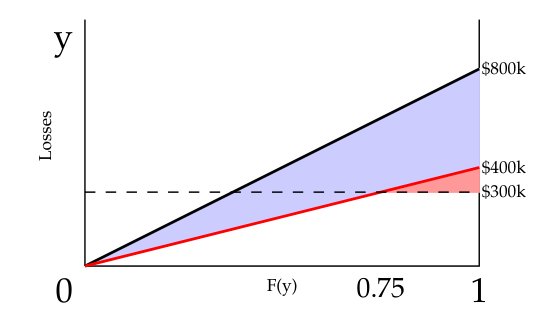
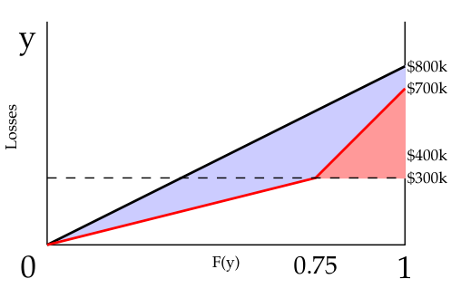
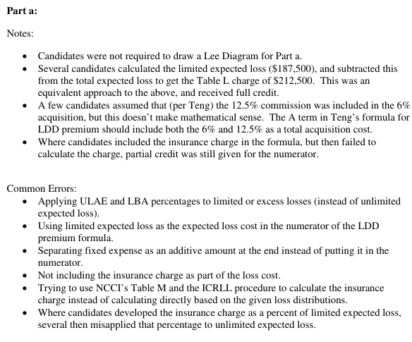
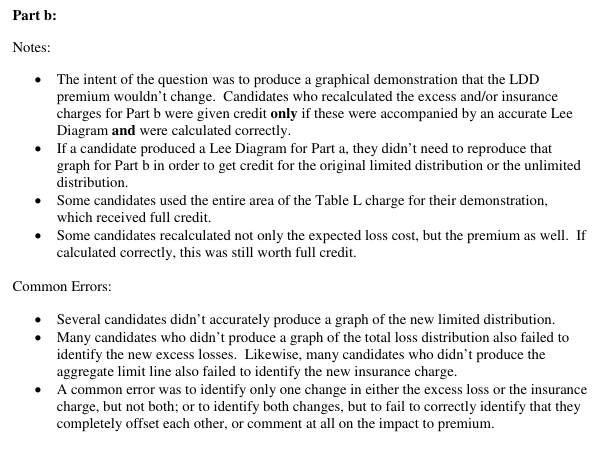

# 2015 Exam 8 - Q14 revised

**Points:** 3

## Question

An insured has a large dollar deductible (LDD) policy. Total losses and ALAE limited to the deductible are distributed uniformly on the interval below:

| B | C |
| --- | --- |
| $0 | Bottom of limited uniform distribution |
| $400,000 | Top of limited uniform distribution |

Total unlimited losses and ALAE are distributed uniformly on the interval below:

| B | C |
| --- | --- |
| $0 | Bottom of unlimited uniform distribution |
| $800,000 | Top of unlimited uniform distribution |

$300,000 — Insured's current aggregate loss limit

- Credit risk is not contemplated in pricing.
- The deductible applies to both loss and ALAE.

The following expenses apply to this insured:

| Expense Item | Value | Applies to: |
| --- | --- | --- |
| ULAE | 7.5% | Ground-up Loss & ALAE |
| Loss-Based Assessments | 5% | Ground-up Loss & ALAE |
| Overhead | $45,000 | Fixed |
| Acquisition | 6% | Written Premium |
| Commission | 12.5% | Written Premium |
| Premium Tax | 4% | Written Premium |
| Profit and Contingency | -5% | Written Premium |

### Part a (2.00 pts)

Calculate the LDD premium for this insured.

### Part b (1.00 pts)

It is later determined that, although the distribution of total unlimited losses and ALAE remains unchanged, the total losses and ALAE limited to the deductible actually follow the following distribution:

| B | C | E | F | G |
| --- | --- | --- | --- | --- |
| 75% | probability of loss and ALAE between | $0 | and | $300,000 |
| 25% | probability of loss and ALAE between | $300,000 | and | $700,000 |

- Losses follow a uniform distribution within each range.

Discuss the impact to the premium for the LDD policy.

## Solution

### Part a

A Lee diagram, while not needed, helps to visualize this, and can also be used for part (b). The solid black line below represents the unlimited loss curve, and the solid red line represents the limited loss curve. The blue area between the curves represents the charge for the expected losses in excess of the occurrence deductible, and the red area represents the expected limited losses above the aggregate limit. The total expected losses covered by the policy is the sum of these 2 areas.

| J | L |
| --- | --- |
| E[A] | $400,000 |
| E[A_D] | $200,000 |
| Expected XS Loss | $200,000 |
| Agg charge | $12,500 |

Formulas

- `L8` = `=AVERAGE(B12:B13)`
- `L9` = `=AVERAGE(B7:B8)`
- `L10` = `=L8-L9`
- `L11` = `=0.5*(1-B15/B8)*(B8-B15)`

**LDD Prem:** $372,727 — `=(L10+L11+L8*(C23+C24)+C25)/(1-SUM(C26:C29))`

### Part b

The diagram below can help visualize part (b). The total expected loss covered by the policy is represented by the total shaded area in the diagram, and this is unchanged compared to the diagram in part (a).

There will be no impact to the premium of the LDD policy because there is no change in the expected losses covered by the policy. There will be a shift compared to part (a), where in part (b) the aggregate charge will be bigger, but this is perfectly offset by the reduction in the charge for the occurrence deductible.

| J | L |
| --- | --- |
| E[A_D] new | $237,500 |
| Expected XS Loss | $162,500 |
| Agg charge | $50,000 |

Formulas

- `L50` = `=B39*AVERAGE(E39,G39)+B40*AVERAGE(E40,G40)`
- `L51` = `=L8-L50`
- `L52` = `=0.5*(B40*(G40-E40))`

| J | L | M |
| --- | --- | --- |
| Total | $212,500 |  |
| Total from (a) | $212,500 | unchanged |

Formulas

- `L54` = `=SUM(L51:L52)`
- `L55` = `=SUM(L10:L11)`

## Examiner Report

Examiner Report Comments:

