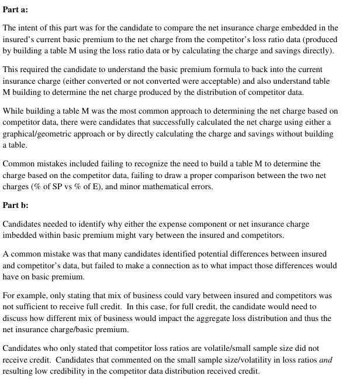

# 2015 Exam 8 - Q15

**Points:** 2.5

## Question

An insured in a retrospectively-rated workers compensation plan has the following policy information:

| B | C |
| --- | --- |
| $26,820 | Current basic premium |
| $100,000 | Standard premium |
| $20,000 | Expense Ratio (e) |
| $70,000 | Expected Losses |
| 1.00 | Tax Multiplier |
| 1.17 | Loss Conversion Factor |
| 1.00 | Entry Ratio @ G |
| 0.75 | Entry Ratio @ H |

The insured believes that the insurance charge embedded in the current basic premium is unfair and cites the following unlimited loss ratios from five similarly-sized competitors doing business in the same industry:

| Competitor | Loss Ratio |
| --- | --- |
| 1 | 70.0% |
| 2 | 105.0% |
| 3 | 52.5% |
| 4 | 87.5% |
| 5 | 35.0% |

### Part a (2.00 pts)

Compare the net insurance charge in the current basic premium for this policy to the net charge based on the provided competitor loss ratio experience.

### Part b (0.50 pts)

Discuss the appropriateness of using the basic premium derived from the competitor data to price this policy.

## Solution

### Part a

We have to assume the plan is balanced, otherwise we can't proceed. It allows you to use the formula for B.

I for policy — $16,000 — `=(B6-B8+(B11-1)*B9)/B11` — From B = e - (c-1)E[A] + cI

**E[A]/P:** 70.0% — `=B9/B7`

For the competitor piece, we can use vertical slices for a quick solution. We could also build a full Table M to get the same solution, but it would take much longer, and time is precious on the exam.

| K | N |
| --- | --- |
| Competitor Charge | 0.15 |
| Competitor Savings | 0.05 |

Formulas

- `N11` = `=(H21-B12)*(1/5)+(H23-B12)*(1/5)`
- `N12` = `=(B13-H24)*(1/5)`

**Competitor Net Charge:** $7,000 — `=(N11-N12)*B9`

The net insurance charge in the current basic premium is $16k, while the net insurance charge based on the competitor data is only $7k.

### Part b

Solution 1: Aggregate distribution should be different for competitor due to mix of business differences

1.00 — `=D20/AVERAGE($D$20:$D$24)`

| H | K |
| --- | --- |
| 1.50 | Using the charge derived from competitor analysis is not appropriate because competitors may |
| 0.75 | have a different mix of business and therefore have different aggregate loss curve that would |
| 1.25 | produce different and not comparable insurance charges. |

Formulas

- `H21` = `=D21/AVERAGE($D$20:$D$24)`
- `H22` = `=D22/AVERAGE($D$20:$D$24)`
- `H23` = `=D23/AVERAGE($D$20:$D$24)`

0.50 — `=D24/AVERAGE($D$20:$D$24)`

Solution 2: Focus on expenses in the basic premium being different

Not appropriate, basic premium includes expenses that could vary significantly from company to company.

Solution 3: Aggregate distribution should be different for competitor (similar to solution 1)

It may not be appropriate to use competitor data to price the policy due to differences in certain risk characteristics although the nature of business is the same. For example, there will be differences in operations, locations, safety programs, morale of employees which varies across companies. This will result in different loss distribution, and hence, produce different insurance charge.

Solution 4: Sample size of 5 competitors isn't credible to create a distribution

The data of 5 risks is not credible, of much less credible than the industrywide data going into the NCCI table M. The data on the 5 risks has low credibility and is not appropriate.

## Examiner Report

Examiner Report Comments:

