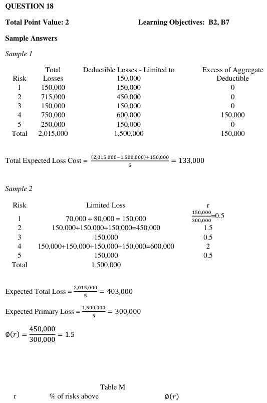
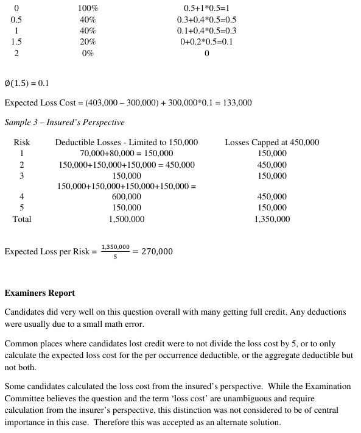

# 2015 Exam 8 - Q18

**Points:** 2

## Question

An actuary is given the following claims experience for large dollar deductible workers compensation insurance for five identically sized risks. Each claim is a separate occurrence.

Individual Claims Experience (Gross of Deductible)

| Risk # | Claim 1 | Claim 2 | Claim 3 | Claim 4 |
| --- | --- | --- | --- | --- |
| 1 | 70,000 | 80,000 |  |  |
| 2 | 165,000 | 300,000 | 250,000 |  |
| 3 | 150,000 |  |  |  |
| 4 | 150,000 | 250,000 | 200,000 | 150,000 |
| 5 | 250,000 |  |  |  |

Calculate the expected loss cost for a risk identical to the five above with the following deductibles:

| B | C |
| --- | --- |
| $150,000 | Per-occurrence deductible |
| $450,000 | Annual aggregate deductible |

## Solution

SOLUTION 1: Direct method (fastest)

| I | J | L | N | O |
| --- | --- | --- | --- | --- |
| A | A_D | min(A_D,450k) | E[A] | 403,000 |
| 150,000 | 150,000 | 150,000 | E[A_D;450k] | 270,000 |
| 715,000 | 450,000 | 450,000 |  |  |
| 150,000 | 150,000 | 150,000 | You could also get the components separately if desired: |  |
| 750,000 | 600,000 | 450,000 | Occurrence XS = E[A] - E[A_D] |  |
| 250,000 | 150,000 | 150,000 | Aggregate XS = E[A_D] - E[A_D;450k] |  |

Formulas

- `O8` = `=AVERAGE(I9:I13)`
- `I9` = `=SUM(C9:F9)`
- `J9` = `=MIN(C9,$B$17)+MIN(D9,$B$17)`
- `L9` = `=MIN(J9,B$18)`
- `O9` = `=AVERAGE(L9:L13)`
- `I10` = `=SUM(C10:F10)`
- `J10` = `=MIN(C10,$B$17)+MIN(D10,$B$17)+MIN(E10,$B$17)`
- `L10` = `=MIN(J10,B$18)`
- `I11` = `=SUM(C11:F11)`
- `J11` = `=MIN(C11,$B$17)`
- `L11` = `=MIN(J11,B$18)`
- `I12` = `=SUM(C12:F12)`
- `J12` = `=MIN(C12,$B$17)+MIN(D12,$B$17)+MIN(E12,$B$17)+MIN(F12,B17)`
- `L12` = `=MIN(J12,B$18)`
- `I13` = `=SUM(C13:F13)`
- `J13` = `=MIN(C13,$B$17)`
- `L13` = `=MIN(J13,B$18)`

**Expected Loss Cost:** 133,000 — `=O8-O9`

SOLUTION 2: Limited Table M

| L | M | O | P |
| --- | --- | --- | --- |
| E[A] | 403,000 | r*_G | 1.50 |
| E[A_D] | 300,000 |  |  |

Formulas

- `M19` = `=AVERAGE(I9:I13)`
- `P19` = `=B18/M20`
- `M20` = `=AVERAGE(J9:J13)`

| Risk | r* | r* | # above | % above | Lim Table M Charge |
| --- | --- | --- | --- | --- | --- |
| 1 | 0.5 | 0 | 5 | 1 | 1 |
| 2 | 1.5 | 0.5 | 2 | 0.4 | 0.5 |
| 3 | 0.5 | 1.5 | 1 | 0.2 | 0.1 |
| 4 | 2 | 2 | 0 | 0 | 0 |
| 5 | 0.5 |  |  |  |  |

Formulas

- `M23` = `=J9/M$20`
- `P23` = `=COUNTIF($M$23:$M$27,">"&O23)`
- `Q23` = `=P23/5`
- `R23` = `=R24+(O24-O23)*Q23`
- `M24` = `=J10/M$20`
- `O24` = `=M23`
- `P24` = `=COUNTIF($M$23:$M$27,">"&O24)`
- `Q24` = `=P24/5`
- `R24` = `=R25+(O25-O24)*Q24`
- `M25` = `=J11/M$20`
- `O25` = `=M24`
- `P25` = `=COUNTIF($M$23:$M$27,">"&O25)`
- `Q25` = `=P25/5`
- `R25` = `=R26+(O26-O25)*Q25`
- `M26` = `=J12/M$20`
- `O26` = `=M26`
- `P26` = `=COUNTIF($M$23:$M$27,">"&O26)`
- `Q26` = `=P26/5`
- `M27` = `=J13/M$20`

| L | M |
| --- | --- |
| XS Charge | 103,000 |
| Agg Charge | 30,000 |

Formulas

- `M29` = `=M19-M20`
- `M30` = `=M20*R25`

**Expected Loss Cost:** 133,000 — `=M29+M30`

SOLUTION 2: Table L

| L | M | O | P |
| --- | --- | --- | --- |
| E[A] | 403,000 | r_G | 1.12 |
| E[A_D] | 300,000 | k | 0.26 |

Formulas

- `M36` = `=AVERAGE(I9:I13)`
- `P36` = `=B18/M36`
- `M37` = `=AVERAGE(J9:J13)`
- `P37` = `=1-M37/M36`

| Risk | r |   |   |   |   |
| --- | --- | --- | --- | --- | --- |
| 1 | 0.37 | r | # above | % above | Table L Charge |
| 2 | 1.12 | 0 | 5 | 1 | 1 |
| 3 | 0.37 | 0.37 | 2 | 0.4 | 0.627792 |
| 4 | 1.49 | 1.12 | 1 | 0.2 | 0.330025 |
| 5 | 0.37 | 1.49 | 0 | 0 | 0.26 |

Formulas

- `M40` = `=J9/M$36`
- `M41` = `=J10/M$36`
- `P41` = `=COUNTIF($M$40:$M$44,">"&O41)`
- `Q41` = `=P41/5`
- `R41` = `=R42+(O42-O41)*Q41`
- `M42` = `=J11/M$36`
- `O42` = `=M40`
- `P42` = `=COUNTIF($M$40:$M$44,">"&O42)`
- `Q42` = `=P42/5`
- `R42` = `=R43+(O43-O42)*Q42`
- `M43` = `=J12/M$36`
- `O43` = `=M41`
- `P43` = `=COUNTIF($M$40:$M$44,">"&O43)`
- `Q43` = `=P43/5`
- `R43` = `=R44+(O44-O43)*Q43`
- `M44` = `=J13/M$36`
- `O44` = `=M43`
- `P44` = `=COUNTIF($M$40:$M$44,">"&O44)`
- `Q44` = `=P44/5`
- `R44` = `=P37`

**Expected Loss Cost:** 133,000 — `=R43*M36`

## Examiner Report

Examiner Report Solutions and Comments:

