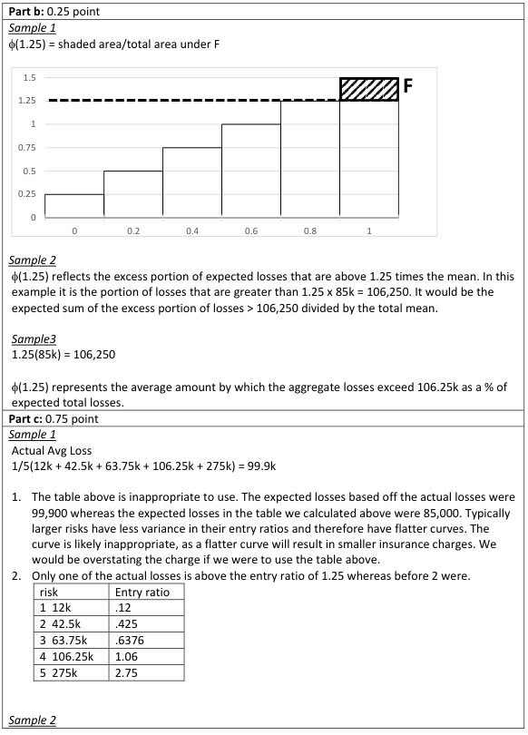
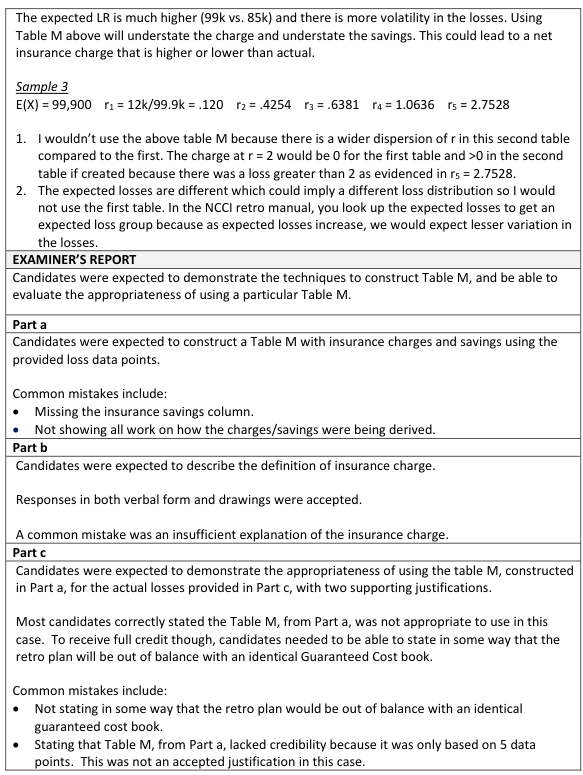

# 2016 Exam 8 - Q12

**Points:** 2.5

## Question

An actuary is given the following sample of experience from a grouping of five similarly-sized risks:

| Risk | Actual Loss | Risk | Actual Loss |
| --- | --- | --- | --- |
| 1 | $85,000 | 4 | $63,750 |
| 2 | $127,500 | 5 | $106,250 |
| 3 | $42,500 |  |  |

### Part a (1.50 pts)

Construct a Table M of insurance charges and savings at entry ratios of 0 to 1.50 in multiples of 0.25.

### Part b (0.25 pts)

Briefly describe what the insurance charge at an entry ratio of 1.25 reflects.

### Part c (0.75 pts)

Suppose the Table M constructed above is used to price a book of Worker's Compensation retroactively rated business. The following table of actual losses reflects the experience of this book:

| Risk | Actual Loss | Risk | Actual Loss |
| --- | --- | --- | --- |
| 1 | $12,000 | 4 | $106,250 |
| 2 | $42,500 | 5 | $275,000 |
| 3 | $63,750 |  |  |

Evaluate the appropriateness of using the Table M constructed in part (a) above. Provide two reasons in support of the conclusion.

## Solution

### Part a

**E[A]:** $85,000 — `=AVERAGE(D7:D9,F7:F8)`

| Risk | Entry ratio |
| --- | --- |
| 1 | 1.00 |
| 2 | 1.50 |
| 3 | 0.50 |
| 4 | 0.75 |
| 5 | 1.25 |

Formulas

- `K5` = `=D7/K$2`
- `K6` = `=D8/K$2`
- `K7` = `=D9/K$2`
- `K8` = `=F7/K$2`
- `K9` = `=F8/K$2`

| r | # above | % above | Charge | Savings |
| --- | --- | --- | --- | --- |
| 0 | 5 | 1 | 1 | 0 |
| 0.25 | 5 | 1 | 0.75 | 0 |
| 0.5 | 4 | 0.8 | 0.5 | 0 |
| 0.75 | 3 | 0.6 | 0.3 | 0.05 |
| 1 | 2 | 0.4 | 0.15 | 0.15 |
| 1.25 | 1 | 0.2 | 0.05 | 0.3 |
| 1.5 | 0 | 0 | 0 | 0.5 |

Formulas

- `K12` = `=COUNTIF($K$5:$K$9,">"&J12)`
- `L12` = `=K12/5`
- `M12` = `=M13+(J13-J12)*L12`
- `N12` = `=M12+J12-1`
- `J13` = `=J12+0.25`
- `K13` = `=COUNTIF($K$5:$K$9,">"&J13)`
- `L13` = `=K13/5`
- `M13` = `=M14+(J14-J13)*L13`
- `N13` = `=M13+J13-1`
- `J14` = `=J13+0.25`
- `K14` = `=COUNTIF($K$5:$K$9,">"&J14)`
- `L14` = `=K14/5`
- `M14` = `=M15+(J15-J14)*L14`
- `N14` = `=M14+J14-1`
- `J15` = `=J14+0.25`
- `K15` = `=COUNTIF($K$5:$K$9,">"&J15)`
- `L15` = `=K15/5`
- `M15` = `=M16+(J16-J15)*L15`
- `N15` = `=M15+J15-1`
- `J16` = `=J15+0.25`
- `K16` = `=COUNTIF($K$5:$K$9,">"&J16)`
- `L16` = `=K16/5`
- `M16` = `=M17+(J17-J16)*L16`
- `N16` = `=M16+J16-1`
- `J17` = `=J16+0.25`
- `K17` = `=COUNTIF($K$5:$K$9,">"&J17)`
- `L17` = `=K17/5`
- `M17` = `=M18+(J18-J17)*L17`
- `N17` = `=M17+J17-1`
- `J18` = `=J17+0.25`
- `K18` = `=COUNTIF($K$5:$K$9,">"&J18)`
- `L18` = `=K18/5`
- `N18` = `=M18+J18-1`

### Part b

The 5% charge is the expected loss in excess of 1.25 times the average loss as a percent of the average loss.

### Part c

Note that the proper spelling is "Workers' Compensation" not "Worker's Compensation." Given the point value, you wouldn't be expected to create a new table M for these new risks and then compare the tables.

I would not use the Table from part (a) to price this book because: any 2 of:

- This new distribution has more variance (e.g., 12k and 275k losses), so the aggregate

distribution in (a) will not be appropriate to price this book.

- The Table M from part (a) was built on only 5 risks, which isn't credible enough to use as a

table M curve to price other policies.

- The average loss of these risks is 99,900, and since this is different from the average loss in

part (a), it suggests the aggregate distributions will likely be different as well.

## Examiner Report

Examiner Report Solutions for parts (b) and (c) and Commentary:

