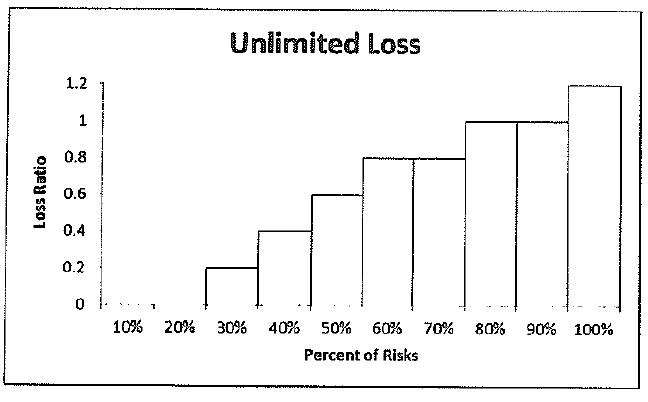
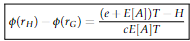
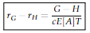
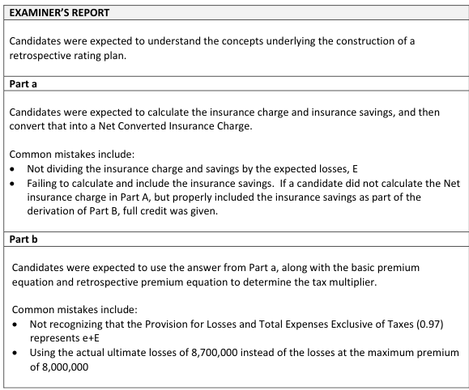

# 2016 Exam 8 - Q13

**Points:** 2.5

## Question

A risk is written using a retrospective rating plan with the following characteristics:

| C | D |
| --- | --- |
| $10,000,000 | Standard Premium |
| 60% | Expected Loss Ratio |
| 80% | Loss Ratio at Maximum Premium |
| 20% | Loss Ratio at Minimum Premium |
| 1.085 | Loss Conversion Factor |
| 0.97 | Provision for Losses and Total |

Expenses Exclusive of Taxes

The following Lee Diagram depicts actual experience from a sample of similarly-sized risks and similar to the risk in question:

**Bar chart titled "Unlimited Loss".** Horizontal axis = Percent of Risks in 10% bands, vertical axis = Loss Ratio (0 to 1.2). Bar heights by band:

| Band | Loss ratio |
| --- | --- |
| 10% | 0 |
| 20% | 0 |
| 30% | 0.2 |
| 40% | 0.4 |
| 50% | 0.6 |
| 60% | 0.8 |
| 70% | 0.8 |
| 80% | 1.0 |
| 90% | 1.0 |
| 100% | 1.2 |

### Part a (1.25 pts)

Determine the converted insurance charge for this plan.

### Part b (1.25 pts)

Given the following additional information:

| B | C |
| --- | --- |
| $8,700,000 | Insured's actual ultimate losses |
| $12,500,000 | Final retrospective premium |

Determine the tax multiplier that was used in the rating of this plan.

## Solution

### Part a

The question didn't specify, so I assume you can give the converted insurance charge in either dollars or as a percent of standard premium, though I'll give both. Note that the question asked for the converted insurance charge, so we need to multiply the insurance charge by the loss conversion factor. Given the point value, I assume they meant for you to give the converted NET insurance charge, so you need to account for both the charge and savings. We need to use the graph to get the areas related to the max and min. Since the vertical axis is loss ratios, these areas will represent the insurance charge and savings times the expected loss ratio. It is a little difficult to read the height of the bars in the graph. I assume the last bar has a height of 1.2.

Assume question asks for converted NET insurance charge.

| K | M |
| --- | --- |
| Charge | 0.13 |
| Savings | 0.07 |

Formulas

- `M13` = `=(0.1*(1.2-C8)+0.2*(1-C8))/C7`
- `M14` = `=0.2*(C9-0)/C7`

**E[A]:** $6,000,000 — `=C7*C6`

**cI:** $434,000 — `=(M13-M14)*C10*M16`

### Part b

Solution 1: Solve for basic premium, then use R = (B + cL)T to solve for T

We aren't given B, so we have to assume the plan is balanced in order to get it. Note that the loss ratio at max premium is 80%, so we need to cap the losses at 80% × 10M = 8M.

**Cap Loss at:** $8,000,000 — `=MIN(C8*C6,B42)`

e — $3,700,000 — `=(C11-C7)*C6` — e = (e + E[A]) - E[A]

B — $3,624,000 — `=M27-(C10-1)*M16+M18` — B = e - (c-1)E[A] + cI

T — 1.016 — `=B43/(M29+C10*M25)` — R = (B + cL)T, solve for T

Solution 2: Use balance equations to solve for T

| K | L | M | N | O |
| --- | --- | --- | --- | --- |
| phi(r_G) | 0.13 |  | r_G | 1.33 |
| r_H | 0.33 |  |  |  |
| phi(r_H) | 0.73 | From psi(r) = phi(r) + r - 1 |  |  |
| Charge diff | 0.60 |  |  |  |
| Entry diff | 1.00 |  |  |  |

Formulas

- `L35` = `=M13`
- `O35` = `=C8/C7`
- `L36` = `=C9/C7`
- `L37` = `=M14-L36+1`
- `L38` = `=L37-L35`
- `L39` = `=O35-L36`

$$\phi(r_H) - \phi(r_G) = \frac{(e + E[A])T - H}{c\,E[A]\,T}$$

phi(r_H) - phi(r_G) = 0.60 = (0.97T - H/10,000,000)/(1.085*60%*T)

$$r_G - r_H = \frac{G - H}{c\,E[A]\,T}$$

**G/P:** 1.25 — `=B43/C6`

r_G - r_H = 1 = (1.25 - H/10,000,000)/(1.085*60%*T)

Now we have 2 equations with 2 unknowns (H and T), so we can solve the system of equations for T.

From charge equation:

| K | L |
| --- | --- |
| 0.3906 | 0.3906T = 0.97T - H/10,000,000 |
| 0.5794 | H/10,000,000 = 0.5794T |

Formulas

- `K49` = `=L38*C10*C7`
- `K50` = `=C11-K49`

Plug H/10,000,000 = 0.5794T into entry equation:

1 = (1.25 - 0.5794T)/(1.085*60%*T)

0.651 — `=L39*C10*C7` — 0.651T = 1.25 - 0.5794T

**Solve for T:** 1.016 — `=L43/(K55+K50)`

## Examiner Report

Examiner Report Comments:

