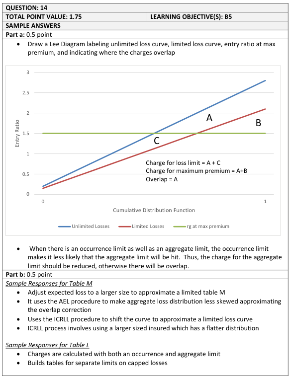
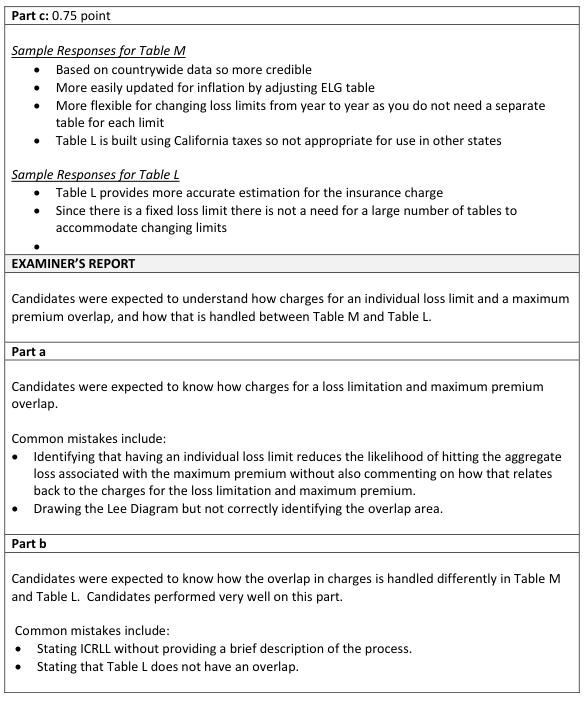
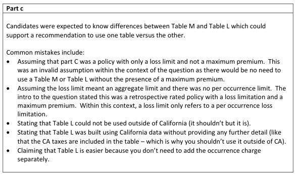

# 2016 Exam 8 - Q14

**Points:** 1.75

## Question

A retrospective rated policy has both a loss limitation and a maximum premium.

### Part a (0.50 pts)

Demonstrate how the charges for the loss limitation and the maximum premium overlap.

### Part b (0.50 pts)

Explain how the overlap is handled differently when using Table M versus Table L.

### Part c (0.75 pts)

An actuary is pricing a large worker's compensation policy with a fixed loss limit of $100,000. Recommend a table of insurance charges, Table M or Table L, that the actuary should use and provide two reasons supporting the recommendation.

## Solution

### Part a

I assume this question means to ask how the charges would overlap if you didn't properly account for the overlap (i.e., if you used a regular Table M without the ICRLL procedure), especially given part (b) talks about addressing the overlap. Obviously, if you use something like a Limited Table M or a Table L, there would be no overlap in the charges themselves.

With a regular Table M, there is an overlap between charges since the aggregate loss distribution used for the maximum premium charge is based on unlimited losses, even though we will actually be using limited losses for the policy due to the loss limitation. Since unlimited losses are more likely to exceed a given aggregate limit compared to limited losses, the max premium charge will be too high.

### Part b

The wording isn't clear about Table M here, as the regular Table M doesn't address the overlap. However, that might lead to a redundant answer with part (a). So I assume we want to talk about the ICRLL procedure here, or perhaps even building a Limited Table M.

With a Table L, the table is built on limited loss data, and the charges for the loss limit and the maximum premium are combined into a single charge.

SOLUTION 1: Using the ICRLL procedure

To account for the overlap on a Table M, we use the ICRLL procedure to approximate a Limited Table M by obtaining the max premium charge from the aggregate distribution for a larger risk size, which is an approximation to the aggregate distribution built on limited losses for the risk size we desire. The separate charge for the loss limit is based on the loss elimination ratio.

SOLUTION 2: Using a Limited Table M

With a Limited Table M, the table is built on limited loss data, so the charge for the max premium properly reflects limited losses, and the separate charge for the loss limit is based on the loss elimination ratio.

### Part c

Note that the proper spelling is "Workers' Compensation" not "Worker's Compensation." It isn't clear what type of policy we are discussing here (e.g., retrospectively rated), and there is no reference to a maximum premium, aggregate limit, or aggregate deductible, which is the whole point of using one of these tables in the first place. But since the top piece of the question talks about retrospective rating, I'm going to assume we are dealing with a retrospectively rated policy here that has an occurrence limit and a maximum premium. Finally, again it isn't clear whether we are talking about a regular Table M here, which would have an issue due to overlap, or a Table M with the ICRLL procedure or even a Limited Table M. I'll assume Table M with the ICRLL procedure.

SOLUTION 1: Choose Table L

I would use a Table L to price the policy because:

- It properly accounts for the overlap between the loss limit and the maximum premium.
- Since there is a fixed loss limit, there is not a need for a large number of tables to

accommodate changing limits.

SOLUTION 2: Choose Table M

I would use a Table M to price the policy because:

- It is easier to update for inflation by adjusting the ELG table.
- It is more flexible for changing loss limits from year to year as you do not need a separate

table for each limit.

## Examiner Report

Examiner Report Solutions and Comments:

