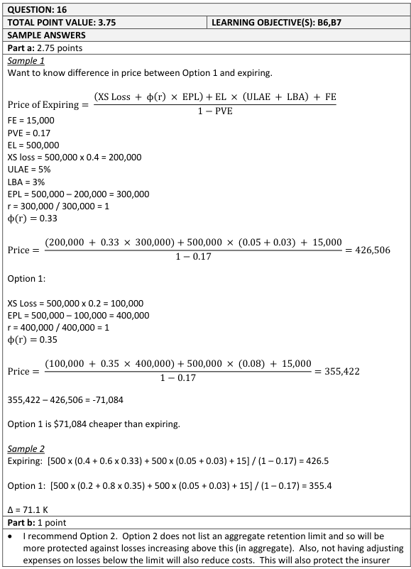
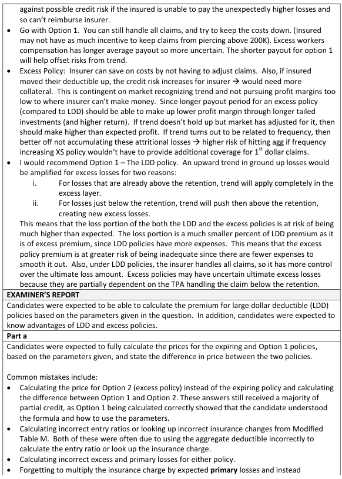
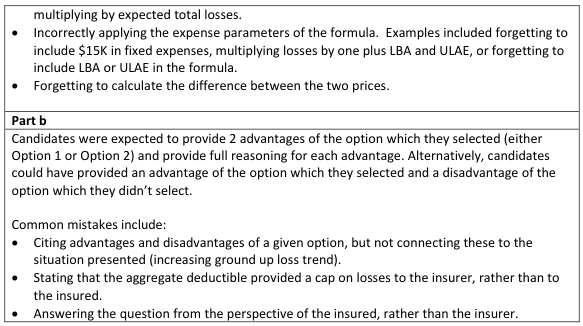

# 2016 Exam 8 - Q16

**Points:** 3.75

## Question

An actuary is given the following expiring policy information for a Workers' Compensation Large Dollar Deductible policy:

| C | D |
| --- | --- |
| $500,000 | Expected Total Loss & ALAE |
| $100,000 | Deductible |
| 40% | Percentage of Loss & ALAE Excess of $100,000 |
| 20% | Percentage of Loss & ALAE Excess of $200,000 |
| 5% | ULAE |
| 3% | Loss Based Assessment Factor |
| 17% | Profit and Variable Expenses |
| $15,000 | Fixed Expense |
| $300,000 | Aggregate Deductible |

There are no changes to these expenses and profit provision. The table of Insurance Charges is displayed below:

Modified Table M for Similarly Sized Policies

Deductible

| C | D | E | F | G |
| --- | --- | --- | --- | --- |
| Entry Ratio | $100,000 | $200,000 | $300,000 | $400,000 |
| 0.5 | 0.450 | 0.480 | 0.495 | 0.505 |
| 1.0 | 0.330 | 0.350 | 0.365 | 0.370 |
| 1.5 | 0.270 | 0.303 | 0.325 | 0.350 |
| 2.0 | 0.185 | 0.240 | 0.260 | 0.286 |

The insured would like to retain more risk and requests the price of the following options:

Option 1: Deductible of $200,000 with an aggregate deductible of $400,000.

Option 2: Excess Policy with self-insured retention of $200,000 on a per occurrence basis.

### Part a (2.75 pts)

Calculate the difference in price between Option 1 and the expiring structure. Use linear interpolation as needed.

### Part b (1.00 pts)

The insurer observed an upward trend of ground up losses in the insured's industry for the most recent year, but is unsure if this trend will continue in the future. Based on this observation, recommend one of the two options for the insurer and fully support the recommendation.

## Solution

### Part a

Note that in part (a) we are comparing Option 1 to the expiring policy, not comparing option 1 to option

2. I assume the ULAE given is a percent of ground-up Loss & ALAE . I assume the Loss Based

Assessment Factor (really, a ratio, not a factor) is a percent of ground-up loss. Note that a Modified Table M is really just a Limited Table M.

Expiring Policy

E[A_D] r*_G Charge

Premium

Option 1

E[A_D] r*_G Charge

Premium

Difference

### Part b

Any 1 of:

- Both options have the same occurrence retention for the insured, but the LDD policy also

has an aggregate deductible. If the upward loss trend materializes, then the limited losses for the insured will be higher, and as such, it will be easier for the insured to exceed the aggregate deductible. Assuming the insurance charge is not updated to reflect this, then the charge for the aggregate deductible will be too low, and the LDD will be underpriced as a result. As such, I would recommend option 2 (the excess policy).

- I recommend Option 2. Option 2 does not list an aggregate retention and so the insurer will

be more protected against losses increasing above this in aggregate. Also, not having adjusting expenses on losses below the occurrence retention will also reduce costs. This will also protect the insurer against possible credit risk if the insured is unable to pay the unexpectedly higher losses and so can't reimburse the insurer.

- I recommend Option 1. The insurer can handle all claims and try to keep costs down.

Excess WC has longer average payout so more uncertain. The shorter payout for option 1 will help offset risks from trend.

- I would recommend Option 1. An upward trend in ground-up losses would result in an

even greater excess loss trend. This means that the loss portion of both the LDD and Excess policies are at risk of being much higher than expected. The loss portion is a smaller percent of LDD premium as it is of excess premium, since LDD policies have more expenses. This means that the excess policy premium is at greater risk of being inadequate. Also, under LDD policies, the insurer handles all claims, so it has more control over the ultimate loss amount. Excess policies may have uncertain ultimate excess losses because they are partially dependent on the TPA handling the claims below the retention.

$300,000 — `=C7*(1-C9)`

1 — `=C15/N9`

0.330 — `=D24`

$426,506 — `=(C7*C9+N9*N11+C7*(C11+C12)+C14)/(1-C13)`

$400,000 — `=C7*(1-C10)`

1.00 — `=400000/N17`

0.350 — `=E24`

$355,422 — `=(C7*C10+N17*N19+C7*(C11+C12)+C14)/(1-C13)`

$71,084 — `=N13-N21`

## Examiner Report

Examiner Report Solutions and Comments:

