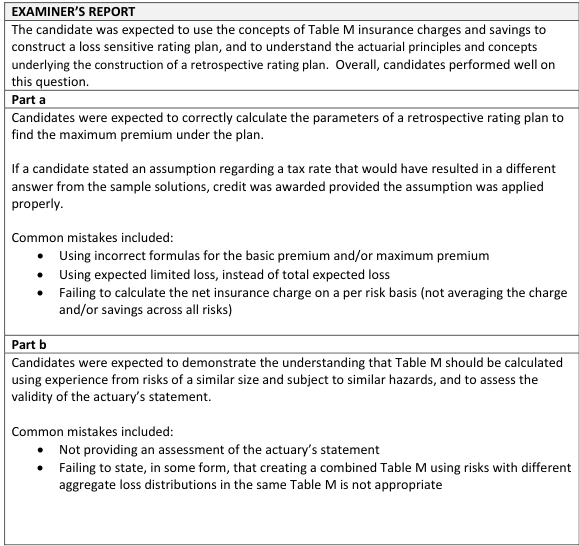

# 2017 Exam 8 - Q13

**Points:** 2.5

## Question

A risk is written using a balanced retrospective rating plan with the following characteristics:

| B | C |
| --- | --- |
| $50,000 | Losses at the minimum premium |
| $300,000 | Losses at the maximum premium |
| 1.05 | Loss conversion factor |
| $10,000 | e |

The following table shows actual experience from a representative sample of risks that are similar to the risk in question:

| Risk | Actual Aggregate Loss | Risk | Actual Aggregate Loss |
| --- | --- | --- | --- |
| 1 | $25,000 | 6 | $175,000 |
| 2 | $50,000 | 7 | $200,000 |
| 3 | $100,000 | 8 | $300,000 |
| 4 | $100,000 | 9 | $350,000 |
| 5 | $150,000 | 10 | $550,000 |

### Part a (2.00 pts)

Determine the maximum premium that the insured can be charged.

### Part b (0.50 pts)

An actuary has acquired actual aggregate data from a new book consisting of risks within the same industry. The loss experience of five representative risks from this book is shown below:

| Risk | Actual Aggregate Loss |
| --- | --- |
| 1 | $275,000 |
| 2 | $300,000 |
| 3 | $500,000 |
| 4 | $700,000 |
| 5 | $800,000 |

The actuary proposes to combine the data from the two books, stating that the combined data will result in a more accurate calculation of the insured's retrospective premium. Assess the validity of the actuary's statement.

## Solution

### Part a

Here we need to solve G = (B + cL_G)T. Since T is not given and cannot be obtained from the information given, I assume T = 1.

Assume T = 1

**E[A]:** $200,000 — `=AVERAGE(C15:C19,E15:E19)`

From here, we can use vertical slices, limiting losses, or constructing a Table M. I'll show 2 of these approaches.

Solution 1: Use vertical slices

| J | K |
| --- | --- |
| Charge | $30,000 |
| Savings | $2,500 |

Formulas

- `K13` = `=(E19-B7)*(1/10)+(E18-B7)*(1/10)`
- `K14` = `=(B6-C15)/10`

| J | K |
| --- | --- |
| I | $27,500 |
| B | $28,875 |

Formulas

- `K16` = `=K13-K14`
- `K17` = `=B9-(B8-1)*K7+B8*K16`

**G:** $343,875 — `=(K17+B8*B7)`

### Part b

The new risks generally have much larger losses than the original 10 risks, and including them would significantly change the aggregate loss distribution and expected loss for the risk we are pricing. If the insured is similar in size to the original 10 risks (E[A] = $200k), then including the new data would overstate the expected loss and insurance charge for the insured.

Solution 2: Build a Table M

| O | P | R | S | T | U | V |
| --- | --- | --- | --- | --- | --- | --- |
| Risk | r | r_G | 1.5 |  |  |  |
| 1 | 0.125 | r_H | 0.25 |  |  |  |
| 2 | 0.25 |  |  |  |  |  |
| 3 | 0.5 | r | # above | % above | Charge | Savings |
| 4 | 0.5 | 0 | 10 | 1 | 1 | 0 |
| 5 | 0.75 | 0.125 | 9 | 0.9 | 0.875 | 0 |
| 6 | 0.875 | 0.25 | 8 | 0.8 | 0.7625 | 0.0125 |
| 7 | 1 | 0.5 | 6 | 0.6 | 0.5625 | 0.0625 |
| 8 | 1.5 | 0.75 | 5 | 0.5 | 0.4125 | 0.1625 |
| 9 | 1.75 | 0.875 | 4 | 0.4 | 0.35 | 0.225 |
| 10 | 2.75 | 1 | 3 | 0.3 | 0.3 | 0.3 |
|  |  | 1.5 | 2 | 0.2 | 0.15 | 0.65 |
|  |  | 1.75 | 1 | 0.1 | 0.1 | 0.85 |
|  |  | 2.75 | 0 | 0 | 0 | 1.75 |

Formulas

- `S13` = `=B7/K7`
- `P14` = `=C15/$K$7`
- `S14` = `=B6/K7`
- `P15` = `=C16/$K$7`
- `P16` = `=C17/$K$7`
- `P17` = `=C18/$K$7`
- `S17` = `=COUNTIF($P$14:$P$23,">"&R17)`
- `T17` = `=S17/10`
- `U17` = `=U18+(R18-R17)*T17`
- `V17` = `=U17+R17-1`
- `P18` = `=C19/$K$7`
- `R18` = `={SORT(UNIQUE(P14:P23))}`
- `S18` = `=COUNTIF($P$14:$P$23,">"&R18)`
- `T18` = `=S18/10`
- `U18` = `=U19+(R19-R18)*T18`
- `V18` = `=U18+R18-1`
- `P19` = `=E15/$K$7`
- `S19` = `=COUNTIF($P$14:$P$23,">"&R19)`
- `T19` = `=S19/10`
- `U19` = `=U20+(R20-R19)*T19`
- `V19` = `=U19+R19-1`
- `P20` = `=E16/$K$7`
- `S20` = `=COUNTIF($P$14:$P$23,">"&R20)`
- `T20` = `=S20/10`
- `U20` = `=U21+(R21-R20)*T20`
- `V20` = `=U20+R20-1`
- `P21` = `=E17/$K$7`
- `S21` = `=COUNTIF($P$14:$P$23,">"&R21)`
- `T21` = `=S21/10`
- `U21` = `=U22+(R22-R21)*T21`
- `V21` = `=U21+R21-1`
- `P22` = `=E18/$K$7`
- `S22` = `=COUNTIF($P$14:$P$23,">"&R22)`
- `T22` = `=S22/10`
- `U22` = `=U23+(R23-R22)*T22`
- `V22` = `=U22+R22-1`
- `P23` = `=E19/$K$7`
- `S23` = `=COUNTIF($P$14:$P$23,">"&R23)`
- `T23` = `=S23/10`
- `U23` = `=U24+(R24-R23)*T23`
- `V23` = `=U23+R23-1`
- `S24` = `=COUNTIF($P$14:$P$23,">"&R24)`
- `T24` = `=S24/10`
- `U24` = `=U25+(R25-R24)*T24`
- `V24` = `=U24+R24-1`
- `S25` = `=COUNTIF($P$14:$P$23,">"&R25)`
- `T25` = `=S25/10`
- `U25` = `=U26+(R26-R25)*T25`
- `V25` = `=U25+R25-1`
- `S26` = `=COUNTIF($P$14:$P$23,">"&R26)`
- `T26` = `=S26/10`
- `V26` = `=U26+R26-1`

| P | Q |
| --- | --- |
| I | $27,500 |
| B | $28,875 |
| G | $343,875 |

Formulas

- `Q28` = `=(U24-V19)*K7`
- `Q29` = `=B9-(B8-1)*K7+B8*Q28`
- `Q30` = `=(Q29+B8*B7)`

## Examiner Report

Examiner Report Comments:

