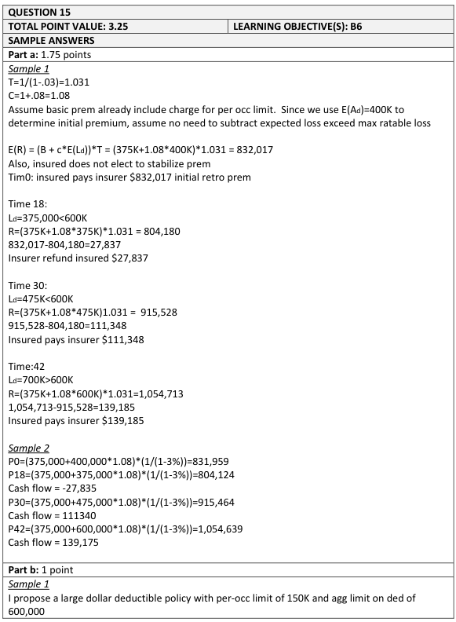
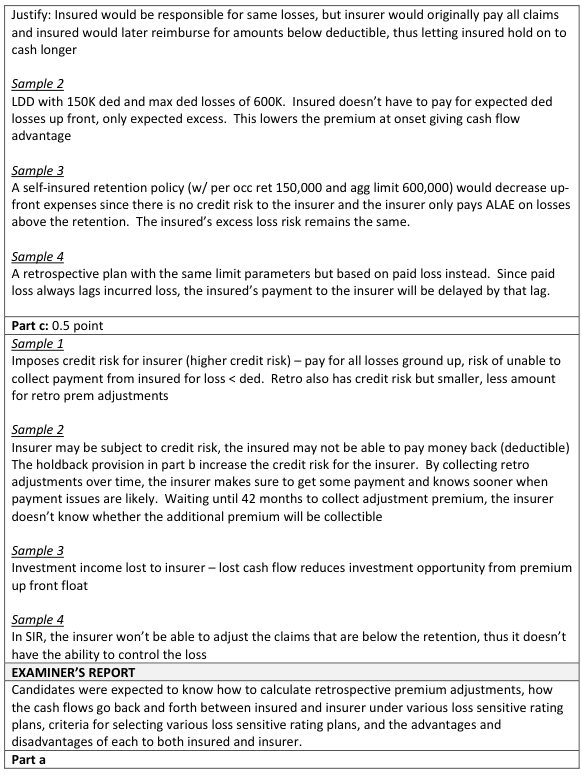
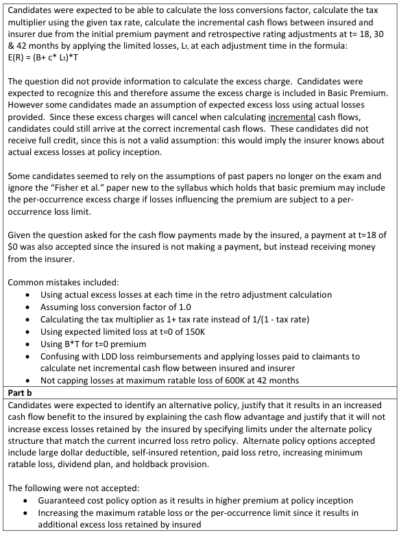
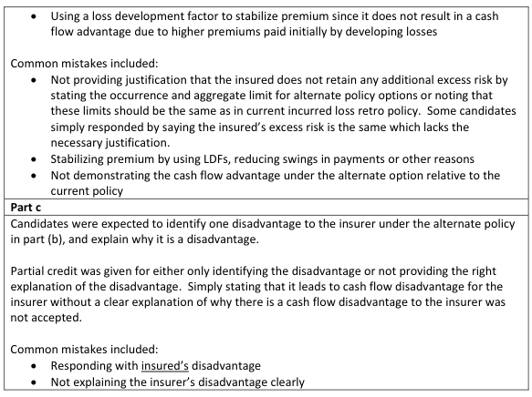

# 2017 Exam 8 - Q15

**Points:** 3.25

## Question

The following applies to an incurred loss retrospectively rated policy effective January 1, 2017.

| B | C |
| --- | --- |
| $150,000 | Per occurrence limit |
| $600,000 | Maximum ratable loss |
| 8% | ULAE as a percentage of loss & ALAE |
| $400,000 | Expected Loss & ALAE limited to $150,000 |
| $375,000 | Basic Premium |
| 3% | Tax Rate |

The expected loss & ALAE limited to $150,000 is used to determine the initial premium. Retrospective rating adjustments start at 18 months and occur every twelve months thereafter.

The following loss experience occurs during the policy period. All claims are closed at 42 months.

Maturity (months)

| B | E | F | G |
| --- | --- | --- | --- |
|  | 18 | 30 | 42 |
| Unlimited Incurred Loss & ALAE | $425,000 | $650,000 | $950,000 |
| Incurred Loss & ALAE Limited to $150,000 | $375,000 | $475,000 | $700,000 |
| Incurred Loss & ALAE Excess of $150,000 | $50,000 | $175,000 | $250,000 |

### Part a (1.75 pts)

Determine the amount and timing of each incremental cash flow payment made by the insured for this policy beginning with time 0.

### Part b (1.00 pts)

Propose and justify an alternative policy that would increase the insured's cash flow benefit without the insured retaining any additional excess loss risk.

### Part c (0.50 pts)

Identify and briefly describe one disadvantage to the insurer of the proposed plan in part (b) compared to the existing retrospectively rated plan.

## Solution

### Part a

In this problem, the basic premium MUST include the EXPECTED loss & ALAE excess of $150k, because there is no other way to obtain that information.

**Initial Prem:** $831,959 — `=(B10+(1+B8)*B9)/(1-B11)`

| K | M |
| --- | --- |
| 18 mo prem | $804,124 |
| 30 mo prem | $915,464 |
| 42 mo prem | $1,054,639 |

Formulas

- `M7` = `=(B10+(1+B8)*MIN(E21,B7))/(1-B11)`
- `M8` = `=(B10+(1+B8)*MIN(F21,B7))/(1-B11)`
- `M9` = `=(B10+(1+B8)*MIN(G21,B7))/(1-B11)`

| K | M | N |
| --- | --- | --- |
| Initial cash flow | $831,959 |  |
| 18 mo cash flow | $-27,835 | refund to insured |
| 30 mo cash flow | $111,340 |  |
| 42 mo cash flow | $139,175 |  |

Formulas

- `M11` = `=M5`
- `M12` = `=M7-M11`
- `M13` = `=M8-M7`
- `M14` = `=M9-M8`

### Part b

Note that we can't and don't need to calculate the premium for these alternative policies for this part. For example, for a LDD plan premium, the ULAE would need to be related to ground-up loss (since an insurer handles all claims with a Large Deductible plan), while the basic premium only includes ULAE related to excess loss. I'll show 2 solutions, but others were accepted as well.

Solution 1: Large Deductible Plan

With a Large Deductible plan, the insured could retain the first $150,000 in losses for each claim, and can have a maximum retained amount of $600,000. Since the insured is retaining more primary losses, the premium would be significantly lower than the initial retro premium, which would give the insured a large cash flow benefit. The insured would still be responsible for reimbursing the insurer for all claims below $150,000, but only up to the aggregate limit of $600,000.

Solution 2: Excess policy above self-insured retention

With a self-insured retention and an Excess policy, the insured could retain the first $150,000 in losses for each claim, and can have a maximum retained amount of $600,000. Since the insured is retaining more primary losses, the premium would be significantly lower than the initial retro premium, which would give the insured a large cash flow benefit.

### Part c

For LDD answer in part (b), any 1 of:

- The insurer will incur credit risk for the collectability of deductible payments from the insured.
- The initial cash flow to the insurer is much lower, which means lower investment income for the insurer.
- The insurer's premium will be much lower, which may hurt premium growth goals.

For self-insured retention answer in part (b), any 1 of:

- The insurer won't adjust claims below the retention, so it can't control the losses.
- The initial cash flow to the insurer is much lower, which means lower investment income for the insurer.
- The insurer's premium will be much lower, which may hurt premium growth goals.

## Examiner Report

Examiner Report Solutions and Comments:

