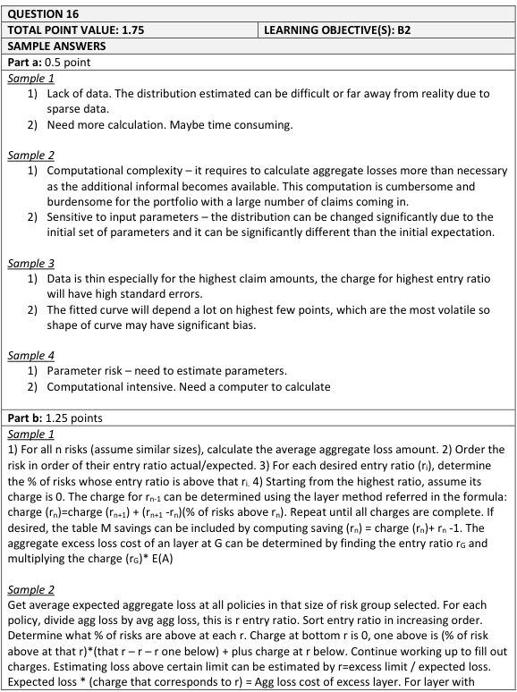
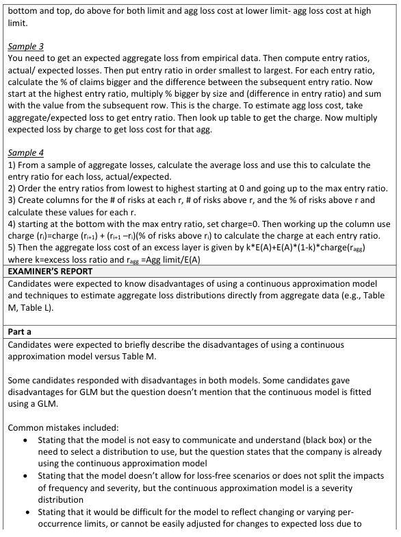
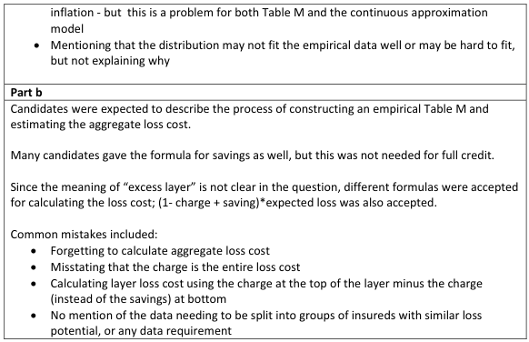

# 2017 Exam 8 - Q16

**Points:** 1.75

## Question

An insurance company generally uses two different methods to price excess layer insurance contracts:

- Empirical construction of Table M; or
- Approximating the distribution of aggregate losses with a continuous approximation model.

### Part a (0.50 pts)

Briefly describe two potential disadvantages of using a continuous approximation model.

### Part b (1.25 pts)

Fully describe the process of constructing an empirical Table M and estimating the aggregate loss cost of an excess layer using the table.

## Solution

### Part a

- The distribution fit can be very sensitive to the input data, and may be unstable if estimated

based on a small dataset.

- The calculations to obtain expected excess losses might be very complicated or

computationally intensive using some distributions.

### Part b

To build a Table M:

- Obtain aggregate loss data for a large number of similarly-sized risks.
- Calculate the expected aggregate loss as the average aggregate loss.
- Calculate entry ratios for each loss amount as actual loss / expected loss.
- Calculate the % of risks above each entry ratio.
- Set the Table M charge for the highest entry ratio to 0.
- Calculate Charge(r_i) = Charge(r_i+1) + (r_i+1 - r_i)(% risks above r_i)

To estimate aggregate excess losses for a risk:

- Calculate the entry ratio as aggregate limit / expected loss for the risk.
- Lookup the Table M charge for that entry ratio in Table M.
- Multiply the charge by the expected loss for the risk to get expected aggregate excess losses

in excess of the aggregate limit.

## Examiner Report

Examiner Report Solutions and Comments:

