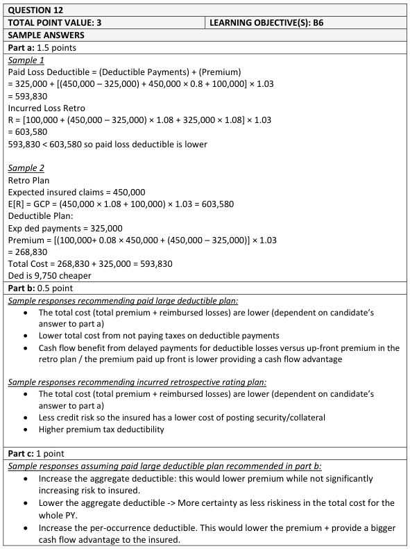
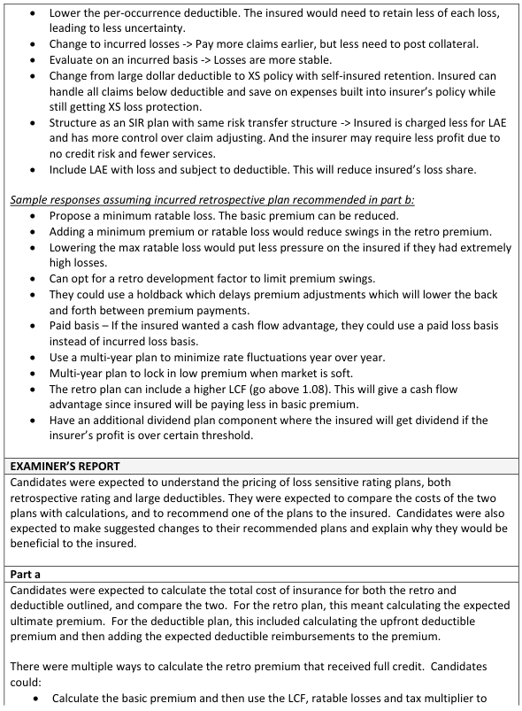
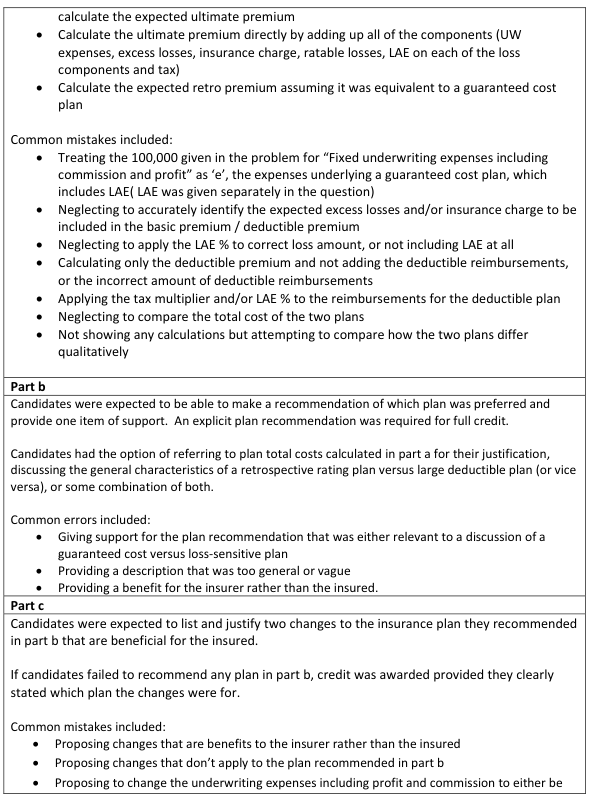
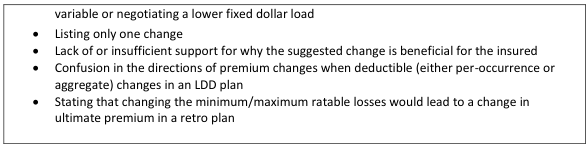

# 2018 Exam 8 - Q12

**Points:** 3

## Question

An insured is considering an incurred loss retrospective rating plan and a paid loss deductible plan with the following characteristics:

Incurred Loss Retro Per Occurrence Limit Maximum Ratable Loss

Paid Loss Deductible Per Occurrence Deductible Aggregate Deductible

The following apply to both plans:

Expected Ultimate Losses Expected Ultimate Losses limited by occurrence Expected Ultimate Losses limited by occurrence and aggregate

Fixed underwriting expenses including commission & profit

LAE as a percentage of Loss Tax Multiplier

### Part a (1.50 pts)

Compare the expected total cost of insurance of the two plans, taking into account both premium and deductible payments, from the perspective of the insured.

### Part b (0.50 pts)

Recommend and briefly justify one of the two plans above from the perspective of the insured.

### Part c (1.00 pts)

Propose two changes to the recommended plan in part (b) above and briefly explain why each would be beneficial for the insured.

$150,000

$500,000

$150,000

$500,000

$450,000

$350,000

$325,000

$100,000

8.0%

1.030

## Solution

### Part a

To be more precise, the per occurrence limit on the retro should have said "ratable" per occurrence limit. That way it makes it more clear that this is a ratable limit and not a coverage limit. For the retro plan, the cost of insurance is just the expected retro premium. For the deductible plan, the insured's total cost includes the premium and all amounts below the deductible. I assume ground-up LAE is covered by the deductible plan (though in reality, it would make more sense for this to be ground-up ULAE, and for ALAE to be included with loss). We should expect the cost of insurance to be cheaper for the deductible plan, since the tax multiplier will apply to a smaller premium.

Expected Retro Prem

Expected Ded Pol Losses Expected Ded Pol ALAE

Expected Ded Pol Prem

Ded Plan total cost of insurance

The lower total cost for the deductible plan is due to the tax multiplier applying to a smaller premium based on just excess losses.

### Part b

Solution 1: Recommend the Deductible Plan

I would recommend the deductible plan as it results in lower expected costs for the insured, and a lower initial outgoing premium cash flow for the insured.

Solution 2: Recommend the Retro Plan

I would recommend the retro plan as the insured can potentially have lower costs if they have very good experience, and the insured will be able to tax deduct the higher insurance initial premium.

### Part c

It isn't obvious what changes they were thinking would be allowed here. Would increasing deductibles be allowed for the deductible plan to further reduce the premium to which the tax multiplier applies? Would changing the plan itself be allowed (e.g., from a deductible plan to a SIR with an excess policy)? I'll show a few

$603,580 — `=(G16*(1+G22)+G20)*G23` — this is retro total cost of insurance

$125,000 — `=G16-G18`

$36,000 — `=G22*G16`

$268,830 — `=(N12+N13+G20)*G23`

$593,830 — `=N15+G18`

## Examiner Report

examples. See examiner report solutions below for additional accepted answers as many were accepted.

Corresponding with the deductible plan:

Any 2 of:

- Increasing deductibles would lower premium, and would further reduce the cost of

insurance since the tax multiplier would apply to a smaller premium.

- Changing to a self-insured retention with an excess policy would give the insured greater

control over losses below the retention and would further reduce expected costs.

- Lowering deductibles would provide the insured more certainty in its total costs (though

they would likely be higher as premium would increase).

Corresponding with the retro plan:

Any 2 of:

- Changing the retro to be based on paid losses would give an added cash flow advantage to

the insured since the premium at early maturities will be lower.

- Changing the retro to use the retrospective development option would allow for more

predictable cash flows for the insured.

- Adding holdbacks to the retro plan would defer retrospective premium adjustments to a

later date when losses have reached more maturity and would result in more predictable cash flows for the insured.

- Adding a minimum ratable loss could reduce the basic premium.

Examiner Report Solutions and Comments:

